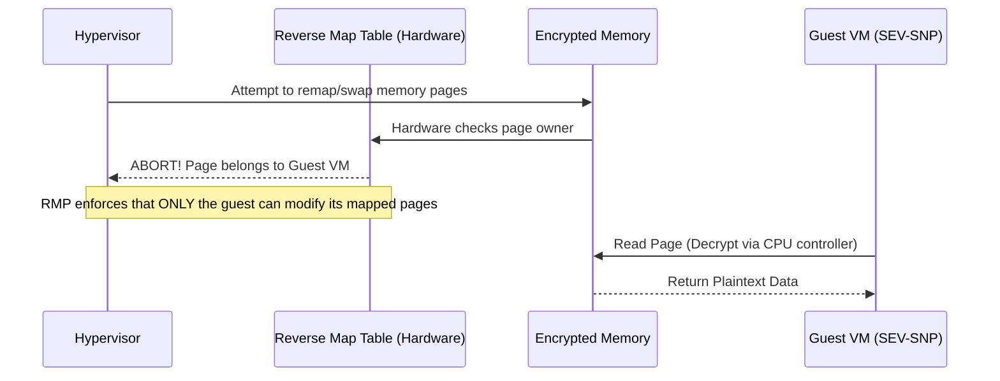

# 04 - AMD SEV-SNP (Secure Encrypted Virtualization)

While Intel approaches this with TDX, **AMD** pioneered full-VM memory encryption with **SEV (Secure Encrypted Virtualization)**, which evolved into **SEV-SNP (Secure Nested Paging)**. 

## 1. The Concept (ELI5)

Imagine you have a magic notebook (your RAM). You write your secrets in it. 

The first generation of security (**AMD SEV**) was like writing in invisible ink. The hypervisor could look at the notebook, but couldn't read the words. 

However, attackers realized they could still *rip out pages* or *swap pages around* without reading them (memory remapping attacks), causing the program to crash or behave maliciously.

**AMD SEV-SNP (Secure Nested Paging)** solves this by giving every single page in your notebook a cryptographic seal and a page number. Now, not only is the text invisible ink, but if the hypervisor tries to swap page 5 with page 10, the CPU instantly detects the tampered seal and halts the system. This provides full **Memory Integrity**.

## 2. The Visual: Secure Nested Paging



## 3. The Code: Protecting Network Ingress

Because the hypervisor controls the network layer (virtio), a malicious hypervisor could inject malformed packets into the guest VM's network buffers to trigger buffer overflows *inside* the encrypted boundary. 

You must strictly validate all input entering the Trust Boundary.

### ❌ Vulnerable Code (Trusting Hypervisor Input)

Accepting untrusted network packets and immediately parsing them with unsafe languages or complex parsers.

```python
# python
import struct

def handle_network_packet(raw_payload: bytes):
    # VULNERABILITY: Blindly trusting the length header provided by 
    # the network layer (which is controlled by the untrusted Hypervisor)
    payload_length = struct.unpack(">I", raw_payload[0:4])[0]
    
    # If the hypervisor manipulated the length, this could cause memory 
    # corruption or out-of-bounds reads during further processing.
    process_data(raw_payload[4 : 4 + payload_length])
```

### ✅ Production-Ready Secure Code (Strict Input Validation)

When crossing the trust boundary, treat all hypervisor-mediated data as highly hostile. Use safe parsing, bounds checking, and authenticate the data payload (e.g., AEAD).

```python
# python
import struct
from cryptography.exceptions import InvalidTag
from cryptography.hazmat.primitives.ciphers.aead import AESGCM

# In a CC environment, you establish a shared key with the client
# via remote attestation. The hypervisor DOES NOT have this key.
SESSION_KEY = b'...' 

def handle_network_packet_secure(raw_payload: bytes):
    if len(raw_payload) < 16:
        raise ValueError("Packet too short")

    # 1. Hypervisor controls delivery, but cannot forge the AES-GCM tag.
    nonce = raw_payload[:12]
    ciphertext = raw_payload[12:]
    
    aesgcm = AESGCM(SESSION_KEY)
    
    try:
        # 2. Cryptographically verify data integrity before ANY parsing
        plaintext = aesgcm.decrypt(nonce, ciphertext, None)
    except InvalidTag:
        # The hypervisor tampered with the packet! Drop it.
        raise SecurityError("Network payload integrity verification failed!")
        
    # 3. Safely parse the verified plaintext
    safe_process(plaintext)
```

## 4. The Guardrail: GCP Confidential Compute Enforcement

If your organization uses Google Cloud Platform, you can enforce the usage of AMD SEV-SNP backed instances (e.g., N2D or C2D machine types).

Here is a Semgrep rule that scans Terraform code to ensure GCP compute instances use Confidential Computing.

```yaml
# semgrep
rules:
  - id: enforce-gcp-confidential-compute
    patterns:
      - pattern: |
          resource "google_compute_instance" $ANY {
            ...
          }
      - pattern-not-inside: |
          resource "google_compute_instance" $ANY {
            ...
            confidential_instance_config {
              enable_confidential_compute = true
            }
            ...
          }
    message: |
      SECURITY WARNING: Google Compute Instance is missing Confidential Computing config.
      To protect Data-In-Use, ensure 'enable_confidential_compute = true' is set.
    languages:
      - hcl
    severity: ERROR
```
