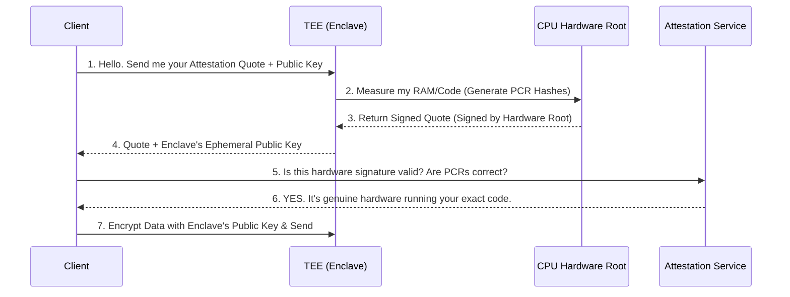

# 05 - Cryptographic Attestation

Putting data in a vault is useless if you can't prove you are talking to the *real* vault and not a fake plywood box painted grey. **Cryptographic Attestation** is the process by which a hardware enclave proves its identity, its hardware status, and the exact software running inside it.

## 1. The Concept (ELI5)

Imagine you are a spy receiving instructions from Headquarters. You get a phone call from someone claiming to be your commander. How do you know it's not the enemy using an AI voice clone?

You challenge them: *"Read me the daily cipher code."*
The commander replies with a code that only the true Headquarters could possibly know, signed by the Director.

**Attestation** works the same way. When your client application talks to an Enclave in the cloud, it asks: *"Prove to me you are a real Intel/AMD hardware chip, and prove to me the exact hash of the code you are running."* The Enclave replies with a **Quote** (an Attestation Document) cryptographically signed by a hardware root key physically burned into the CPU at the factory. 

## 2. The Visual: The Attestation Flow



## 3. The Code: Verifying the Hardware Quote

A common critical vulnerability in Confidential Computing is failing to properly verify the Attestation Document. If you blindly trust the enclave, an attacker can simply write a Python script that says `{"status": "I am a real enclave"}` and steal your data.

### ❌ Vulnerable Code (Trusting Unverified Claims)

```typescript
// typescript
interface EnclaveResponse {
    publicKey: string;
    isEnclave: boolean;
    measurements: string;
}

async function sendSecretToEnclave(enclaveUrl: string, secret: string) {
    const res = await fetch(`${enclaveUrl}/get-key`);
    const data: EnclaveResponse = await res.json();
    
    // VULNERABILITY: Blindly trusting the response without verifying 
    // the hardware cryptographic signature!
    if (data.isEnclave === true) {
        const encrypted = rsaEncrypt(secret, data.publicKey);
        await fetch(`${enclaveUrl}/process`, { method: "POST", body: encrypted });
    }
}
```

### ✅ Production-Ready Secure Code (Cryptographic Verification)

You must cryptographically verify the signature against the hardware manufacturer's root certificate (e.g., AWS, Intel, AMD). Furthermore, you must verify the **PCRs (Platform Configuration Registers)** to ensure the *expected* code is running.

```typescript
// typescript
import { verifyAttestationDocument } from 'aws-nitro-enclaves-verify';

// The pre-calculated SHA384 hash of your compiled enclave code
const EXPECTED_PCR0 = "a1b2c3d4e5f6..."; 

async function sendSecretToEnclaveSecure(enclaveUrl: string, secret: string) {
    const res = await fetch(`${enclaveUrl}/attestation`);
    const base64Document = await res.text();
    
    try {
        // 1. Verifies the CBOR object signature against the AWS Nitro Root CA
        const parsedDoc = verifyAttestationDocument(base64Document);
        
        // 2. Verify the exact code hash (PCR0)
        if (parsedDoc.pcrs[0] !== EXPECTED_PCR0) {
            throw new Error("PCR0 mismatch! Unknown code running in enclave.");
        }
        
        // 3. Extract the public key securely bound to this specific attestation
        const enclavePublicKey = parsedDoc.public_key;
        
        // 4. Safely encrypt data, knowing ONLY the enclave possesses the private key
        const encrypted = rsaEncrypt(secret, enclavePublicKey);
        await fetch(`${enclaveUrl}/process`, { method: "POST", body: encrypted });
        
    } catch (err) {
        console.error("Attestation failed! Terminating connection.");
    }
}
```

## 4. The Guardrail: OPA Policy for PCR Enforcement

When managing complex deployments, you can use Open Policy Agent (OPA) to enforce that any service requesting secrets from your Vault or KMS presents a valid Attestation Document with the correct PCR values.

```rego
# rego
package authz.enclave

import input as req

default allow = false

# Ensure the request provides a valid, signed attestation document
allow {
    verify_nitro_signature(req.attestation_doc)
    
    # PCR0 represents the hash of the Enclave Image (EIF)
    req.attestation_doc.pcrs[0] == data.allowed_enclave_hashes.v1_0_0
    
    # PCR2 represents the IAM role of the parent instance
    req.attestation_doc.pcrs[2] == data.allowed_parent_iam_roles.production
}

verify_nitro_signature(doc) {
    # Internal function to validate the COSE signature against the root CA
    crypto.x509.verify_certs(doc.certificate_chain, data.aws_root_ca)
}
```
