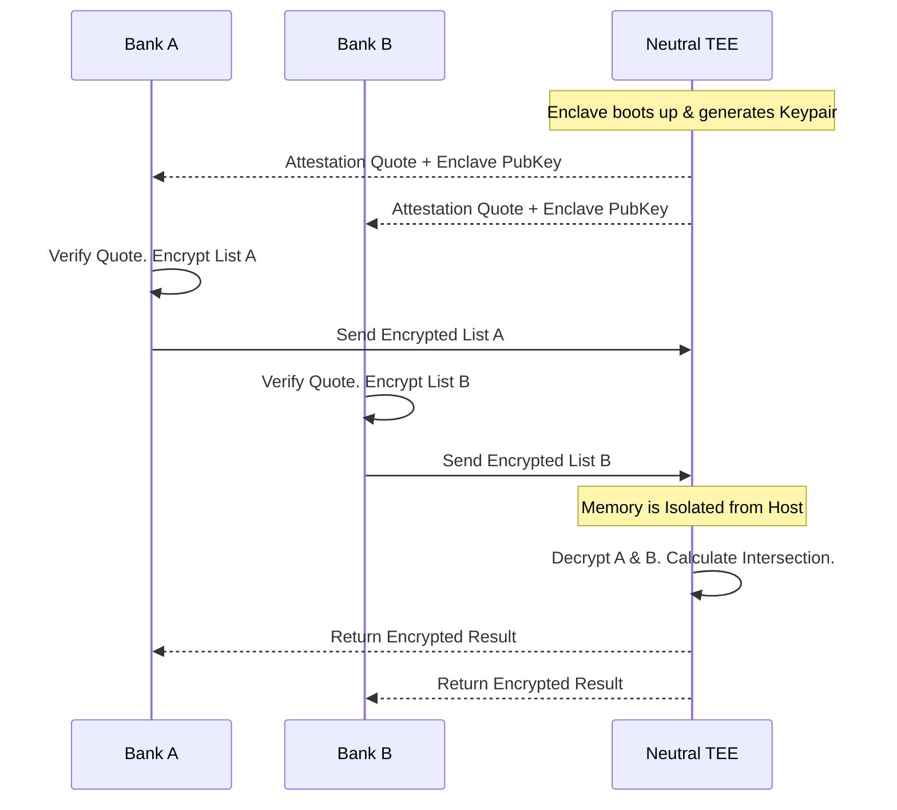

# 06 - Secure Multi-Party Computation (SMPC) via TEEs

One of the most powerful use cases for Confidential Computing is **Secure Multi-Party Computation (SMPC)**. It allows multiple mutually untrusting parties to compute a shared function on their combined data without exposing their raw data to each other.

## 1. The Concept (ELI5)

Imagine two rival banks, Bank A and Bank B. They both have a secret list of known fraudsters. They want to find out which fraudsters are on *both* lists (intersection) so they can block them. 

However, neither bank is willing to hand over their entire customer list to the other. 

Using a TEE, they can spin up an Enclave in the cloud. 
1. Bank A encrypts its list and sends it to the Enclave.
2. Bank B encrypts its list and sends it to the Enclave.
3. The Enclave decrypts both lists in its isolated memory, finds the matches, encrypts the final answer, and sends it back to both banks. 
4. The Enclave is then destroyed. 

Neither bank ever saw the other's full list, and the cloud provider saw nothing but ciphertext.

## 2. The Visual: SMPC Data Flow



## 3. The Code: Terminating TLS inside the Enclave

To achieve SMPC, data must not be decrypted by the cloud load balancer or the host OS. The TLS connection must terminate **inside** the enclave. 

### ❌ Vulnerable Code (Host OS TLS Termination)

If TLS terminates at an Nginx proxy on the host, the Host OS sees the plaintext data before it reaches the enclave.

```nginx
# nginx.conf (Running on the Untrusted Host OS)
server {
    listen 443 ssl;
    server_name enclave.example.com;

    # VULNERABILITY: The host OS holds the private key and terminates TLS!
    ssl_certificate /etc/nginx/certs/fullchain.pem;
    ssl_certificate_key /etc/nginx/certs/privkey.pem;

    location / {
        # The Host OS proxies plaintext data to the enclave...
        proxy_pass http://127.0.0.1:5000;
    }
}
```

### ✅ Production-Ready Secure Code (Enclave TLS Termination)

Pass the raw TCP stream directly into the Enclave. The Enclave holds the private key (generated in memory at boot) and terminates the TLS connection.

```go
// go (Running INSIDE the Enclave)
package main

import (
    "crypto/tls"
    "fmt"
    "net/http"
)

func main() {
    // 1. Generate an ephemeral TLS certificate entirely in Enclave RAM
    cert := generateEphemeralCert()
    
    tlsConfig := &tls.Config{
        Certificates: []tls.Certificate{cert},
        // Enforce strict TLS for incoming bank connections
        MinVersion:   tls.VersionTLS13,
    }

    server := &http.Server{
        Addr:      ":8443",
        TLSConfig: tlsConfig,
        Handler:   http.HandlerFunc(handleBankData),
    }

    // 2. Terminate TLS directly inside the hardware boundary
    fmt.Println("Enclave listening on 8443...")
    // In a real TEE, this listens on a vsock or specific network interface
    err := server.ListenAndServeTLS("", "") 
    if err != nil {
        panic(err)
    }
}

func handleBankData(w http.ResponseWriter, r *http.Request) {
    // Process Bank A and Bank B data securely...
}
```

## 4. The Guardrail: Network Policy Isolation

To guarantee that the TEE is only communicating with authorized parties (the banks) and isn't exfiltrating data to an attacker's server, you enforce strict egress/ingress rules via Network Policies (or Cloud Security Groups).

```yaml
# kubernetes network policy
apiVersion: networking.k8s.io/v1
kind: NetworkPolicy
metadata:
  name: enclave-strict-isolation
spec:
  podSelector:
    matchLabels:
      app: smpc-enclave
  policyTypes:
  - Ingress
  - Egress
  ingress:
  - from:
    - ipBlock:
        cidr: 203.0.113.0/24 # Bank A IP Range
    - ipBlock:
        cidr: 198.51.100.0/24 # Bank B IP Range
    ports:
    - protocol: TCP
      port: 8443
  egress:
  # VITAL: Block all egress. The enclave should only respond to incoming 
  # requests and never initiate outbound connections (prevent exfiltration).
  - to: []
```
