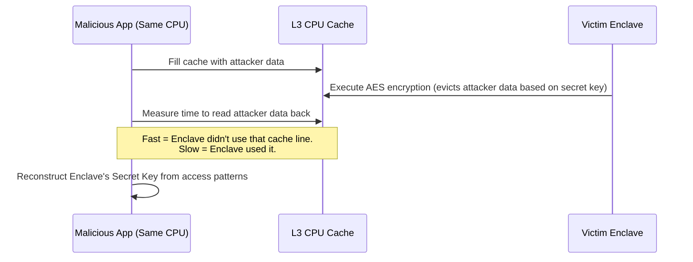

# 07 - Threat Modeling & Side-Channels

Trusted Execution Environments provide incredible security, but they are not magic. While the Hypervisor cannot read the Enclave's memory directly, it *shares* the underlying physical hardware (like CPU Caches). This opens the door to **Side-Channel Attacks**.

## 1. The Concept (ELI5)

Imagine you are trying to guess a co-worker's computer password. You cannot see their screen (the Enclave memory is encrypted). 

However, you *can* hear them typing on the keyboard. 
If they type the wrong first letter, the computer beeps immediately, and they stop typing (takes 1 second). 
If they get the first three letters right, but the fourth wrong, they type longer before the beep (takes 3 seconds). 

By measuring the **time** it takes for them to fail, you can guess the password letter by letter. 

In a CPU, the hypervisor can measure how long the Enclave takes to do things, or observe which parts of the CPU Cache are being filled, leaking cryptographic keys indirectly.

## 2. The Visual: Cache Timing Attack



## 3. The Code: Constant-Time Operations

To prevent side-channel attacks, code handling cryptographic secrets inside an enclave must run in **constant time**. It must take the exact same amount of time to execute, regardless of whether a password guess is correct or incorrect.

### ❌ Vulnerable Code (Early Exit String Comparison)

Standard string comparison operators (`==` or `!=`) exit as soon as they find a mismatch. This allows an attacker to measure the exact microsecond the function returns to guess how many characters were correct.

```python
# python
def verify_admin_token_vulnerable(user_token: bytes, secret_token: bytes) -> bool:
    # VULNERABILITY: '==' does an early exit.
    # If the first byte is wrong, it returns in 1ns.
    # If the first 10 bytes are right, it returns in 10ns.
    # The attacker can brute-force the token byte-by-byte.
    if user_token == secret_token:
        return True
    return False
```

### ✅ Production-Ready Secure Code (Timing-Safe Comparison)

Always use constant-time comparison functions provided by cryptographic libraries. They check every single byte even if the first one is a mismatch.

```python
# python
import hmac

def verify_admin_token_secure(user_token: bytes, secret_token: bytes) -> bool:
    if len(user_token) != len(secret_token):
        return False
        
    # hmac.compare_digest executes in constant time.
    # It takes the exact same amount of time regardless of where the mismatch occurs.
    # This prevents the hypervisor from learning the token via timing.
    return hmac.compare_digest(user_token, secret_token)
```

## 4. The Guardrail: Semgrep Rules for Timing Attacks

In a CI/CD pipeline, you can use Semgrep to statically analyze the codebase for insecure string comparisons involving secrets.

```yaml
# semgrep
rules:
  - id: avoid-timing-attacks-on-secrets
    patterns:
      - pattern-either:
          - pattern: $SECRET == $USER_INPUT
          - pattern: $USER_INPUT == $SECRET
          - pattern: $SECRET != $USER_INPUT
          - pattern: $USER_INPUT != $SECRET
      - metavariable-regex:
          metavariable: $SECRET
          regex: (.*token.*|.*password.*|.*key.*|.*secret.*)
    message: |
      SECURITY WARNING: Potential timing attack side-channel.
      Using '==' or '!=' to compare sensitive data allows attackers to guess 
      the secret via timing measurements. 
      Use a constant-time comparison like `hmac.compare_digest` or `crypto.timingSafeEqual`.
    languages:
      - python
    severity: ERROR
```
