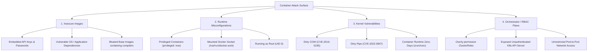
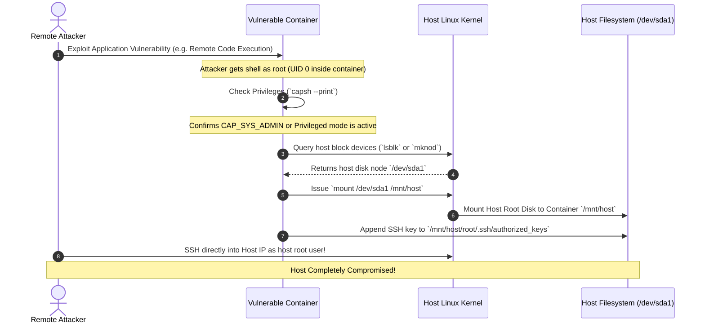

# 01. Overview & Linux Isolation Primitives

Containers are often mistakenly referred to as lightweight Virtual Machines (VMs). In reality, **containers are simply isolated Linux processes sharing the host operating system kernel**. 

Understanding container security requires a deep technical comprehension of how the Linux kernel isolates processes, where those boundaries break down, and how attackers leverage misconfigurations to execute container escapes.

> [!IMPORTANT]
> A **container breakout** occurs when an attacker inside a container bypasses kernel isolation boundaries to execute arbitrary code, read sensitive data, or gain root access directly on the host operating system.

---

## 1. Containers vs. Virtual Machines: Architectural Boundaries

To understand the attack surface, compare the virtualization boundary of Virtual Machines against the process boundary of Containers:

```
┌─────────────────────────────────────────┐   ┌─────────────────────────────────────────┐
│        VIRTUAL MACHINE ARCHITECTURE     │   │         CONTAINER ARCHITECTURE          │
├─────────────────────────────────────────┤   ├─────────────────────────────────────────┤
│ ┌─────────────┐         ┌─────────────┐ │   │ ┌─────────────┐         ┌─────────────┐ │
│ │ App A Code  │         │ App B Code  │ │   │ │ App A Code  │         │ App B Code  │ │
│ ├─────────────┤         ├─────────────┤ │   │ ├─────────────┤         ├─────────────┤ │
│ │ Guest OS A  │         │ Guest OS B  │ │   │ │ Binaries &  │         │ Binaries &  │ │
│ │ (Kernel A)  │         │ (Kernel B)  │ │   │ │ Libraries   │         │ Libraries   │ │
│ └──────┬──────┘         └──────┬──────┘ │   │ └──────┬──────┘         └──────┬──────┘ │
│        │                       │        │   │        │                       │        │
│ ┌──────▼───────────────────────▼──────┐ │   │        │ (Shared Syscalls)     │        │
│ │   Hypervisor (Type 1 / KVM / ESXi)  │ │   │        ▼                       ▼        │
│ └──────────────────┬──────────────────┘ │   │ ┌─────────────────────────────────────┐ │
│                    ▼                    │   │ │      Container Runtime (containerd)  │ │
│ ┌─────────────────────────────────────┐ │   │ └──────────────────┬──────────────────┘ │
│ │            Host Hardware            │ │   │                    ▼                    │
│ └─────────────────────────────────────┘ │   │ ┌─────────────────────────────────────┐ │
│                                         │   │ │    Host Linux Kernel (Shared Ops)     │ │
│                                         │   │ └─────────────────────────────────────┘ │
└─────────────────────────────────────────┘   └─────────────────────────────────────────┘
```

- **Virtual Machines:** Hypervisors enforce strict hardware-level isolation. Each VM executes its own independent operating system kernel. A vulnerability in Guest Kernel A cannot compromise Guest Kernel B unless a hypervisor breakout vulnerability exists.
- **Containers:** Every container on a host shares the **exact same host Linux kernel**. Isolation relies entirely on kernel software constructs (Namespaces, cgroups, Capabilities, and Seccomp). If an attacker inside container A exploits a host kernel vulnerability, the entire underlying host is compromised.

---

## 2. Deep Dive: The 4 Core Linux Isolation Primitives

Container runtimes like `docker` and `containerd` construct container isolation by orchestrating four primary Linux kernel features:

```
┌─────────────────────────────────────────────────────────────────────────────┐
│                   THE 4 LINUX KERNEL ISOLATION PRIMITIVES                   │
├───────────────────┬─────────────────────────────────────────────────────────┤
│ Primitive         │ Core Function & Isolation Mechanism                     │
├───────────────────┼─────────────────────────────────────────────────────────┤
│ **1. Namespaces** │ Virtualizes system resources so a process sees a private│
│                   │ copy of PID, Network, Filesystem, IPC, UTS, and Users.  │
├───────────────────┼─────────────────────────────────────────────────────────┤
│ **2. cgroups**    │ Enforces resource quotas (CPU, RAM, Disk I/O, PIDs) to   │
│                   │ prevent resource exhaustion and Denial of Service.      │
├───────────────────┼─────────────────────────────────────────────────────────┤
│ **3. Capabilities**│ Deconstructs the monolithic `root` power into 41 fine-  │
│                   │ grained permissions, enabling dropping dangerous ops.  │
├───────────────────┼─────────────────────────────────────────────────────────┤
│ **4. Seccomp**    │ Restricts which Linux system calls (syscalls) a process  │
│                   │ can issue directly to the host kernel.                  │
└───────────────────┴─────────────────────────────────────────────────────────┘
```

---

### A. Linux Namespaces (Process Visibility Isolation)

Linux **Namespaces** wrap global system resources into isolated abstractions. A process inside a namespace sees only the resources allocated to that namespace.

There are 7 primary Linux namespaces utilized by containers:

| Namespace | Identifier | Isolated System Resource | Security Impact if Shared (`host*` mode) |
| :--- | :--- | :--- | :--- |
| **PID** | `CLONE_NEWPID` | Process IDs and process tree hierarchy | Setting `hostPID: true` allows the container to view, trace (`ptrace`), and kill all host processes. |
| **NET** | `CLONE_NEWNET` | Network devices, IP addresses, route tables, sockets | Setting `hostNetwork: true` lets the container bind directly to host ports and sniff host network interfaces. |
| **MNT** | `CLONE_NEWNS` | File system mount points | Mounting host `/` gives the container full read/write access to host OS files. |
| **IPC** | `CLONE_NEWIPC` | Inter-Process Comm (System V IPC, POSIX message queues) | Setting `hostIPC: true` permits reading/writing to shared memory segments used by host processes. |
| **UTS** | `CLONE_NEWUTS` | Hostname and NIS domain name | Permits changing the host system's domain name or hostname. |
| **User** | `CLONE_NEWUSER` | User and Group IDs mapping | Unmapped container `root` (UID 0) equals host `root` (UID 0). User namespaces map container UID 0 to an unprivileged host UID (e.g. 100000). |
| **Cgroup** | `CLONE_NEWCGROUP` | Control Group root directory view | Prevents containers from inspecting or altering parent cgroup resource limits. |

---

### B. Control Groups (cgroups v1 & v2)

Control Groups (**cgroups**) throttle and monitor resource usage (CPU, memory, disk I/O, network bandwidth) for a collection of processes. Without cgroups, a single compromised container could consume 100% of host RAM and CPU, executing a Denial-of-Service (DoS) attack against all neighboring containers.

#### Key Security Limits:
1. **Memory Quotas (`memory.max`):** Restricts maximum RAM. When exceeded, the Linux Out-Of-Memory (**OOM Killer**) terminates the container process instead of crashing the host.
2. **CPU Quotas (`cpu.max`):** Restricts CPU bandwidth per period, preventing cryptomining or resource exhaustion.
3. **PID Limits (`pids.max`):** Restricts the maximum number of tasks inside the container cgroup. Crucial for mitigating **fork bombs**:
   ```bash
   # Classic bash fork bomb - mitigated by setting pids.max = 100
   :(){ :|:& };:
   ```

---

### C. Linux Capabilities (`CAP_SYS_ADMIN` Hazard)

Traditionally, Unix systems divided privileges into two categories: **unprivileged** (UID != 0) and **privileged** (UID = 0). 

Linux Capabilities break down monolithic `root` privilege into 41 distinct capability flags. Even if a process executes as UID 0 inside a container, it only possesses the capabilities granted to its process header.

#### High-Risk Capabilities Matrix:

> [!WARNING]
> Granting `CAP_SYS_ADMIN` to a container is functionally equivalent to handing out host root access. It enables mounting filesystems, creating block devices, and altering kernel settings.

| Capability | Privileges Granted | Container Breakout Vector |
| :--- | :--- | :--- |
| `CAP_SYS_ADMIN` | Overly broad system admin operations (mount, swap, namespaces) | Can mount host disks (`/dev/sda1`), load file systems, and execute host binaries. |
| `CAP_NET_ADMIN` | Network interface reconfiguration, promiscuous mode, IP spoofing | Can alter host routing tables, intercept internal traffic, and perform ARP spoofing. |
| `CAP_SYS_PTRACE` | Arbitrary process tracing via `ptrace` system call | Can inspect memory of host processes and inject shellcode into host binaries. |
| `CAP_SYS_MODULE` | Loading and unloading arbitrary Linux Kernel Modules (LKMs) | Can insert a malicious kernel rootkit directly into the host kernel. |
| `CAP_DAC_READ_SEARCH` | Bypasses file read permission checks and directory searches | Can read any file on the host filesystem regardless of permission settings. |
| `CAP_SYS_CHROOT` | Execution of `chroot` system call | Can breakout of `chroot` jail environments if unmasked. |

---

### D. Seccomp (Secure Computing Mode)

**Seccomp** (Secure Computing Mode) acts as a syscall firewall between user-space applications and the Linux kernel.

The x86_64 Linux kernel exposes over **350 system calls** (`sys_execve`, `sys_openat`, `sys_ptrace`, etc.). A typical web server container (Node.js, Nginx, Python) only requires ~40 to 60 system calls during its operation.

```
┌─────────────────────────────────────────────────────────────────────────────┐
│                          SECCOMP SYSTEM CALL FILTER                         │
├─────────────────────────────────────────────────────────────────────────────┤
│ Container Application Process (e.g. Node.js / Python)                      │
│   │                                                                         │
│   ├─► Required Syscall:  openat(), read(), write() ──► [ ALLOWED BY SECCOMP ]
│   │                                                                         │
│   └─► Dangerous Syscall: ptrace(), reboot(), kexec() ──► [ BLOCKED BY SECCOMP ]
│                                                                 │           │
│                                                                 ▼           │
│                                                         SIGSYS Signal Sent  │
│                                                         (Execution Denied)  │
└─────────────────────────────────────────────────────────────────────────────┘
```

#### Key Syscalls Blocked by Default Kubernetes/Docker Seccomp Profile:
- `ptrace`: Prevents process memory inspection and code injection.
- `sys_module` / `finit_module`: Blocks loading host kernel modules.
- `kexec_load`: Blocks loading a new kernel for execution.
- `reboot`: Prevents shutting down or restarting the host kernel.
- `unshare`: Blocks creation of new namespaces that could bypass restrictions.

---

## 3. Container Threat Landscape & Attack Vectors

Container security risks span multiple operational layers:



---

## 4. Container Breakout Workflow

The diagram below illustrates a classic privilege escalation and container breakout path when a pod runs with `privileged: true` or `CAP_SYS_ADMIN`:



---

*Next Chapter: [02. Hardened Dockerfiles & Image Security →](02-dockerfile-hardening.md)*
