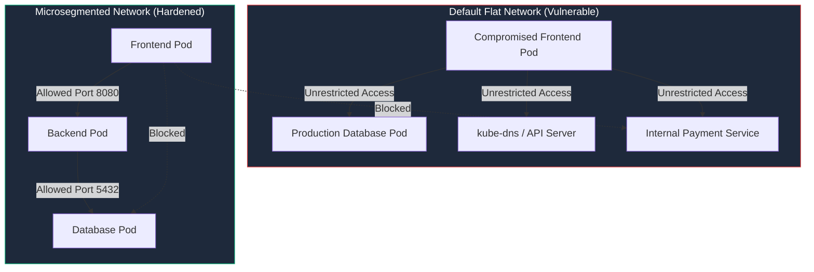

# 04. NetworkPolicies & RBAC Hardening

By default, Kubernetes implements an **unsegmented flat network model**: any Pod can communicate with any other Pod across all namespaces and nodes in the cluster. Furthermore, Kubernetes automatically mounts API access credentials into every running container. 

If an attacker compromises a single container on an unhardened cluster, they can perform lateral network scanning and query the Kubernetes API server using the auto-mounted ServiceAccount token.

---

## 1. Kubernetes Network Security & Microsegmentation

To mitigate lateral movement, Kubernetes uses **NetworkPolicies**—declarative packet filtering rules that specify how groups of Pods are allowed to communicate with each other and with other network endpoints.

> [!IMPORTANT]
> NetworkPolicies require a Container Network Interface (CNI) plugin that supports policy enforcement (e.g. **Calico**, **Cilium**, **Weave Net**). Default basic CNI plugins like Flannel ignore NetworkPolicy manifests.



---

### Step 1: Enforce "Default Deny All" Ingress & Egress

The foundational zero-trust pattern for Kubernetes networking is to apply a **Default Deny All** policy to every namespace. This blocks all incoming and outgoing traffic unless explicitly permitted by subsequent policies.

```yaml
# default-deny-all.yaml
apiVersion: networking.k8s.io/v1
kind: NetworkPolicy
metadata:
  name: default-deny-all
  namespace: production
spec:
  podSelector: {} # Empty selector selects ALL pods in the namespace
  policyTypes:
    - Ingress
    - Egress
```

---

### Step 2: Explicit Microsegmentation Policies

Once Default Deny is active, explicitly grant only required traffic paths:

#### A. Allow Ingress Traffic to Backend from Frontend Only
```yaml
# allow-frontend-to-backend.yaml
apiVersion: networking.k8s.io/v1
kind: NetworkPolicy
metadata:
  name: allow-frontend-to-backend
  namespace: production
spec:
  podSelector:
    matchLabels:
      app.kubernetes.io/tier: backend
  policyTypes:
    - Ingress
  ingress:
    - from:
        - podSelector:
            matchLabels:
              app.kubernetes.io/tier: frontend
      ports:
        - protocol: TCP
          port: 8080
```

#### B. Allow Egress Traffic from Backend to PostgreSQL Database Only
```yaml
# allow-backend-to-db.yaml
apiVersion: networking.k8s.io/v1
kind: NetworkPolicy
metadata:
  name: allow-backend-to-db
  namespace: production
spec:
  podSelector:
    matchLabels:
      app.kubernetes.io/tier: backend
  policyTypes:
    - Egress
  egress:
    - to:
        - podSelector:
            matchLabels:
              app.kubernetes.io/tier: database
      ports:
        - protocol: TCP
          port: 5432
```

#### C. Allow CoreDNS Egress Resolution
Pods must be permitted egress traffic to `kube-dns` on port 53 for internal domain name resolution:
```yaml
# allow-dns-egress.yaml
apiVersion: networking.k8s.io/v1
kind: NetworkPolicy
metadata:
  name: allow-dns-egress
  namespace: production
spec:
  podSelector: {}
  policyTypes:
    - Egress
  egress:
    - to:
        - namespaceSelector:
            matchLabels:
              kubernetes.io/metadata.name: kube-system
          podSelector:
            matchLabels:
              k8s-app: kube-dns
      ports:
        - protocol: UDP
          port: 53
        - protocol: TCP
          port: 53
```

---

## 2. Least Privilege RBAC & ServiceAccount Token Controls

Kubernetes Role-Based Access Control (**RBAC**) regulates operations on API server resources based on four primary entities:

```
┌─────────────────────────────────────────────────────────────────────────────┐
│                      KUBERNETES RBAC ARCHITECTURE                           │
├─────────────────────┬───────────────────────────────────────────────────────┤
│ Entity              │ Scope & Function                                      │
├─────────────────────┼───────────────────────────────────────────────────────┤
│ **ServiceAccount**  │ Identity assigned to a Pod for authenticating to API. │
├─────────────────────┼───────────────────────────────────────────────────────┤
│ **Role**            │ Defines set of permissions (verbs/resources) in 1 NS. │
├─────────────────────┼───────────────────────────────────────────────────────┤
│ **ClusterRole**     │ Defines cluster-wide permissions across all NS.       │
├─────────────────────┼───────────────────────────────────────────────────────┤
│ **RoleBinding**     │ Binds a Role or ClusterRole to a SA within 1 NS.      │
├─────────────────────┼───────────────────────────────────────────────────────┤
│ **ClusterRoleBinding**│ Binds a ClusterRole to a SA across ALL namespaces.  │
└─────────────────────┴───────────────────────────────────────────────────────┘
```

---

### Dangerous RBAC High-Risk Anti-Patterns

> [!WARNING]
> Never grant application ServiceAccounts permissions on `secrets`, `pods/exec`, `roles`, or `cluster-admin`. An attacker who compromises a container with `pods/exec` can execute arbitrary commands in any pod in the cluster.

| Permission / Pattern | Risk Level | Threat Vector |
| :--- | :--- | :--- |
| `resources: ["*"], verbs: ["*"]` | **CRITICAL** | Full cluster-admin takeover. |
| `resources: ["secrets"], verbs: ["get", "list"]` | **HIGH** | Exfiltrates database passwords, TLS keys, and tokens. |
| `resources: ["pods/exec"], verbs: ["create"]` | **CRITICAL** | Allows spawning interactive shells in neighboring pods. |
| `resources: ["roles", "rolebindings"], verbs: ["create"]` | **HIGH** | Permits privilege escalation by self-granting cluster-admin. |

---

### ServiceAccount Token Automount Control

By default, Kubernetes mounts a ServiceAccount JSON Web Token (JWT) at `/var/run/secrets/kubernetes.io/serviceaccount/token` inside every container.

If an application does not directly interact with the Kubernetes API server, **automounting MUST be disabled**.

```yaml
# Disable token automount at the ServiceAccount level
apiVersion: v1
kind: ServiceAccount
metadata:
  name: hardened-app-sa
  namespace: production
automountServiceAccountToken: false # Disables automatic token injection!
```

You can also explicitly disable it at the Pod specification level:
```yaml
apiVersion: apps/v1
kind: Deployment
metadata:
  name: secure-app
spec:
  template:
    spec:
      serviceAccountName: hardened-app-sa
      automountServiceAccountToken: false
      containers:
        - name: app
          image: myregistry.azurecr.io/appsec-atlas/api:v1.0.0
```

---

### Hardened Least-Privilege RBAC Manifest Example

If an application component (e.g. Config Reloader) requires read access to ConfigMaps, define a granular, namespace-scoped Role:

```yaml
# 1. Namespace-scoped ServiceAccount
apiVersion: v1
kind: ServiceAccount
metadata:
  name: config-viewer-sa
  namespace: production
automountServiceAccountToken: true

---
# 2. Granular Least-Privilege Role
apiVersion: rbac.authorization.k8s.io/v1
kind: Role
metadata:
  name: configmap-reader-role
  namespace: production
rules:
  - apiGroups: [""]
    resources: ["configmaps"]
    verbs: ["get", "list", "watch"] # Strictly read-only access!

---
# 3. RoleBinding scoped strictly to the production namespace
apiVersion: rbac.authorization.k8s.io/v1
kind: RoleBinding
metadata:
  name: bind-configmap-reader
  namespace: production
subjects:
  - kind: ServiceAccount
    name: config-viewer-sa
    namespace: production
roleRef:
  kind: Role
  name: configmap-reader-role
  apiGroup: rbac.authorization.k8s.io
```

---

## 3. Kubernetes API Server Security & Audit Logging

The API Server is the central management hub of the Kubernetes control plane. 

### A. API Server Hardening Rules
1. **Disable Anonymous Authentication:** Ensure `--anonymous-auth=false` is set on the kube-apiserver binary.
2. **Restrict API Server Public Access:** Limit API server ingress access to authorized admin bastion hosts or VPN CIDRs using firewall rules.
3. **Enforce OIDC Authentication:** Integrate external Identity Providers (Okta, Entra ID, Keycloak) for human cluster operators instead of using static tokens or client certificates.

### B. Kubernetes Audit Logging Policy

Kubernetes Audit Logging records every request received by the API server. Configure an audit policy file (`audit-policy.yaml`) to capture suspicious activities:

```yaml
# audit-policy.yaml
apiVersion: audit.k8s.io/v1
kind: Policy
rules:
  # 1. Log secret resource access at RequestResponse level
  - level: RequestResponse
    resources:
      - group: ""
        resources: ["secrets"]

  # 2. Log pod execution and port-forward events at Request level
  - level: Request
    resources:
      - group: ""
        resources: ["pods/exec", "pods/portforward"]

  # 3. Log all metadata changes to RBAC rules
  - level: Metadata
    resources:
      - group: "rbac.authorization.k8s.io"
        resources: ["roles", "rolebindings", "clusterroles", "clusterrolebindings"]

  # 4. Default policy for other requests
  - level: Metadata
    omitStages:
      - "RequestReceived"
```

---

*Next Chapter: [05. Runtime Threat Detection with Falco →](05-runtime-security-and-falco.md)*
