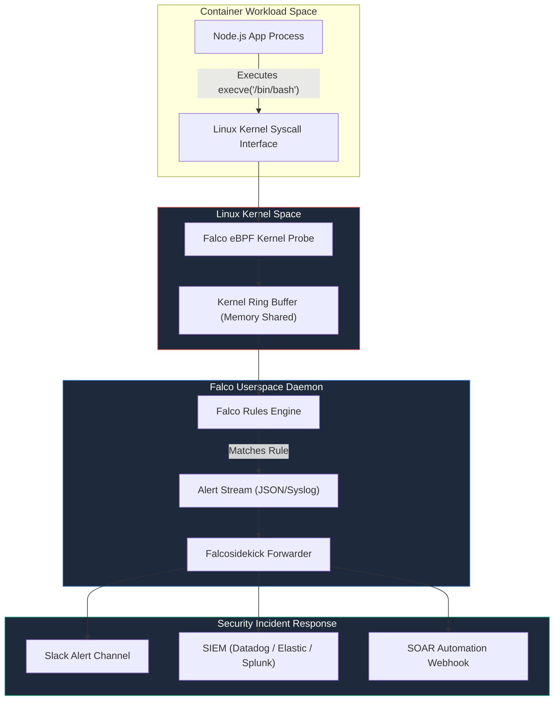

# 05. Runtime Threat Detection with Falco

Static vulnerability scanning and Pod Security Admission controls reduce build-time and deployment risks, but they cannot defend against zero-day exploits, compromised application credentials, or post-exploitation activities inside running containers.

**Runtime Security** provides continuous visibility into container process behavior, filesystem modifications, and network connections directly at the operating system kernel level.

---

## 1. Runtime Detection Mechanics: eBPF vs Kernel Modules

To detect runtime intrusions without introducing performance overhead or host instability, modern cloud-native security relies on **eBPF (Extended Berkeley Packet Filter)**.

```
┌─────────────────────────────────────────────────────────────────────────────┐
│                      EBPF VS LEGACY KERNEL MODULES                          │
├─────────────────────┬──────────────────────┬────────────────────────────────┤
│ Feature Attribute   │ Legacy Kernel Module │ eBPF (Extended BPF)            │
├─────────────────────┼──────────────────────┼────────────────────────────────┤
│ **Safety**          │ High risk: Bug causes│ **Safe**: In-kernel verifier   │
│                     │ host kernel panic.   │ guarantees no kernel crashes.  │
├─────────────────────┼──────────────────────┼────────────────────────────────┤
│ **Performance**     │ Moderate context-sw. │ **High**: Native JIT compiled  │
│                     │ overhead.            │ bytecode execution in kernel.  │
├─────────────────────┼──────────────────────┼────────────────────────────────┤
│ **Portability**     │ Requires kernel header│ Portable across Linux kernel   │
│                     │ compilation per OS.  │ versions (BTF enabled).        │
└─────────────────────┴──────────────────────┴────────────────────────────────┘
```

---

## 2. CNCF Falco Architecture

**Falco** is the de facto CNCF open-source runtime threat detection engine for Linux and Kubernetes. Falco parses system call trace points using eBPF probes, evaluates events against a declarative rules engine, and emits alerts when anomalies or security violations occur.



---

## 3. Writing Production-Grade Falco Rules

A Falco rule file consists of four primary components:
1. **`rule`**: A unique, human-readable identifier for the security event.
2. **`condition`**: A filtering expression evaluating event fields (`proc.name`, `container.id`, `fd.name`, `user.name`).
3. **`output`**: The formatted message string emitted when the condition evaluates to true.
4. **`priority`**: Severity level (`EMERGENCY`, `CRITICAL`, `ERROR`, `WARNING`, `NOTICE`, `INFO`).

---

### Rule 1: Detecting Interactive Shell Spawning in Container

Detects when an attacker leverages a Remote Code Execution (RCE) vulnerability to spawn an interactive terminal shell (`bash`, `sh`, `zsh`) inside a production container.

```yaml
# custom_falco_rules.yaml
- rule: Terminal Shell Spawned in Production Container
  desc: Detects interactive shell execution inside running containers
  condition: >
    spawned_process and 
    container and 
    proc.name in (bash, sh, zsh, ksh, csh) and 
    not user_expected_terminal_exec
  output: >
    🚨 CRITICAL: Interactive shell spawned inside container 
    (user=%user.name container_id=%container.id container_name=%container.name 
    image=%container.image.repository command=%proc.cmdline parent=%proc.pname)
  priority: CRITICAL
  tags: [container, shell, execution, mitre_execution]
```

---

### Rule 2: Unauthorized System Directory File Modification

Detects attempts to write to critical system directories (`/etc`, `/bin`, `/usr/bin`, `/sbin`) within a container filesystem.

```yaml
- rule: Write Below Binary or System Directories
  desc: Detects file creation or write attempts under system directories
  condition: >
    open_write and 
    container and 
    (fd.name startswith /bin/ or 
     fd.name startswith /usr/bin/ or 
     fd.name startswith /sbin/ or 
     fd.name startswith /etc/) and 
    not package_mgmt_processes
  output: >
    🚨 WARNING: Unauthorized file write attempt in system directory 
    (user=%user.name file=%fd.name process=%proc.name container=%container.name image=%container.image.repository)
  priority: ERROR
  tags: [filesystem, container, persistence, mitre_persistence]
```

---

### Rule 3: Package Manager Execution in Production

Detects execution of package managers (`apt-get`, `apk`, `yum`) in running containers—a common post-exploitation step where attackers download tools like `nmap` or `netcat`.

```yaml
- rule: Package Manager Executed in Container
  desc: Detects execution of package management utilities in running containers
  condition: >
    spawned_process and 
    container and 
    proc.name in (apt, apt-get, apk, yum, dnf, zypper)
  output: >
    🚨 NOTICE: Package manager executed inside production container 
    (user=%user.name command=%proc.cmdline container=%container.name image=%container.image.repository)
  priority: WARNING
  tags: [container, package_manager, mitre_defense_evasion]
```

---

### Rule 4: Kubernetes ServiceAccount Token Access by Non-System Process

Detects when an application binary attempts to read the auto-mounted ServiceAccount JWT token.

```yaml
- rule: Kubernetes ServiceAccount Token Read
  desc: Detects processes reading the Kubernetes ServiceAccount token
  condition: >
    open_read and 
    container and 
    fd.name startswith /var/run/secrets/kubernetes.io/serviceaccount/token and 
    not proc.name in (kubectl, coredns, kube-proxy)
  output: >
    🚨 HIGH: ServiceAccount token read by application process 
    (user=%user.name process=%proc.name cmdline=%proc.cmdline container=%container.name)
  priority: HIGH
  tags: [container, rbac, token_theft, mitre_credential_access]
```

---

### Rule 5: Container Breakout via Host Namespace Join (`nsenter`)

Detects attempts to execute `nsenter` to attach to host namespaces from inside a container.

```yaml
- rule: Namespace Escape via Nsenter
  desc: Detects execution of nsenter which can be used for container breakouts
  condition: >
    spawned_process and 
    container and 
    proc.name = nsenter
  output: >
    🚨 CRITICAL: Container breakout attempt using nsenter! 
    (user=%user.name cmdline=%proc.cmdline container=%container.name host=%server1)
  priority: EMERGENCY
  tags: [container, breakout, privilege_escalation, mitre_privilege_escalation]
```

---

## 4. Falco Deployment & Alert Forwarding Pipeline

Deploy Falco across all Kubernetes worker nodes using Helm with eBPF enabled:

```bash
# 1. Add Falco Helm repository
helm repo add falcosecurity https://falcosecurity.github.io/charts
helm repo update

# 2. Install Falco DaemonSet with eBPF driver and Falcosidekick integration
helm install falco falcosecurity/falco \
  --namespace falco \
  --create-namespace \
  --set driver.kind=ebpf \
  --set falcosidekick.enabled=true \
  --set falcosidekick.config.slack.webhookurl="https://hooks.slack.com/services/T000/B000/XXXX" \
  --set falcosidekick.config.datadog.apikey="112233445566778899"
```

### Sample `falcosidekick.yaml` Config Snippet:
```yaml
falcosidekick:
  config:
    slack:
      webhookurl: "https://hooks.slack.com/services/T000/B000/XXXX"
      minimumpriority: "warning"
      channel: "#sec-ops-alerts"
    datadog:
      apikey: "YOUR_DATADOG_API_KEY"
      site: "datadoghq.com"
    webhook:
      address: "https://soar.internal.net/api/v1/falco-events"
```

---

*Next Chapter: [06. Hands-On Vulnerability Lab →](06-hands-on-lab.md)*
