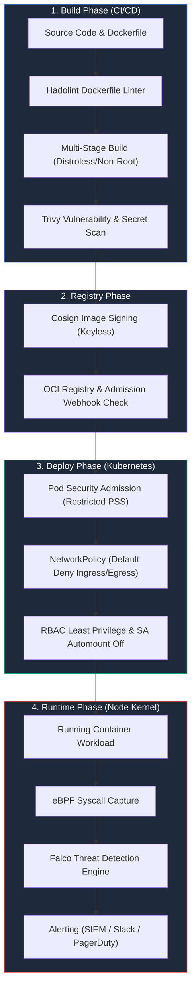

# Container & Kubernetes Security Guide

> [!NOTE]
> **Section:** ☁️ Cloud & Infrastructure Security  
> **Level:** Intermediate to Advanced  
> **Time to Complete:** ~90 minutes  
> **Prerequisites:** Fundamentals of Docker, Linux kernel basics, and Kubernetes API manifests  
> **Status:** ✅ Complete & Production-Ready

---

## 🎯 Overview & Learning Objectives

Containerization and Kubernetes orchestration have revolutionized modern application deployment. However, containers are **processes sharing the host kernel**, which introduces a broad attack surface across the entire container lifecycle—from insecure base images to overly permissive pod configurations and unsegmented cluster networks.

This guide delivers an enterprise-grade roadmap to securing containerized workloads across the build, shipping, deployment, and runtime phases.

By completing this module, you will be able to:

- [x] **Deconstruct Linux Isolation Primitives:** Understand how Namespaces, cgroups, Linux Capabilities (`CAP_SYS_ADMIN`), and Seccomp syscall filtering isolate processes and prevent host kernel compromise.
- [x] **Engineer Hardened Dockerfiles:** Implement multi-stage builds, distroless base images, non-root user execution, read-only root filesystems, and build-time secret mounts.
- [x] **Enforce Pod Security Standards (PSS):** Configure Kubernetes `securityContext` specs to satisfy the Restricted Pod Security Admission policy.
- [x] **Implement Network Microsegmentation & Least Privilege RBAC:** Deploy Default Deny NetworkPolicies, disable automounting ServiceAccount tokens, and eliminate excessive RBAC permissions.
- [x] **Deploy eBPF Runtime Threat Detection:** Write production-grade Falco rules to intercept container escapes, terminal shell execution, and unauthorized filesystem access in real time.
- [x] **Execute a Hands-On Vulnerability Lab:** Audit a vulnerable Kubernetes manifest, execute a privilege escalation container breakout exploit, and implement hardened defense-in-depth remediations.

---

## 📚 Module Navigation

1. **[01. Overview & Linux Isolation Primitives](01-introduction.md)** — Kernel isolation mechanics: Namespaces (PID, NET, MNT, IPC, UTS, User, Cgroup), cgroups resource limits, Linux Capabilities (`CAP_SYS_ADMIN` risk), Seccomp filtering, and container escape threat vectors.
2. **[02. Hardened Dockerfiles & Image Security](02-dockerfile-hardening.md)** — Multi-stage Dockerfiles, minimal distroless base images, non-root execution (`USER 65532`), read-only root filesystems, build secrets (`--mount=type=secret`), Trivy scanning, Hadolint linting, and Cosign image signing.
3. **[03. Kubernetes SecurityContext & Pod Standards](03-kubernetes-security-context.md)** — Kubernetes Pod Security Standards (Privileged, Baseline, Restricted), `securityContext` configuration, capability dropping (`drop: [ALL]`), `seccompProfile: RuntimeDefault`, and AppArmor integration.
4. **[04. NetworkPolicies & RBAC Hardening](04-network-policies-and-rbac.md)** — Kubernetes flat network hazards, Default Deny Ingress/Egress policies, ingress/egress microsegmentation rules, RBAC principle of least privilege, disabling `automountServiceAccountToken`, and API server audit policies.
5. **[05. Runtime Threat Detection with Falco](05-runtime-security-and-falco.md)** — eBPF kernel instrumentation vs kernel modules, CNCF Falco architecture, custom Falco rule development (detecting shells, unauthorized writes, token theft), and alert forwarding via `falcosidekick`.
6. **[06. Hands-On Vulnerability Lab](06-hands-on-lab.md)** — Complete runnable lab: Vulnerable Kubernetes Pod -> Container Breakout Exploit Script -> Falco Detection -> Hardened Restricted Manifest Remediation & Verification.
7. **[07. References & Security Standards](07-references.md)** — CIS Kubernetes & Docker Benchmarks, NIST SP 800-190, NSA/CISA K8s Guidance, MITRE ATT&CK for Containers, and recommended AppSec tooling.

---

## 🛡️ Container Security Lifecycle Architecture

Security must be embedded into every phase of the software delivery pipeline. The diagram below illustrates the defense-in-depth gates across the container lifecycle:

---

## 🔑 Key Security Controls Summary

| Security Domain | Core Risk | Primary Mitigations | Enforcement Tooling |
| :--- | :--- | :--- | :--- |
| **Linux Kernel Isolation** | Host takeover via container breakout | Namespaces, cgroup limits, Seccomp profiles, Capabilities drop | Linux Kernel, Seccomp-BPF |
| **Container Image Build** | Vulnerable packages, embedded secrets, root user | Multi-stage builds, Distroless images, `USER nonroot`, build secrets | Hadolint, Trivy, Cosign |
| **Pod Security Context** | Host access via privileged containers / setuid | `runAsNonRoot`, `allowPrivilegeEscalation: false`, `readOnlyRootFilesystem` | Kubernetes Pod Security Admission |
| **Cluster Networking** | Unrestricted lateral movement between Pods | Default Deny All NetworkPolicies, ingress/egress microsegmentation | Calico, Cilium |
| **Identity & Access** | API server compromise via leaked tokens | Least-privilege RBAC, `automountServiceAccountToken: false` | K8s RBAC, Audit Logs |
| **Runtime Detection** | Zero-day escapes, reverse shells, memory exploits | Real-time kernel syscall monitoring & rule-based alerting | Falco (eBPF), Falcosidekick |

---

*Begin reading: [01. Overview & Linux Isolation Primitives →](01-introduction.md)*
