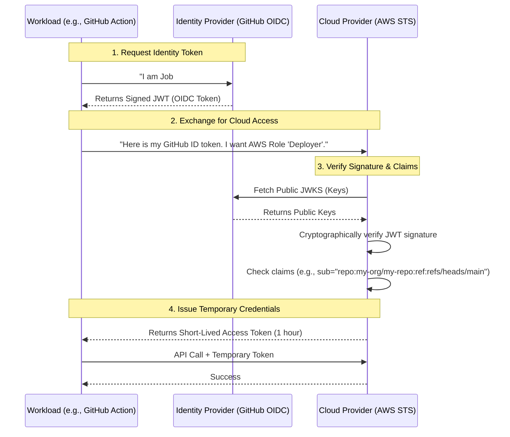

# Understanding OIDC Trust

## 1. The Concept (ELI5)

Imagine you are trying to buy alcohol at a bar. The bartender doesn't know you, so they don't know if you're old enough. Instead of bringing your mom to vouch for you (which would be weird), you show the bartender your government-issued ID card. 

The bartender looks at the ID and checks three things:
1. Is it issued by a trusted government entity? (The hologram and seal)
2. Does it belong to you? (The photo matches your face)
3. Are you over 21? (The birth date)

If all checks pass, they serve you. 

**OpenID Connect (OIDC)** works exactly like this for cloud infrastructure. 
Instead of a government ID, it's a **JSON Web Token (JWT)**.
Instead of a bartender, it's a **Cloud Provider (AWS/GCP/Azure)**.
Instead of the government, the issuer is an **Identity Provider (GitHub Actions, GitLab, Okta, etc.)**.

The external system (like GitHub Actions) gives your workload a digitally signed JWT. Your workload hands that JWT to AWS. AWS checks the digital signature (the "hologram") against GitHub's public keys. If the signature is valid, and the token is meant for AWS, AWS issues temporary access credentials. No static keys needed!

## 2. The Visual



## 3. The Code

Let's look at how you manually verify an OIDC token to understand what the cloud provider does under the hood. Normally, the cloud provider's STS (Security Token Service) handles this, but seeing the code demystifies the process.

### Vulnerable Code ❌ (Trusting Unverified JWTs)

**TypeScript (Node.js):**
```typescript
import jwt from 'jsonwebtoken';

// ❌ BAD: Decoding a JWT without verifying its cryptographic signature!
// An attacker can forge a token that says they are anyone.
function insecureTokenExchange(incomingJwt: string) {
    // jwt.decode simply parses the base64 JSON, ignoring the signature.
    const decoded = jwt.decode(incomingJwt);
    
    if (decoded && decoded.sub === "trusted-workload") {
        console.log("Access Granted based on unverified claim!");
        return issueTemporaryCloudToken();
    }
    throw new Error("Access Denied");
}
```

### Production-Ready Secure Code ✅ (Verifying OIDC Signatures and Claims)

**TypeScript (Node.js using `jwks-rsa`):**
```typescript
import jwt from 'jsonwebtoken';
import jwksClient from 'jwks-rsa';

// ✅ GOOD: Cryptographically verify the token against the Issuer's public keys.
const client = jwksClient({
  jwksUri: 'https://token.actions.githubusercontent.com/.well-known/jwks.json'
});

function getKey(header: jwt.JwtHeader, callback: jwt.SigningKeyCallback) {
  client.getSigningKey(header.kid, function(err, key) {
    if (err || !key) return callback(err);
    const signingKey = key.getPublicKey();
    callback(null, signingKey);
  });
}

export function secureTokenExchange(incomingJwt: string) {
    const options: jwt.VerifyOptions = {
        audience: 'sts.amazonaws.com', // Must be intended for our cloud provider
        issuer: 'https://token.actions.githubusercontent.com' // Must come from expected IdP
    };

    jwt.verify(incomingJwt, getKey, options, (err, decoded) => {
        if (err) {
            console.error("Token verification failed:", err.message);
            throw new Error("Unauthorized");
        }
        
        // Furthermore, explicitly check the subject claim!
        if (decoded && decoded.sub === "repo:my-org/production-repo:ref:refs/heads/main") {
            console.log("Token signature and claims verified. Granting access.");
            // Return temporary cloud credentials
        } else {
            throw new Error("Unauthorized Subject");
        }
    });
}
```

## 4. The Guardrail

When configuring OIDC trust, the most common catastrophic mistake is the **"Confused Deputy"** problem—configuring the trust relationship to accept tokens from the correct Identity Provider (e.g., GitHub), but failing to filter by the specific subject (e.g., your specific repository). If you don't filter the subject, *any* GitHub repository in the world can assume your cloud role.

### Semgrep Rule

Use this Semgrep rule to detect AWS IAM roles configured for OIDC trust that lack a strict condition on the `sub` (subject) claim in Terraform.

**`oidc_trust_missing_subject.yaml`:**
```yaml
rules:
  - id: terraform-aws-iam-oidc-missing-subject-condition
    patterns:
      - pattern-inside: |
          data "aws_iam_policy_document" $ANY {
            ...
          }
      - pattern-inside: |
          statement {
            actions = ["sts:AssumeRoleWithWebIdentity"]
            ...
          }
      - pattern-not-inside: |
          condition {
            test     = "StringEquals"
            variable = "...:sub"
            ...
          }
      - pattern-not-inside: |
          condition {
            test     = "StringLike"
            variable = "...:sub"
            ...
          }
    message: |
      SECURITY ALERT: OIDC Trust relationship found without a condition on the 'sub' (subject) claim.
      This leads to the Confused Deputy vulnerability, allowing any tenant of the OIDC provider 
      to assume this role. You must restrict the condition to your specific workload/repository.
    languages:
      - hcl
    severity: ERROR
```
