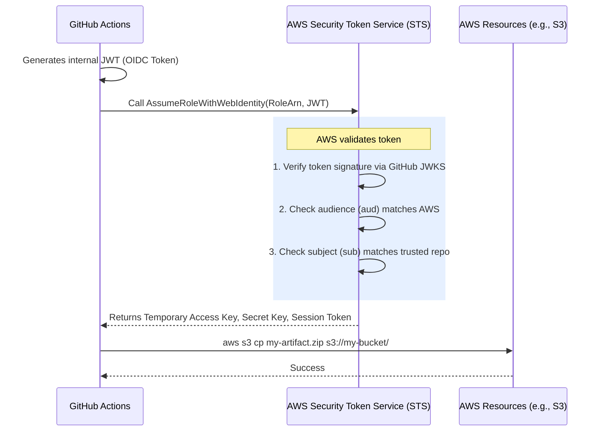

# AWS OIDC Federation

## 1. The Concept (ELI5)

Think of AWS Identity and Access Management (IAM) as the bouncer at an exclusive club. Normally, you need a VIP membership card (an AWS Access Key) to get in. If you lose that card, anyone who finds it can enter the club and order expensive drinks on your tab.

With **AWS OIDC Federation**, you tell the bouncer: "Hey, I don't want to carry a VIP card anymore. But you see that other club across the street (like GitHub or GitLab)? They check people's IDs very strictly. If someone comes over here wearing a certified wristband from *that* club, let them in for an hour."

AWS IAM sets up an **Identity Provider** configuration. When your external workload presents its JWT (the wristband), AWS verifies the cryptographic signature using the external provider's public keys. If valid, AWS uses `sts:AssumeRoleWithWebIdentity` to hand back temporary, short-lived session credentials.

## 2. The Visual



## 3. The Code

When your infrastructure is configured correctly, your application code doesn't need to know anything about OIDC. The AWS SDKs automatically detect the web identity tokens if standard environment variables are set.

### Vulnerable Code ❌ (Using AWS Access Keys)

**Python (Hardcoded/Env Vars):**
```python
import os
import boto3

# ❌ BAD: Relying on static access keys from environment variables.
# These keys are often permanent and a huge risk if leaked.
aws_access_key = os.environ.get('AWS_ACCESS_KEY_ID')
aws_secret_key = os.environ.get('AWS_SECRET_ACCESS_KEY')

client = boto3.client(
    'ec2',
    aws_access_key_id=aws_access_key,
    aws_secret_access_key=aws_secret_key
)
```

### Production-Ready Secure Code ✅ (Default Credential Chain via Web Identity)

**Python:**
```python
import boto3

# ✅ GOOD: Rely entirely on the default credential provider chain.
# When AWS_WEB_IDENTITY_TOKEN_FILE and AWS_ROLE_ARN are present in the environment,
# boto3 automatically calls AssumeRoleWithWebIdentity behind the scenes.
client = boto3.client('ec2')

def list_instances():
    response = client.describe_instances()
    return response
```

For this to work, your environment simply needs to set:
```bash
export AWS_ROLE_ARN="arn:aws:iam::123456789012:role/MyFederatedRole"
export AWS_WEB_IDENTITY_TOKEN_FILE="/path/to/oidc/token"
```
(Note: CI/CD systems like GitHub Actions or GitLab CI manage these variables automatically when using their respective AWS auth actions).

## 4. The Guardrail

The critical infrastructure setup requires establishing the OIDC Provider in AWS and creating an IAM Role with a very strict Trust Policy.

### Terraform Guardrail for AWS OIDC

**`aws_oidc_setup.tf`:**

```hcl
# 1. Register the OIDC Provider (e.g., GitHub Actions)
resource "aws_iam_openid_connect_provider" "github" {
  url             = "https://token.actions.githubusercontent.com"
  client_id_list  = ["sts.amazonaws.com"]
  
  # Thumbprint for GitHub's certificate
  thumbprint_list = ["6938fd4d98bab03faadb97b34396831e3780aea1"]
}

# 2. Create the Trust Policy (The Guardrail)
data "aws_iam_policy_document" "github_assume_role" {
  statement {
    effect  = "Allow"
    actions = ["sts:AssumeRoleWithWebIdentity"]

    principals {
      type        = "Federated"
      identifiers = [aws_iam_openid_connect_provider.github.arn]
    }

    # 🛑 CRITICAL GUARDRAIL: Prevent Confused Deputy 
    # Without this, ANY GitHub repo can assume this role!
    condition {
      test     = "StringEquals"
      variable = "token.actions.githubusercontent.com:aud"
      values   = ["sts.amazonaws.com"]
    }

    condition {
      test     = "StringLike"
      variable = "token.actions.githubusercontent.com:sub"
      # ONLY allow the specific organization and repository
      values   = ["repo:my-organization/my-secure-app:*"]
    }
  }
}

# 3. Create the Role
resource "aws_iam_role" "github_deploy_role" {
  name               = "github-actions-deploy-role"
  assume_role_policy = data.aws_iam_policy_document.github_assume_role.json
}
```

By ensuring the `StringLike` condition strictly filters the `sub` claim, you create a robust, keyless deployment architecture that is immune to external hijacking.
