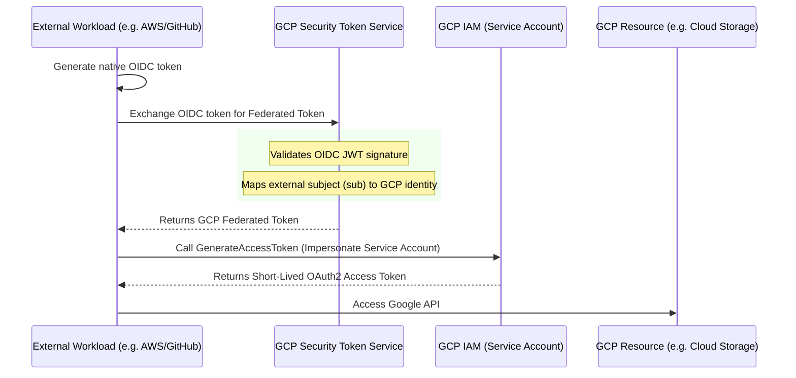

# GCP Workload Identity Federation

## 1. The Concept (ELI5)

In Google Cloud Platform (GCP), the traditional way to grant a machine access is by generating a Service Account JSON key. This key is basically a text file containing an RSA private key. If a developer accidentally commits this JSON file to a public repository, bad actors will compromise your GCP environment in seconds.

**GCP Workload Identity Federation (WIF)** allows you to throw away those JSON keys. 

Imagine you work for a company in Europe, and you visit a partner company in Japan. Instead of making you fill out forms to get a Japanese employee badge (the JSON key), the Japanese company's security system is linked to your European company's system. You just swipe your normal European badge, the system talks to your home office to verify you, and the doors open. 

GCP WIF lets an external workload (like an AWS EC2 instance, an on-premise server, or a CI/CD pipeline) present its own identity token to GCP. GCP verifies the token against the external provider and maps that external identity to a Google Cloud Service Account, issuing a short-lived Google access token.

## 2. The Visual



## 3. The Code

Unlike AWS which relies heavily on environment variables directly triggering STS, GCP uses a special configuration file (a Credential Configuration file, not a private key) that tells the GCP SDK *how* to fetch the federated token. 

### Vulnerable Code ❌ (Using Static JSON Keys)

**Go:**
```go
package main

import (
	"context"
	"log"

	"cloud.google.com/go/storage"
	"google.golang.org/api/option"
)

func main() {
	ctx := context.Background()
	// ❌ BAD: Loading a highly sensitive static private key from disk.
	client, err := storage.NewClient(ctx, option.WithCredentialsFile("/secrets/my-service-account.json"))
	if err != nil {
		log.Fatalf("Failed to create client: %v", err)
	}
	// Use client...
}
```

### Production-Ready Secure Code ✅ (Using Workload Identity Federation)

**Go:**
```go
package main

import (
	"context"
	"log"

	"cloud.google.com/go/storage"
)

func main() {
	ctx := context.Background()
	// ✅ GOOD: Implicitly uses Google Application Default Credentials (ADC).
	// When GOOGLE_APPLICATION_CREDENTIALS points to a WIF configuration file,
	// the Go SDK handles the entire OIDC exchange process automatically.
	client, err := storage.NewClient(ctx)
	if err != nil {
		log.Fatalf("Failed to create client: %v", err)
	}
	// Use client...
}
```

To make the above secure code work, you set:
`export GOOGLE_APPLICATION_CREDENTIALS="/path/to/wif-config.json"`

*Note: The WIF config file contains NO secrets. It merely contains the GCP Project Number, Pool ID, Provider ID, and the path where the external token can be read.*

## 4. The Guardrail

In GCP, setting up WIF involves creating a Workload Identity Pool, a Provider, and granting the external identity permission to impersonate a GCP Service Account. 

The critical security control is the **attribute mapping** and **attribute condition**.

### Terraform Guardrail for GCP WIF

**`gcp_wif_setup.tf`:**

```hcl
# 1. Create a Workload Identity Pool
resource "google_iam_workload_identity_pool" "github_pool" {
  workload_identity_pool_id = "github-actions-pool"
  display_name              = "GitHub Actions Pool"
  description               = "Identity pool for GitHub Actions deployments"
}

# 2. Create the Identity Provider within the Pool
resource "google_iam_workload_identity_pool_provider" "github_provider" {
  workload_identity_pool_id          = google_iam_workload_identity_pool.github_pool.workload_identity_pool_id
  workload_identity_pool_provider_id = "github-provider"
  
  # Map claims from the GitHub JWT to Google attributes
  attribute_mapping = {
    "google.subject"       = "assertion.sub"
    "attribute.actor"      = "assertion.actor"
    "attribute.repository" = "assertion.repository"
  }

  # 🛑 CRITICAL GUARDRAIL: Attribute Condition
  # If you do not include this condition, ANY GitHub repository 
  # can authenticate to your pool. You MUST restrict it.
  attribute_condition = "assertion.repository == 'my-org/my-repo'"

  oidc {
    issuer_uri = "https://token.actions.githubusercontent.com"
  }
}

# 3. Allow the external identity to impersonate the GCP Service Account
resource "google_service_account_iam_member" "workload_identity_user" {
  service_account_id = google_service_account.deploy_sa.name
  role               = "roles/iam.workloadIdentityUser"
  
  # Bind specifically to the repository attribute defined above
  member = "principalSet://iam.googleapis.com/${google_iam_workload_identity_pool.github_pool.name}/attribute.repository/my-org/my-repo"
}
```

This ensures that only traffic originating from the specified GitHub repository is allowed to exchange tokens and access GCP resources.
