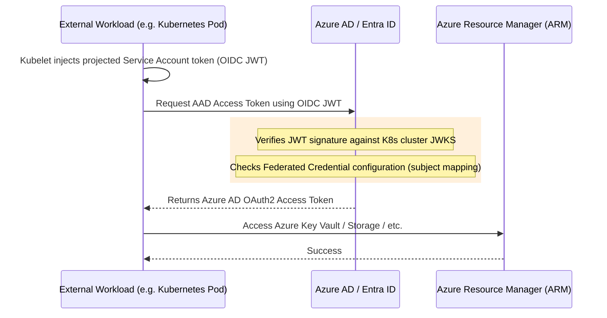

# Azure AD Workload Identity

## 1. The Concept (ELI5)

In the Azure ecosystem, automated services usually authenticate using a Service Principal (which acts like a user account for a machine). To prove they are that Service Principal, machines historically used either a Client Secret (a very long, static password) or a static Certificate. Both can be stolen, leaked, or expire unexpectedly, causing production outages.

**Azure AD (Entra ID) Workload Identity Federation** introduces OIDC trust to Microsoft Azure. 

Imagine you have a locker at a gym. Normally, you need a physical key to open it (Client Secret). Azure Workload Identity changes the lock to a smart facial-recognition system. The system checks the gym's master database (Identity Provider). You just stand in front of it (presenting your OIDC token), the system verifies your identity dynamically, and the locker opens. No keys to lose.

With Azure, you configure a Federated Identity Credential on an Azure AD Application. Azure will trust an external IdP (like GitHub, GitLab, or a Kubernetes cluster) to issue tokens for a specific subject, allowing that external workload to seamlessly access Azure Resources.

## 2. The Visual



## 3. The Code

When using modern Azure SDKs (usually starting with `@azure/identity` in TS, or `Azure.Identity` in C#), the code automatically handles Workload Identity Federation without any hardcoded credentials.

### Vulnerable Code ❌ (Using Client Secrets)

**TypeScript (Node.js):**
```typescript
import { ClientSecretCredential } from "@azure/identity";
import { KeyClient } from "@azure/keyvault-keys";

// ❌ BAD: Relying on a hardcoded or statically provided Client Secret.
// If leaked, an attacker can access your Azure environment.
const tenantId = process.env.AZURE_TENANT_ID!;
const clientId = process.env.AZURE_CLIENT_ID!;
const clientSecret = process.env.AZURE_CLIENT_SECRET!; // <-- The dangerous part

const credential = new ClientSecretCredential(tenantId, clientId, clientSecret);
const client = new KeyClient("https://my-keyvault.vault.azure.net", credential);
```

### Production-Ready Secure Code ✅ (Using DefaultAzureCredential)

**TypeScript (Node.js):**
```typescript
import { DefaultAzureCredential } from "@azure/identity";
import { KeyClient } from "@azure/keyvault-keys";

// ✅ GOOD: DefaultAzureCredential automatically detects the federated 
// environment variables (AZURE_CLIENT_ID, AZURE_TENANT_ID, AZURE_FEDERATED_TOKEN_FILE)
// and handles the token exchange dynamically. No secrets required!
const credential = new DefaultAzureCredential();

const client = new KeyClient("https://my-keyvault.vault.azure.net", credential);

async function getKeys() {
    for await (const keyProperties of client.listPropertiesOfKeys()) {
        console.log(`Key Name: ${keyProperties.name}`);
    }
}
```

## 4. The Guardrail

In Azure, the security boundary is the **Federated Identity Credential** attached to the Application / Service Principal. 

### Terraform Guardrail for Azure Workload Identity

**`azure_federation.tf`:**

```hcl
data "azuread_client_config" "current" {}

# 1. Create the Azure AD Application
resource "azuread_application" "github_deploy_app" {
  display_name = "github-actions-deploy"
}

# 2. Create the Service Principal
resource "azuread_service_principal" "github_deploy_sp" {
  client_id = azuread_application.github_deploy_app.client_id
}

# 3. Create the Federated Identity Credential
resource "azuread_application_federated_identity_credential" "github_federation" {
  application_id = azuread_application.github_deploy_app.id
  display_name   = "github-actions-federation"
  description    = "Deployments from GitHub Actions"
  
  # External IdP Audience
  audiences      = ["api://AzureADTokenExchange"]
  
  # External IdP Issuer URL
  issuer         = "https://token.actions.githubusercontent.com"
  
  # 🛑 CRITICAL GUARDRAIL: The Subject claim
  # This string must EXACTLY match the format provided by the external IdP.
  # For GitHub, it must be scoped to the specific repo and branch/environment.
  # If left as a wildcard (which Azure currently blocks by default, thankfully),
  # it would lead to a confused deputy exploit.
  subject        = "repo:my-organization/my-azure-app:ref:refs/heads/main"
}
```

By ensuring the `subject` accurately scopes down access to a specific branch of a specific repository, Azure will explicitly reject tokens generated by other repositories or malicious tenants.
