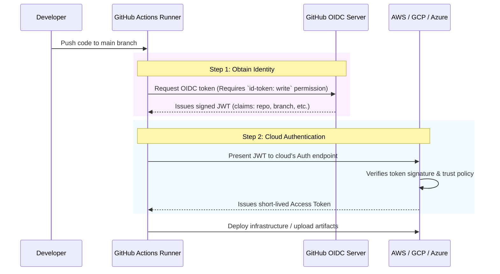

# GitHub Actions to Cloud Trust

## 1. The Concept (ELI5)

In previous chapters, we looked at how Cloud Providers (AWS, GCP, Azure) are configured to *receive* and *verify* OIDC tokens. But how do we actually *send* those tokens from our CI/CD pipeline?

Imagine you are applying for a passport. You go to a government office, prove who you are, and they print a highly secure document with your name and face on it. 

In a CI/CD pipeline, **GitHub Actions** is that government office. When a job runs, GitHub automatically spins up a virtual machine. If you configure it correctly, the GitHub Actions runner will dynamically request an OIDC JWT (the passport) from GitHub's internal identity server. This JWT contains cryptographic claims that prove exactly who is running the job (e.g., "I am Organization X, Repository Y, running on Branch Z").

Your pipeline then simply passes this JWT to the cloud provider's authentication action, which handles the complex token exchange we learned about earlier.

## 2. The Visual



## 3. The Code

The true beauty of OIDC in GitHub Actions is that the heavy lifting is handled by official actions provided by AWS, GCP, and Azure. 

### Vulnerable Code ❌ (Using Secrets)

**`.github/workflows/deploy.yml`:**
```yaml
name: Vulnerable Deploy
on: [push]

jobs:
  deploy:
    runs-on: ubuntu-latest
    steps:
      - uses: actions/checkout@v4
      
      # ❌ BAD: Passing long-lived static secrets into the pipeline.
      # If these leak via logs or a compromised dependency, game over.
      - name: Configure AWS Credentials
        uses: aws-actions/configure-aws-credentials@v4
        with:
          aws-access-key-id: ${{ secrets.AWS_ACCESS_KEY_ID }}
          aws-secret-access-key: ${{ secrets.AWS_SECRET_ACCESS_KEY }}
          aws-region: us-east-1
```

### Production-Ready Secure Code ✅ (Keyless OIDC)

**`.github/workflows/deploy.yml`:**
```yaml
name: Secure Keyless Deploy
on: [push]

# 🛑 CRITICAL: You MUST grant the job permission to request the OIDC token.
permissions:
  id-token: write   # Required to fetch the OIDC token from GitHub
  contents: read    # Required to checkout the code

jobs:
  deploy:
    runs-on: ubuntu-latest
    steps:
      - uses: actions/checkout@v4
      
      # ✅ GOOD: No static secrets! We only provide the Role ARN.
      # The action automatically fetches the GitHub OIDC token and 
      # exchanges it with AWS STS for temporary credentials.
      - name: Configure AWS Credentials via OIDC
        uses: aws-actions/configure-aws-credentials@v4
        with:
          role-to-assume: arn:aws:iam::123456789012:role/github-actions-deploy-role
          aws-region: us-east-1
          
      - name: Verify Identity
        run: aws sts get-caller-identity
```

**For GCP (`google-github-actions/auth`):**
```yaml
      - name: Authenticate to Google Cloud
        uses: google-github-actions/auth@v2
        with:
          workload_identity_provider: 'projects/123456789/locations/global/workloadIdentityPools/github-pool/providers/github-provider'
          service_account: 'deploy-sa@my-project.iam.gserviceaccount.com'
```

**For Azure (`azure/login`):**
```yaml
      - name: Azure Login
        uses: azure/login@v2
        with:
          client-id: ${{ secrets.AZURE_CLIENT_ID }} # Non-sensitive ID
          tenant-id: ${{ secrets.AZURE_TENANT_ID }} # Non-sensitive ID
          subscription-id: ${{ secrets.AZURE_SUBSCRIPTION_ID }} # Non-sensitive ID
```

## 4. The Guardrail

The primary guardrail here is ensuring that developers do not accidentally (or maliciously) revert to using static secrets in their pipelines.

### Semgrep Rule (Blocking hardcoded cloud actions secrets)

You can scan your `.github/workflows/` directory to strictly enforce the usage of OIDC and ban the use of static access keys in the `configure-aws-credentials` action.

**`github_actions_require_oidc.yaml`:**
```yaml
rules:
  - id: github-actions-aws-require-oidc
    patterns:
      - pattern-inside: |
          uses: aws-actions/configure-aws-credentials@...
          with:
            ...
      - pattern: |
          aws-access-key-id: ...
    message: |
      SECURITY VIOLATION: Using static AWS Access Keys is prohibited.
      You must use Workload Identity Federation (OIDC) by specifying 'role-to-assume' 
      and granting 'id-token: write' permissions to the job.
    languages:
      - yaml
    severity: ERROR
```
