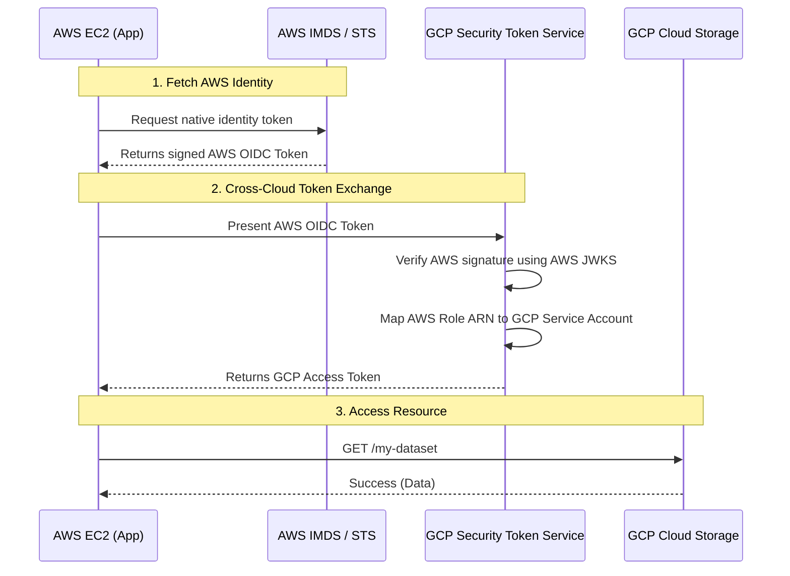

# Cross-Cloud Mesh Trust

## 1. The Concept (ELI5)

We've covered how to let an external CI/CD system (GitHub) talk to a cloud provider without static keys. But what happens when **Cloud A needs to talk directly to Cloud B**?

For example, imagine you have a web application running on Amazon EC2 (AWS) that needs to read a dataset stored in Google Cloud Storage (GCP). 

Historically, developers would generate a GCP JSON Service Account key and save it as an AWS Secrets Manager secret. The AWS app would fetch the secret at runtime to authenticate to GCP. While better than a hardcoded file, it's still a static key that can be leaked or requires rotation.

**Cross-Cloud Mesh Trust** allows you to leverage the native identity of Cloud A to seamlessly authenticate to Cloud B. 

Imagine two countries: Country A (AWS) and Country B (GCP). Country A issues highly secure digital passports to its citizens (EC2 instances get AWS IAM Instance Profiles). Instead of forcing citizens to apply for a visa (a static key) to visit Country B, Country B simply recognizes Country A's passports. 

When your AWS EC2 instance wants to access GCP, it requests its own internal AWS OIDC token (from the AWS Metadata Service), hands it to GCP's Workload Identity Federation, and GCP grants access. Zero secrets stored. Zero keys to rotate.

## 2. The Visual



## 3. The Code

To implement this securely, your application uses the cloud provider SDKs configured for federation.

### Vulnerable Code ❌ (Passing Keys Across Clouds)

**Python (AWS to GCP):**
```python
import boto3
from google.oauth2 import service_account
from google.cloud import storage
import json

# ❌ BAD: Fetching a static GCP JSON key from AWS Secrets Manager.
# The key still exists, can be leaked, and requires manual rotation.
secrets_client = boto3.client('secretsmanager')
response = secrets_client.get_secret_value(SecretId='gcp-service-account-key')
gcp_credentials_dict = json.loads(response['SecretString'])

creds = service_account.Credentials.from_service_account_info(gcp_credentials_dict)
storage_client = storage.Client(credentials=creds)
```

### Production-Ready Secure Code ✅ (AWS to GCP via WIF)

When configured correctly via a WIF config file, the application code requires zero knowledge of AWS or GCP's complex trust relationships.

**Python (AWS to GCP):**
```python
import os
from google.cloud import storage

# ✅ GOOD: Relying on Application Default Credentials (ADC).
# On the EC2 instance, GOOGLE_APPLICATION_CREDENTIALS points to a JSON config file.
# The Google SDK reads the config, asks the local AWS IMDS for an AWS token,
# and automatically exchanges it with GCP. Absolutely NO secrets are used.

# Ensure this env var is set:
# os.environ["GOOGLE_APPLICATION_CREDENTIALS"] = "/etc/gcp/aws-wif-config.json"

def read_gcp_bucket():
    # The client handles the cross-cloud token exchange transparently
    storage_client = storage.Client()
    bucket = storage_client.bucket("my-cross-cloud-dataset")
    blob = bucket.blob("data.json")
    print(blob.download_as_text())
```

## 4. The Guardrail

The crucial step is creating the trust relationship in the destination cloud. In this scenario, we configure GCP to trust the AWS account and specific IAM Role.

### Terraform Guardrail (GCP trusting AWS)

**`aws_to_gcp_trust.tf`:**

```hcl
# 1. Create a Workload Identity Pool in GCP
resource "google_iam_workload_identity_pool" "aws_pool" {
  workload_identity_pool_id = "aws-cross-cloud-pool"
  display_name              = "AWS Cross Cloud Pool"
}

# 2. Create the AWS Provider within the Pool
resource "google_iam_workload_identity_pool_provider" "aws_provider" {
  workload_identity_pool_id          = google_iam_workload_identity_pool.aws_pool.workload_identity_pool_id
  workload_identity_pool_provider_id = "aws-provider"
  
  # Map AWS attributes to GCP attributes
  attribute_mapping = {
    "google.subject" = "assertion.arn"
    "attribute.aws_account" = "assertion.account"
  }

  # 🛑 CRITICAL GUARDRAIL: Restrict to specific AWS Role ARN
  # If omitted, ANY valid AWS account in the world could try to authenticate!
  attribute_condition = "assertion.arn == 'arn:aws:iam::123456789012:role/my-ec2-app-role'"

  aws {
    account_id = "123456789012"
  }
}

# 3. Grant the AWS identity access to impersonate a GCP Service Account
resource "google_service_account_iam_member" "aws_wif_user" {
  service_account_id = google_service_account.gcp_target_sa.name
  role               = "roles/iam.workloadIdentityUser"
  
  # Bind to the mapped subject
  member = "principalSet://iam.googleapis.com/${google_iam_workload_identity_pool.aws_pool.name}/attribute.aws_account/123456789012"
}
```

By explicitly mapping and enforcing the `assertion.arn` (the specific AWS Role ARN), you ensure that only the exact EC2 instances running your application are authorized to cross the cloud boundary.
