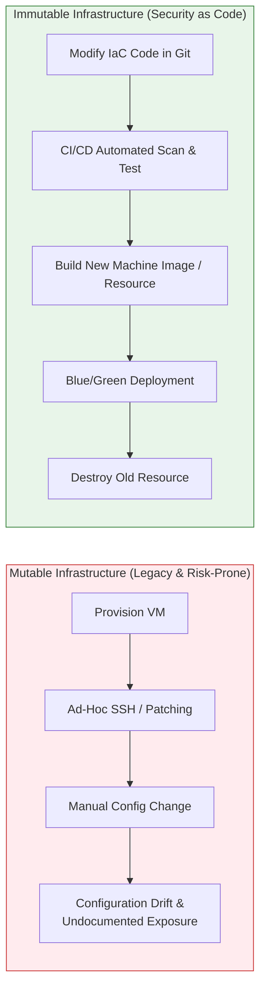
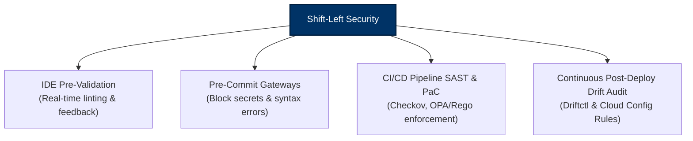

# 01 - Introduction to IaC Security & Threat Landscape

Infrastructure as Code (IaC) has fundamentally transformed modern software delivery. By replacing manual cloud console clicks ("Click-Ops") and ad-hoc shell scripts with declarative definition files, organizations can provision entire multi-region cloud environments, Kubernetes clusters, and serverless architectures within minutes.

However, while IaC delivers unmatched agility and scalability, it also introduces a critical security paradigm: **software bugs are now cloud infrastructure vulnerabilities**. A single misconfiguration written into a Terraform module or CloudFormation template can instantly deploy hundreds of publicly accessible storage buckets, unencrypted databases, or administrative IAM roles across production accounts.

---

## 🛠️ What is Infrastructure as Code (IaC)?

IaC is the practice of defining, provisioning, and managing IT infrastructure—including virtual networks, virtual machines, databases, object storage, container orchestrators, and identity access rules—through machine-readable, version-controlled configuration files.

IaC tools generally fall into two architectural categories:

| Paradigm | Characteristics | Common Technologies | Security Considerations |
| :--- | :--- | :--- | :--- |
| **Declarative** | Defines the *desired end-state* of infrastructure. The IaC engine calculates state diffs and automatically applies necessary API changes. | Terraform, AWS CloudFormation, Azure Bicep, OpenTofu | Requires state management. State files can leak sensitive data if unencrypted. |
| **Imperative / Programmatic** | Defines the *exact sequence of steps or code logic* (in general-purpose languages like TypeScript, Python, Go) to build infrastructure. | AWS CDK, Pulumi, Chef, Ansible | Higher expressive power, but complex programming constructs (loops, conditionals) can obscure security intent and bypass simple regex scanners. |

---

## 🏗️ Immutable vs. Mutable Infrastructure

Traditional IT operations operated on a **Mutable Infrastructure** paradigm, where servers and cloud resources were patched, reconfigured, and updated directly in place via SSH, RDP, or cloud console tools over months or years.

Modern cloud-native operations enforce an **Immutable Infrastructure** model:



### Security Benefits of Immutable Infrastructure

1. **Elimination of SSH / RDP Ingress**: Because servers are never modified in place, interactive administrative access (SSH port 22, RDP port 3389) can be permanently blocked.
2. **Determinism and Reproducibility**: You can prove precisely what code, packages, and configurations are running in production at any point in time.
3. **Instant Vulnerability Remediation**: When a OS-level or middleware CVE is disclosed (e.g., Log4j or OpenSSL zero-day), engineers update the base image or IaC code, rebuild, and swap instances cleanly without patching running state.
4. **Deterministic Rollbacks**: Rolling back to a known-secure baseline requires redeploying a previous git commit SHA, eliminating partial patch states.

---

## 🌪️ The IaC Threat Landscape & Root Causes

Cloud security studies repeatedly indicate that **over 80% of enterprise cloud data breaches stem from infrastructure misconfigurations** rather than zero-day exploits. Below are the five primary root causes of IaC security failures:

```
+-----------------------------------------------------------------------+
|                   ROOT CAUSES OF IaC MISCONFIGURATIONS                |
+-----------------------------------------------------------------------+
|  1. Insecure Provider Defaults   ---> Unencrypted S3, Public Ingress  |
|  2. Hardcoded Credentials        ---> Plaintext AWS Keys in Git       |
|  3. Exposed State Files          ---> Secrets Leaked in tfstate       |
|  4. Over-Privileged IAM Roles    ---> AdministratorAccess Wildcards  |
|  5. Out-of-Band Drift            ---> "Click-Ops" Console Modifications|
+-----------------------------------------------------------------------+
```

### 1. Insecure Provider Defaults
Cloud provider APIs and IaC provider modules often prioritize developer convenience over security defaults. For example, older Terraform provider resources did not enforce server-side encryption or block public access by default. Unless explicitly configured, resources default to insecure states.

### 2. Hardcoded Secrets and Credential Sprawl
Engineers frequently place API tokens, database passwords, TLS private keys, and cloud credentials directly inside `.tf` files, `.tfvars`, or CloudFormation parameter blocks. Once committed to Git, these credentials persist in commit history even if deleted in subsequent commits.

### 3. Unprotected State Storage
Declarative tools like Terraform must track real-world resource mapping in state files (`terraform.tfstate`). State files capture resource attributes in **unencrypted plaintext**, including database master passwords, secret strings, and private keys. Storing state files in unencrypted S3 buckets, public storage, or local disk exposes the entire organization.

### 4. Overly Permissive IAM Execution Roles
To provision infrastructure, CI/CD runners or deployment service accounts are frequently granted full administrative privileges (`*:*` or `AdministratorAccess`). If an attacker compromises the CI/CD pipeline or injects code into an IaC repository, they inherit these administrative privileges.

### 5. Out-of-Band Drift ("Click-Ops")
When cloud operators bypass IaC version control to make emergency console fixes or manual edits, the actual cloud state drifts from the IaC repository. This leaves untracked, unreviewed security exposures that bypass automated CI/CD scans.

---

## 💥 Real-World Attack Scenarios

### Scenario A: Exfiltrating Secrets via Public Terraform State
An enterprise deployed an AWS infrastructure module using a remote S3 state backend. The S3 bucket policy lacked an explicit deny for public access, and bucket versioning was disabled. An attacker running automated internet scanners (searching for standard bucket naming conventions like `*-tfstate` or `*-terraform`) identified the bucket, downloaded `terraform.tfstate`, and extracted plaintext RDS administrator credentials and API keys, granting them direct access to production databases.

### Scenario B: SSRF + Over-Privileged IAM Role Exploitation
An IaC developer configured an AWS EC2 instance running a web application. To speed up development, the developer assigned an IAM role created via IaC using `Resource: "*"` and `Action: "s3:*"`. When attackers identified a Server-Side Request Forgery (SSRF) vulnerability in the web application, they queried the AWS Instance Metadata Service (IMDSv1 at `http://169.254.169.254/latest/meta-data/iam/security-credentials/`) to steal the temporary role credentials and exfiltrated all confidential enterprise S3 buckets across the AWS account.

---

## 🛡️ Security as Code (SaC) Core Principles

Security as Code (SaC) is the programmatic integration of security policy enforcement, compliance checks, and threat prevention directly into the software development lifecycle (SDLC).



### 1. Shift Left & Early Feedback
Catching an IaC misconfiguration in an IDE or pull request costs under 5 minutes of developer time. Catching the same misconfiguration in production after a security incident requires incident response, breach notification, regulatory audits, and enterprise remediation.

### 2. Policy as Code (PaC)
Security rules must not exist as static PDF documents stored on a intranet wiki. They must be codified as executable policy tests (written in Rego, Python, or Sentinel) that run automatically against every pull request.

### 3. Automated Guardrails, Not Manual Gatekeepers
Manual security review of thousands of lines of IaC templates creates deployment bottlenecks. Security teams must build automated guardrails that empower developers to deploy rapidly while automatically blocking dangerous configurations.

---

## 📋 Security Standards & Framework Mapping

To ensure compliance across cloud environments, IaC security controls must map directly to industry standards:

| Framework / Standard | Relevant IaC Security Controls | Application in IaC |
| :--- | :--- | :--- |
| **CIS Benchmarks** | AWS/Azure/GCP Foundations Benchmarks | Enforce encrypted storage, restricted security groups, MFA, and logging via IaC rules. |
| **NIST SP 800-53 Rev. 5** | CM-2 (Baseline Config), CM-6 (Config Settings), SA-11 (Developer Testing) | Enforce IaC versioning, pre-deployment SAST scanning, and immutable baselines. |
| **OWASP IaC Top 10** | Insecure Defaults, Secret Leakage, Over-Privileged Access | Automated Checkov / tfsec rules scanning pull requests. |
| **PCI-DSS v4.0** | Requirement 1 (Network Controls), Requirement 3 (Stored Account Data Encryption) | Restrict IaC ingress rules (`0.0.0.0/0`) and mandate KMS key encryption for data at rest. |

---

> [!IMPORTANT]
> **Key Takeaway**: Infrastructure as Code allows security teams to standardize security architectures across thousands of cloud resources. However, achieving this requires strict state file protection, secrets isolation, automated SAST scanning, and Policy as Code enforcement.
>
> Next, move to **[Chapter 02: Terraform Hardening](02-terraform-hardening.md)** to learn how to secure Terraform state, eliminate secrets, and configure ephemeral OIDC credentials.
