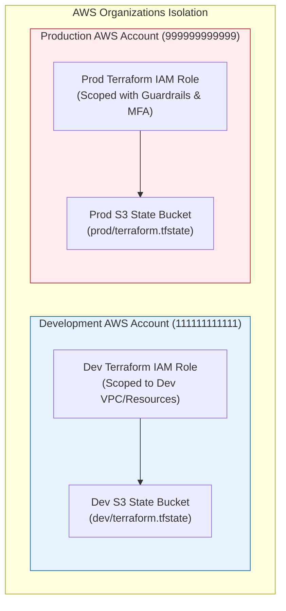

# 02 - Terraform Hardening & State Security Masterclass

HashiCorp Terraform (and its open-source fork OpenTofu) is the industry standard declarative Infrastructure as Code engine. However, default Terraform workflows and unhardened code present significant security risks—most notably state file secret exposure, hardcoded credentials, unpinned module supply chain risks, and over-privileged execution accounts.

This chapter details production-grade security patterns for hardening Terraform deployments across state file management, secrets integration, cloud authentication, and module supply chains.

---

## 🔒 Terraform State File Security

### 1. The Anatomy of State File Vulnerabilities
When Terraform provisions infrastructure, it creates a `terraform.tfstate` file containing a JSON map of real-world resource IDs, metadata, and configuration attributes. 

```
+-------------------------------------------------------------------------+
|                      TERRAFORM STATE FILE EXPOSURE                      |
+-------------------------------------------------------------------------+
|                                                                         |
|   HCL Manifest (.tf) ------------> Terraform Apply                      |
|   (Data sources / Secrets)                 |                            |
|                                            v                            |
|                                  terraform.tfstate                      |
|                                  [Raw JSON Document]                    |
|                                  - db_instance.password: "P@ssw0rd123" |
|                                  - tls_private_key.pem:  "-----BEGIN"  |
|                                  - aws_access_key.secret: "wJalrXUtn"   |
|                                                                         |
+-------------------------------------------------------------------------+
```

> [!CAUTION]
> **State File Exposure Hazard**: Terraform stores **all resource attributes in plaintext** inside `terraform.tfstate`, even if the values originate from encrypted data sources, environment variables, or secret managers. If an attacker gains read access to your state file, they possess all secrets managed by that Terraform workspace.

### 2. Hardening Local & Version Control Workflows
- **Never commit state files to Git**: Always add `*.tfstate`, `*.tfstate.*`, `.terraform/`, and `*.tfvars` to `.gitignore`.
- **Pre-commit hooks**: Use `git-secrets` or `trufflehog` pre-commit hooks to block accidental state commits.

### 3. Production-Grade AWS S3 + DynamoDB Remote Backend
Remote state backends must enforce:
1. **Encryption at Rest**: Customer-Managed KMS keys (`aws:kms`).
2. **Encryption in Transit**: Strict bucket policies requiring TLS 1.2+ (`aws:SecureTransport`).
3. **Public Access Prevention**: S3 Block Public Access enabled on all 4 settings.
4. **State Locking**: DynamoDB table with a primary key `LockID` to prevent concurrent deployments and state corruption.
5. **Versioning & Object Locking**: Protection against accidental state deletion or ransomware overwrite.

#### Step A: Terraform Code to Provision the Secure Remote Backend

```hcl
# backend-infrastructure/main.tf
terraform {
  required_version = ">= 1.5.0"
  required_providers {
    aws = {
      source  = "hashicorp/aws"
      version = "~> 5.0"
    }
  }
}

provider "aws" {
  region = "us-east-1"
}

# KMS Key for State Bucket Encryption
resource "aws_kms_key" "state_key" {
  description             = "KMS Key for Terraform Remote State Bucket"
  deletion_window_in_days = 30
  enable_key_rotation     = true

  tags = {
    Environment = "Management"
    ManagedBy   = "Terraform"
    Security    = "High"
  }
}

resource "aws_kms_alias" "state_key_alias" {
  name          = "alias/tf-state-bucket-key"
  target_key_id = aws_kms_key.state_key.key_id
}

# Remote State S3 Bucket
resource "aws_s3_bucket" "state_bucket" {
  bucket        = "enterprise-tf-state-us-east-1-prod"
  force_destroy = false

  tags = {
    Environment = "Production"
    ManagedBy   = "Terraform"
  }
}

# Enable S3 Bucket Versioning
resource "aws_s3_bucket_versioning" "state_versioning" {
  bucket = aws_s3_bucket.state_bucket.id
  versioning_configuration {
    status = "Enabled"
  }
}

# Server-Side KMS Encryption Configuration
resource "aws_s3_bucket_server_side_encryption_configuration" "state_encryption" {
  bucket = aws_s3_bucket.state_bucket.id

  rule {
    apply_server_side_encryption_by_default {
      kms_master_key_id = aws_kms_key.state_key.arn
      sse_algorithm     = "aws:kms"
    }
    bucket_key_enabled = true
  }
}

# Block ALL Public Access
resource "aws_s3_bucket_public_access_block" "state_public_block" {
  bucket = aws_s3_bucket.state_bucket.id

  block_public_acls       = true
  block_public_policy     = true
  ignore_public_acls      = true
  restrict_public_buckets = true
}

# Enforce TLS 1.2+ for All Bucket Ingress Requests
resource "aws_s3_bucket_policy" "enforce_tls" {
  bucket = aws_s3_bucket.state_bucket.id

  policy = jsonencode({
    Version = "2012-10-17"
    Statement = [
      {
        Sid       = "EnforceTLSRequestsOnly"
        Effect    = "Deny"
        Principal = "*"
        Action    = "s3:*"
        Resource = [
          aws_s3_bucket.state_bucket.arn,
          "${aws_s3_bucket.state_bucket.arn}/*"
        ]
        Condition = {
          Bool = {
            "aws:SecureTransport" = "false"
          }
        }
      }
    ]
  })
}

# DynamoDB Table for State Locking
resource "aws_dynamodb_table" "state_locks" {
  name         = "enterprise-tf-state-locks"
  billing_mode = "PAY_PER_REQUEST"
  hash_key     = "LockID"

  attribute {
    name = "LockID"
    type = "S"
  }

  point_in_time_recovery {
    enabled = true
  }

  server_side_encryption {
    enabled     = true
    kms_key_arn = aws_kms_key.state_key.arn
  }

  tags = {
    Environment = "Production"
    ManagedBy   = "Terraform"
  }
}
```

#### Step B: Hardened Backend Declaration in Infrastructure Modules

```hcl
# app-infrastructure/main.tf
terraform {
  required_version = ">= 1.5.0"
  
  backend "s3" {
    bucket         = "enterprise-tf-state-us-east-1-prod"
    key            = "production/core-network/terraform.tfstate"
    region         = "us-east-1"
    encrypt        = true
    kms_key_id     = "arn:aws:kms:us-east-1:123456789012:key/abc-123-kms-key-id"
    dynamodb_table = "enterprise-tf-state-locks"
  }
}
```

---

## 🔑 Eliminating Hardcoded Secrets

### ❌ Insecure Anti-Pattern: Hardcoded Secrets in HCL

```hcl
# DANGER: Plaintext secret in version control!
resource "aws_db_instance" "vulnerable_rds" {
  allocated_storage   = 20
  engine              = "postgres"
  engine_version      = "15.3"
  instance_class      = "db.t3.micro"
  db_name             = "prod_db"
  username            = "dbadmin"
  password            = "SuperSecretPassword2026!" # ❌ HARDCODED SECRET
  skip_final_snapshot = true
}
```

### ✅ Secure Pattern 1: Dynamic Resolution via AWS Secrets Manager

```hcl
# Fetch existing secret metadata
data "aws_secretsmanager_secret" "db_password_metadata" {
  name = "production/rds/dbadmin-password"
}

# Fetch secret payload at runtime
data "aws_secretsmanager_secret_version" "db_password_payload" {
  secret_id = data.aws_secretsmanager_secret.db_password_metadata.id
}

resource "aws_db_instance" "secure_rds" {
  allocated_storage     = 20
  engine                = "postgres"
  engine_version        = "15.3"
  instance_class        = "db.t3.micro"
  db_name               = "prod_db"
  username              = "dbadmin"
  password              = data.aws_secretsmanager_secret_version.db_password_payload.secret_string # ✅ Dynamic lookup
  storage_encrypted     = true
  kms_key_id            = var.rds_kms_key_arn
  skip_final_snapshot   = false
  deletion_protection   = true

  tags = {
    Environment = "Production"
    Security    = "Hardened"
  }
}
```

### ✅ Secure Pattern 2: HashiCorp Vault Provider Integration

```hcl
provider "vault" {
  address = "https://vault.internal.enterprise.com:8200"
}

# Read dynamic database secret from Vault KV-v2 engine
data "vault_generic_secret" "database_credentials" {
  path = "secret/data/production/database"
}

resource "aws_db_instance" "vault_secured_rds" {
  allocated_storage = 20
  engine            = "mysql"
  instance_class    = "db.t3.micro"
  username          = data.vault_generic_secret.database_credentials.data["username"]
  password          = data.vault_generic_secret.database_credentials.data["password"]
  storage_encrypted = true
}
```

---

## 🔐 Short-Lived Ephemeral Provider Authentication via OIDC

Static AWS Access Keys (`AWS_ACCESS_KEY_ID` / `AWS_SECRET_ACCESS_KEY`) stored in CI/CD secrets present long-lived credential compromise risks. Use **OpenID Connect (OIDC)** identity federation to allow CI/CD runners (e.g., GitHub Actions) to assume short-lived IAM roles without static keys.

### 1. Terraform OIDC IAM Role Setup for GitHub Actions

```hcl
# oidc-setup/main.tf
resource "aws_iam_openid_connect_provider" "github" {
  url             = "https://token.actions.githubusercontent.com"
  client_id_list  = ["sts.amazonaws.com"]
  thumbprint_list = ["6938fd4d98bab03faadb97b34396831e3780aea1"] # GitHub OIDC thumbprint
}

resource "aws_iam_role" "github_actions_terraform" {
  name        = "GitHubActions-Terraform-Deployment-Role"
  description = "Role assumed by GitHub Actions for Terraform deployments"

  assume_role_policy = jsonencode({
    Version = "2012-10-17"
    Statement = [
      {
        Effect = "Allow"
        Principal = {
          Federated = aws_iam_openid_connect_provider.github.arn
        }
        Action = "sts:AssumeRoleWithWebIdentity"
        Condition = {
          StringEquals = {
            "token.actions.githubusercontent.com:aud" = "sts.amazonaws.com"
          }
          StringLike = {
            # Scope execution strictly to production main branch of your enterprise repository
            "token.actions.githubusercontent.com:sub" = "repo:my-enterprise-org/cloud-infra:ref:refs/heads/main"
          }
        }
      }
    ]
  })
}

# Attach Least-Privilege Policy to the Role
resource "aws_iam_role_policy_attachment" "attach_deploy_permissions" {
  role       = aws_iam_role.github_actions_terraform.name
  policy_arn = aws_iam_policy.terraform_least_privilege.arn
}
```

---

## 📦 Supply Chain Hardening & Module Pinning

Terraform registry modules can be updated by upstream maintainers or compromised by supply chain attackers.

### 1. Strict Module Version Pinning
Never leave module versions open or unpinned.

```hcl
# ❌ DANGEROUS: Unpinned module version (downloads latest version automatically)
module "vulnerable_vpc" {
  source = "terraform-aws-modules/vpc/aws"
}

# ⚠️ WEAK: Floating minor version constraint
module "floating_vpc" {
  source  = "terraform-aws-modules/vpc/aws"
  version = "~> 5.0" # Automatically updates to 5.1.0, 5.2.0, etc.
}

# ✅ SECURE: Exact semantic version pinning
module "secure_vpc" {
  source  = "terraform-aws-modules/vpc/aws"
  version = "5.1.1" # Locked to tested baseline
}
```

### 2. Git Submodule & Git Commit SHA Pinning
For private Git repositories, pin directly to an immutable full 40-character Git Commit SHA rather than floating branch names like `main`.

```hcl
# ✅ SECURE: Pinned to exact Git Commit SHA
module "internal_app_mesh" {
  source = "git::https://github.com/enterprise-org/tf-modules.git//modules/app-mesh?ref=a1b2c3d4e5f67890123456789abcdef012345678"
}
```

---

## 🗂️ Workspace Isolation & Least Privilege Execution



### Workspace Isolation Principles
1. **Separate AWS Accounts**: Isolate Development, Staging, and Production environments into distinct cloud accounts (e.g., via AWS Organizations / GCP Projects / Azure Subscriptions).
2. **Dedicated State Buckets**: Use separate state buckets for production and non-production accounts to prevent accidental cross-environment state overwrites or secret contamination.
3. **IAM Boundary Policies**: Attach IAM Permission Boundaries to Terraform execution roles to ensure created resources can never exceed authorized organizational security parameters.

---

> [!TIP]
> **Production Recommendation**: Combine S3 remote backend encryption with dynamic OIDC role assumption and Checkov SAST scanning in your CI/CD pipeline to eliminate over 90% of Terraform security vulnerabilities.
>
> Next, move to **[Chapter 03: CloudFormation and Bicep Hardening](03-cloudformation-and-bicep.md)**.
