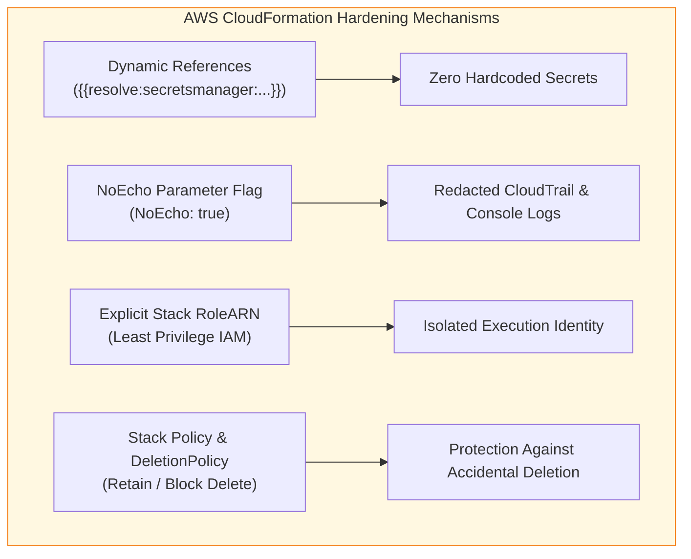
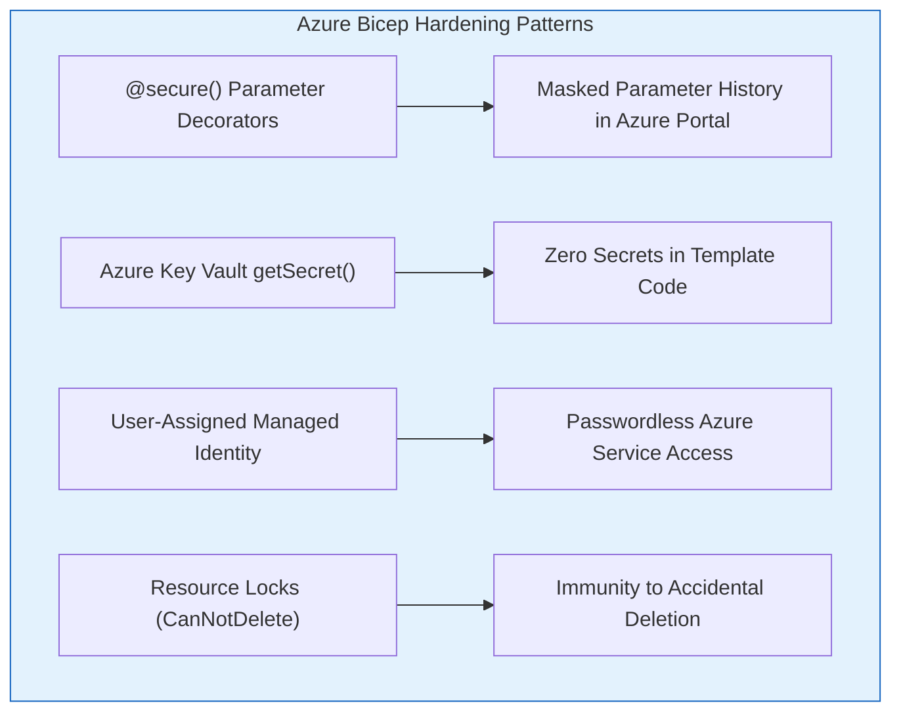

# 03 - CloudFormation and Bicep Hardening Masterclass

While HashiCorp Terraform provides a cloud-agnostic abstraction layer, **AWS CloudFormation** and **Azure Bicep** (which compiles to Azure Resource Manager ARM templates) represent the native, first-party Infrastructure as Code (IaC) engines of AWS and Microsoft Azure.

Because CloudFormation and Bicep integrate directly into cloud provider control planes, securing their manifests, parameters, execution roles, and resource lifecycles is critical for protecting enterprise cloud environments.

---

## 🌩️ AWS CloudFormation Security Hardening

AWS CloudFormation provisions resources using YAML or JSON templates. Securing CloudFormation templates requires mitigating parameter leakage, enforcing execution role least-privilege, and locking down stack update operations.



### 1. Dynamic Secrets Resolution
Never pass raw password strings or credentials into template parameters. AWS CloudFormation supports **Dynamic References** to fetch secrets securely at deploy time directly from AWS Secrets Manager or AWS Systems Manager (SSM) Parameter Store.

```yaml
# Dynamic Reference Syntax Format:
# {{resolve:secretsmanager:SecretIdentity:SecretString:JsonField}}
# {{resolve:ssm-secure:ParameterName:Version}}
```

### 2. Protecting Sensitive Parameters with `NoEcho`
When parameters must accept secret values (for legacy templates), always set `NoEcho: true`. This instructs AWS CloudFormation to mask the parameter value with asterisks (`****`) in the AWS Management Console, CLI `describe-stacks` responses, and CloudTrail event logs.

### 3. Stack Policies & Accidental Deletion Guards
- **Stack Policies**: A Stack Policy is a JSON document that defines the update actions that can be performed on specified resources. Use them to prevent accidental deletion or modification of critical resources (e.g., RDS databases, KMS keys).
- **DeletionPolicy: Retain**: Instructs CloudFormation to preserve specific resources if the stack is deleted.

---

### ❌ Insecure CloudFormation Template Example

```yaml
# DANGER: Insecure CloudFormation Template
AWSTemplateFormatVersion: '2010-09-09'
Description: Insecure RDS and S3 Deployment

Parameters:
  DBPassword:
    Type: String
    Default: 'AdminPass2026!' # ❌ HARDCODED DEFAULT SECRET
    # ❌ MISSING NoEcho: true (Leaked in CLI logs!)

Resources:
  VulnerableS3Bucket:
    Type: AWS::S3::Bucket
    Properties:
      BucketName: enterprise-customer-data-bucket
      AccessControl: PublicRead # ❌ EXPOSED TO PUBLIC INTERNET

  VulnerableRDSInstance:
    Type: AWS::RDS::DBInstance
    Properties:
      DBInstanceClass: db.t3.micro
      Engine: postgres
      MasterUsername: postgresadmin
      MasterUserPassword: !Ref DBPassword # ❌ Plaintext parameter reference
      StorageEncrypted: false # ❌ UNENCRYPTED DATA AT REST
```

---

### ✅ Secure CloudFormation Template Example

```yaml
AWSTemplateFormatVersion: '2010-09-09'
Description: Production-Hardened CloudFormation Infrastructure Baseline

Parameters:
  DBPasswordSecretARN:
    Type: String
    Description: ARN of the AWS Secrets Manager Secret storing RDS Credentials
    AllowedPattern: '^arn:aws:secretsmanager:[a-z0-9-]+:[0-9]{12}:secret:.+$'

  EnvironmentTag:
    Type: String
    Default: Production
    AllowedValues:
      - Production
      - Staging

Resources:
  # KMS Key for S3 and RDS Encryption
  InfrastructureKMSKey:
    Type: AWS::KMS::Key
    Properties:
      Description: Encryption Key for Stack Resources
      EnableKeyRotation: true
      KeyPolicy:
        Version: '2012-10-17'
        Statement:
          - Sid: Enable IAM User Permissions
            Effect: Allow
            Principal:
              AWS: !Sub 'arn:aws:iam::${AWS::AccountId}:root'
            Action: 'kms:*'
            Resource: '*'

  # Secure Private S3 Bucket
  SecureS3Bucket:
    Type: AWS::S3::Bucket
    DeletionPolicy: Retain # ✅ Prevents accidental bucket destruction
    Properties:
      BucketName: !Sub 'enterprise-data-store-${AWS::AccountId}-${AWS::Region}'
      PublicAccessBlockConfiguration: # ✅ Blocks public access completely
        BlockPublicAcls: true
        BlockPublicPolicy: true
        IgnorePublicAcls: true
        RestrictPublicBuckets: true
      BucketEncryption:
        ServerSideEncryptionConfiguration:
          - ServerSideEncryptionByDefault:
              SSEAlgorithm: 'aws:kms'
              KMSMasterKeyID: !GetAtt InfrastructureKMSKey.Arn
            BucketKeyEnabled: true
      VersioningConfiguration:
        Status: Enabled
      Tags:
        - Key: Environment
          Value: !Ref EnvironmentTag

  # Production Encrypted RDS Instance using Dynamic Reference
  SecureRDSInstance:
    Type: AWS::RDS::DBInstance
    DeletionPolicy: Snapshot # ✅ Automatically creates DB snapshot prior to stack deletion
    Properties:
      DBInstanceIdentifier: prod-secure-db
      DBInstanceClass: db.t3.small
      Engine: postgres
      EngineVersion: '15.3'
      MasterUsername: dbadmin
      # ✅ Dynamic Reference resolves secret string securely at runtime
      MasterUserPassword: '{{resolve:secretsmanager:production/rds/dbadmin-password:SecretString:password}}'
      StorageEncrypted: true
      KmsKeyId: !GetAtt InfrastructureKMSKey.Arn
      MultiAZ: true
      PubliclyAccessible: false # ✅ Private network deployment only
      Tags:
        - Key: Environment
          Value: !Ref EnvironmentTag
```

---

## 🔷 Azure Bicep & ARM Security Hardening

Azure Bicep is Microsoft's domain-specific language (DSL) for deploying Azure resources declaratively. Bicep compiles down to ARM JSON templates.



### 1. Enforcing `@secure()` Parameter Protection
In Bicep, annotating string or object parameters with the `@secure()` decorator instructs Azure Resource Manager to redact parameter values in deployment logs, diagnostic outputs, and the Azure Portal deployment history.

### 2. Direct Azure Key Vault Integration
Instead of passing passwords into Bicep deployment parameters, retrieve secrets dynamically from an existing Azure Key Vault using the `getSecret()` function.

### 3. Passwordless Authentication via Azure Managed Identities
Avoid generating storage keys, connection strings, or service principal credentials inside Bicep code. Assign **System-Assigned** or **User-Assigned Managed Identities** to Azure App Services, VMs, and Functions, granting them Azure RBAC permissions without static secrets.

---

### ❌ Insecure Azure Bicep Code Example

```bicep
// DANGER: Insecure Bicep Manifest
param sqlAdminUsername string = 'sqladmin'
param sqlAdminPassword string // ❌ MISSING @secure() decorator! Password exposed in deployment logs!

resource sqlServer 'Microsoft.Sql/servers@2022-05-01-preview' = {
  name: 'vulnerable-sql-server-2026'
  location: resourceGroup().location
  properties: {
    administratorLogin: sqlAdminUsername
    administratorLoginPassword: sqlAdminPassword
    publicNetworkAccess: 'Enabled' // ❌ PUBLIC ACCESS ENABLED
  }
}

resource storageAccount 'Microsoft.Storage/storageAccounts@2022-09-01' = {
  name: 'vulnerablestorage2026'
  location: resourceGroup().location
  sku: {
    name: 'Standard_LRS'
  }
  kind: 'StorageV2'
  properties: {
    supportsHttpsTrafficOnly: false // ❌ HTTP ALLOWED (INSECURE)
    minimumTlsVersion: 'TLS1_0' // ❌ WEAK DEPRECATED TLS VERSION
  }
}
```

---

### ✅ Secure Azure Bicep Code Example

```bicep
// Production-Hardened Azure Bicep Infrastructure

@description('The Azure region where resources will be provisioned')
param location string = resourceGroup().location

@description('Existing Key Vault name holding production credentials')
param keyVaultName string

@secure()
@description('Decorated secure parameter passed at runtime')
param sqlAdminPassword string

// Reference existing secure Key Vault
resource keyVault 'Microsoft.KeyVault/vaults@2022-07-01' existing = {
  name: keyVaultName
}

// User-Assigned Managed Identity for passwordless database access
resource appIdentity 'Microsoft.ManagedIdentity/userAssignedIdentities@2023-01-31' = {
  name: 'id-app-production'
  location: location
}

// Production Hardened Azure SQL Server
resource sqlServer 'Microsoft.Sql/servers@2022-05-01-preview' = {
  name: 'sql-enterprise-prod-${uniqueString(resourceGroup().id)}'
  location: location
  identity: {
    type: 'UserAssigned'
    userAssignedIdentities: {
      '${appIdentity.id}': {}
    }
  }
  properties: {
    administratorLogin: 'sqladmin'
    // ✅ Retrieve secret securely from Key Vault reference
    administratorLoginPassword: keyVault.getSecret('sqlAdminPasswordSecret')
    publicNetworkAccess: 'Disabled' // ✅ Public access blocked
    minimalTlsVersion: '1.2' // ✅ TLS 1.2+ Enforced
  }
}

// Hardened Azure Storage Account
resource storageAccount 'Microsoft.Storage/storageAccounts@2022-09-01' = {
  name: 'stprod${uniqueString(resourceGroup().id)}'
  location: location
  sku: {
    name: 'Standard_ZRS'
  }
  kind: 'StorageV2'
  properties: {
    supportsHttpsTrafficOnly: true // ✅ HTTPS Enforced
    minimumTlsVersion: 'TLS1_2' // ✅ TLS 1.2 Minimum
    allowBlobPublicAccess: false // ✅ Block Blob Public Access
    encryption: {
      services: {
        blob: {
          enabled: true
          keyType: 'Account'
        }
      }
      keySource: 'Microsoft.Storage'
    }
  }
}

// Resource Lock to Prevent Accidental Deletion
resource deleteLock 'Microsoft.Authorization/locks@2020-05-01' = {
  name: 'lock-sql-delete-protection'
  scope: sqlServer
  properties: {
    level: 'CanNotDelete'
    notes: 'Production database server locked against accidental deletion'
  }
}
```

---

## 📊 Cross-Framework Security Comparison Matrix

| Security Domain | HashiCorp Terraform | AWS CloudFormation | Azure Bicep / ARM |
| :--- | :--- | :--- | :--- |
| **State Storage** | `terraform.tfstate` file (Requires KMS S3 / Blob backend) | Managed automatically inside AWS Cloud Control Plane | Managed automatically inside Azure Resource Manager |
| **Secrets Resolution** | HashiCorp Vault / AWS Secrets Manager data sources | Dynamic references `{{resolve:secretsmanager:...}}` | Key Vault `getSecret()` functions |
| **Log Sanitization** | `sensitive = true` HCL attribute | `NoEcho: true` parameter property | `@secure()` parameter decorator |
| **Deletion Protection** | `prevent_destroy = true` lifecycle block | `DeletionPolicy: Retain` / Stack Policies | Resource Locks (`CanNotDelete`) |
| **Provider Auth** | Ephemeral OIDC IAM roles | Stack Execution Role (`RoleARN`) | User-Assigned Managed Identity |
| **Policy Engine** | OPA (Rego), Checkov, Sentinel | AWS CloudFormation Guard, OPA | Azure Policy (Native JSON definitions) |

---

> [!IMPORTANT]
> **Key Takeaway**: Regardless of whether you deploy Terraform, CloudFormation, or Bicep, you must enforce dynamic secret resolution, log parameter masking, least-privilege deployment identities, and deletion safety locks across all infrastructure manifests.
>
> Next, move to **[Chapter 04: IaC SAST and Policy as Code](04-iac-sast-and-policy-as-code.md)**.
