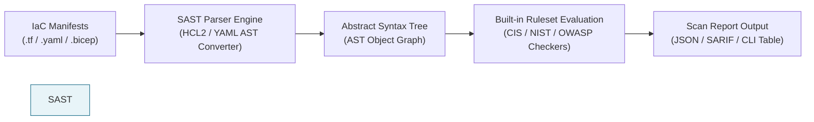
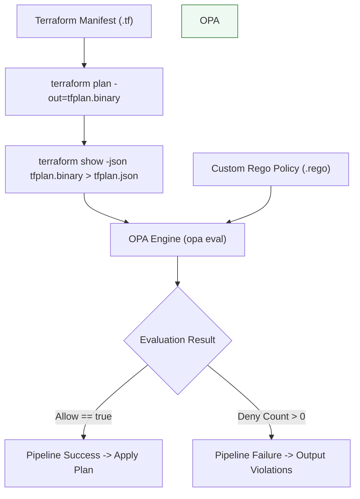

# 04 - IaC SAST and Policy as Code Masterclass

Shift-left security requires automating the analysis of Infrastructure as Code (IaC) templates before changes reach production. Static Application Security Testing (**SAST**) for IaC parses template configurations to detect known misconfigurations, while **Policy as Code (PaC)** allows organizations to define custom compliance rules in executable languages like Open Policy Agent's **Rego**.

This chapter details the inner mechanics of IaC SAST engines, custom OPA Rego rule development, custom Checkov Python policies, and production-grade CI/CD pipeline integration.

---

## 🔍 IaC Static Application Security Testing (SAST)

IaC SAST tools do not execute infrastructure manifests. Instead, they convert declarative files (HCL, YAML, JSON, Bicep) into an **Abstract Syntax Tree (AST)** or Object Graph, evaluating resource attributes against thousands of pre-compiled vulnerability rulesets.



### Industry SAST Engine Comparison

| Tool | Primary Vendor | Supported IaC Languages | Key Strengths | Custom Policy Language |
| :--- | :--- | :--- | :--- | :--- |
| **Checkov** | Prisma Cloud (Bridgecrew) | Terraform, CloudFormation, Bicep, Helm, K8s, Dockerfile | Industry-standard ruleset, deep framework support, SARIF export | Python / YAML |
| **tfsec** | Aqua Security (integrated in `trivy`) | Terraform (HCL2) | High-speed binary execution, deep Terraform context resolution | Rego / YAML |
| **Terrascan** | Tenable | Terraform, K8s, Helm, CloudFormation, ARM | Built-in OPA engine integration | Rego |
| **KICS** | Checkmarx | Terraform, CloudFormation, Ansible, Docker, K8s | Broad multi-iac language support | Rego |

---

### Executing SAST Tools via CLI

#### 1. Checkov Execution Commands

```bash
# Install Checkov via Python package manager
pip install checkov

# Scan entire directory recursively with severity filtering
checkov -d ./terraform --framework terraform --min-severity HIGH

# Export scan results to SARIF for GitHub Security tab integration
checkov -d ./terraform --output sarif --output-file-path results.sarif
```

#### 2. Checkov Configuration File (`.checkov.yaml`)

Store repository scanning baselines inside a `.checkov.yaml` config file:

```yaml
# .checkov.yaml
directory:
  - ./infrastructure
framework:
  - terraform
  - cloudformation
output:
  - cli
  - sarif
soft-fail: false # Hard fail pipeline on violation
compact: true
quiet: false
skip-check:
  - CKV_AWS_144 # Skip specific accepted organizational baseline rules
```

---

## 📜 Policy as Code (PaC) with Open Policy Agent (OPA) & Rego

While SAST scanners catch generic vulnerability patterns, **Policy as Code** allows security architects to codify enterprise-specific security rules (e.g., *"All S3 buckets in production must use KMS key ARN `arn:aws:kms:...` and include an `Owner` tag matching organizational email format"*).

### OPA Terraform Evaluation Workflow



---

### Production Rego Policy 1: Enforce Private S3 Buckets & KMS Encryption

Create a Rego policy `s3_enforcement.rego` that validates planned Terraform resource changes:

```rego
# s3_enforcement.rego
package terraform.security.s3

import future.keywords.in

default allow = false

# Array of denied violation messages
deny[msg] {
    # Iterate over all resource changes in terraform plan JSON
    resource := input.resource_changes[_]
    resource.type == "aws_s3_bucket"
    
    # Extract ACL attribute if defined
    acl := resource.change.after.acl
    public_acls := ["public-read", "public-read-write", "website"]
    acl in public_acls

    msg := sprintf("SECURITY VIOLATION: S3 Bucket '%v' defined with public ACL '%v'. Public S3 buckets are strictly forbidden.", [resource.address, acl])
}

deny[msg] {
    resource := input.resource_changes[_]
    resource.type == "aws_s3_bucket"
    
    # Verify server-side encryption configuration block exists
    not resource.change.after.server_side_encryption_configuration
    
    msg := sprintf("SECURITY VIOLATION: S3 Bucket '%v' lacks mandatory server-side encryption configuration.", [resource.address])
}

# Main decision rule
allow {
    count(deny) == 0
}
```

---

### Production Rego Policy 2: Restrict Ingress Security Group Rules

Create a Rego policy `network_security.rego` blocking exposure of SSH (22), RDP (3389), MySQL (3306), and MongoDB (27017) to `0.0.0.0/0`:

```rego
# network_security.rego
package terraform.security.network

import future.keywords.in

# Forbidden management ports
restricted_ports := [22, 3389, 3306, 27017]

deny[msg] {
    resource := input.resource_changes[_]
    resource.type == "aws_security_group"
    
    # Iterate over ingress rules
    ingress := resource.change.after.ingress[_]
    
    # Check if ingress CIDR includes global internet
    "0.0.0.0/0" in ingress.cidr_blocks
    
    # Check if requested port range overlaps restricted ports
    port := restricted_ports[_]
    ingress.from_port <= port
    ingress.to_port >= port

    msg := sprintf("CRITICAL NETWORKING VIOLATION: Security Group '%v' permits ingress traffic from 0.0.0.0/0 on sensitive port %v.", [resource.address, port])
}
```

---

### Production Rego Policy 3: Enforce Mandatory Resource Tags

```rego
# tagging_policy.rego
package terraform.security.tagging

import future.keywords.in

mandatory_tags := ["Environment", "Owner", "SecurityContact"]

deny[msg] {
    resource := input.resource_changes[_]
    # Check resources that support tagging
    resource.type in ["aws_s3_bucket", "aws_instance", "aws_db_instance", "aws_vpc"]
    
    tags := resource.change.after.tags
    tag := mandatory_tags[_]
    
    # Verify tag presence
    not tags[tag]

    msg := sprintf("COMPLIANCE VIOLATION: Resource '%v' of type '%v' is missing mandatory tag '%v'.", [resource.address, resource.type, tag])
}
```

#### Running OPA Validation CLI

```bash
# 1. Generate JSON Terraform Plan
terraform plan -out=tfplan.binary
terraform show -json tfplan.binary > tfplan.json

# 2. Evaluate JSON plan against Rego policy files
opa eval --format pretty --data ./policies/ --input tfplan.json "data.terraform.security.s3.deny"
```

---

## 🐍 Custom Checkov Python Policy Implementation

When Checkov's built-in 1,000+ checks do not cover custom organizational requirements, write a custom Python policy extending `BaseResourceCheck`.

Create `checkov_custom_rules/CheckCustomKMSKeyRotation.py`:

```python
# checkov_custom_rules/CheckCustomKMSKeyRotation.py
from checkov.common.models.enums import CheckResult, CheckCategories
from checkov.terraform.checks.resource.base_resource_check import BaseResourceCheck

class CheckCustomKMSKeyRotation(BaseResourceCheck):
    def __init__(self):
        name = "Ensure AWS KMS Keys have annual automatic key rotation enabled"
        id = "CKV_CUSTOM_001"
        supported_resources = ['aws_kms_key']
        categories = [CheckCategories.ENCRYPTION]
        super().__init__(name=name, id=id, categories=categories, supported_resources=supported_resources)

    def scan_resource_conf(self, conf):
        # Check if enable_key_rotation attribute is present
        if 'enable_key_rotation' in conf:
            if conf['enable_key_rotation'] == [True]:
                return CheckResult.PASSED
        return CheckResult.FAILED

check = CheckCustomKMSKeyRotation()
```

#### Running Checkov with Custom Python Rules

```bash
checkov -d ./terraform --external-checks-dir ./checkov_custom_rules
```

---

## 🚀 CI/CD Pipeline Security Integration

The ultimate goal of Policy as Code is enforcing automated pull request quality gates. Below is a complete, production-grade GitHub Actions workflow enforcing Checkov SAST, OPA Rego policies, and automated PR comment reporting.

```yaml
# .github/workflows/iac-security-gate.yml
name: IaC Security & Policy Gate

on:
  pull_request:
    branches: [ main, master ]
    paths:
      - 'terraform/**'
      - 'cloudformation/**'

jobs:
  iac-security-scan:
    name: Run Checkov & OPA Policy Scan
    runs-on: ubuntu-latest

    permissions:
      contents: read
      pull-requests: write
      security-events: write

    steps:
      - name: Checkout Source Code
        uses: actions/checkout@v4

      - name: Set up Python Environment
        uses: actions/setup-python@v5
        with:
          python-version: '3.11'

      - name: Install OPA CLI & Checkov
        run: |
          pip install checkov
          curl -L -o opa https://openpolicyagent.org/downloads/v0.62.0/opa_linux_amd64_static
          chmod +x ./opa
          sudo mv ./opa /usr/local/bin/

      - name: Run Checkov SAST Scanner
        id: checkov_scan
        run: |
          checkov -d ./terraform \
            --output cli \
            --output sarif \
            --output-file-path console,results.sarif \
            --soft-fail false

      - name: Upload SARIF to GitHub Security Tab
        uses: github/codeql-action/upload-sarif@v3
        if: always()
        with:
          sarif_file: results.sarif
          category: checkov-iac-sast

      - name: Setup Terraform
        uses: hashicorp/setup-terraform@v3
        with:
          terraform_version: 1.5.7

      - name: Generate Terraform Plan JSON
        run: |
          cd terraform
          terraform init -backend=false
          terraform plan -out=tfplan.binary
          terraform show -json tfplan.binary > tfplan.json

      - name: Evaluate OPA Rego Policies
        run: |
          VIOLATIONS=$(opa eval --format json --data ./policies/ --input ./terraform/tfplan.json "data.terraform.security.s3.deny" | jq '.result[0].expressions[0].value')
          echo "OPA Violations: $VIOLATIONS"
          if [ "`$VIOLATIONS" != "[]" ] && [ "$`VIOLATIONS" != "null" ]; then
            echo "::error::OPA Rego Policy Violations Detected!"
            exit 1
          fi
```

---

> [!TIP]
> **Pipeline Best Practice**: Combine fast SAST scans (Checkov/tfsec) on local pre-commit hooks with comprehensive OPA Rego plan evaluation inside CI/CD pull request workflows.
>
> Next, move to **[Chapter 05: Drift Detection and Compliance](05-drift-detection-and-compliance.md)**.
