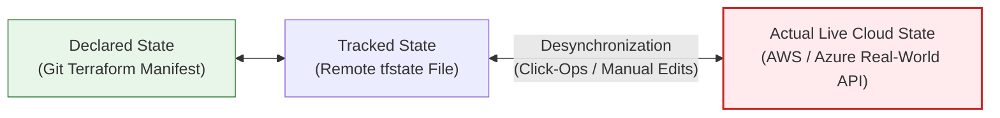
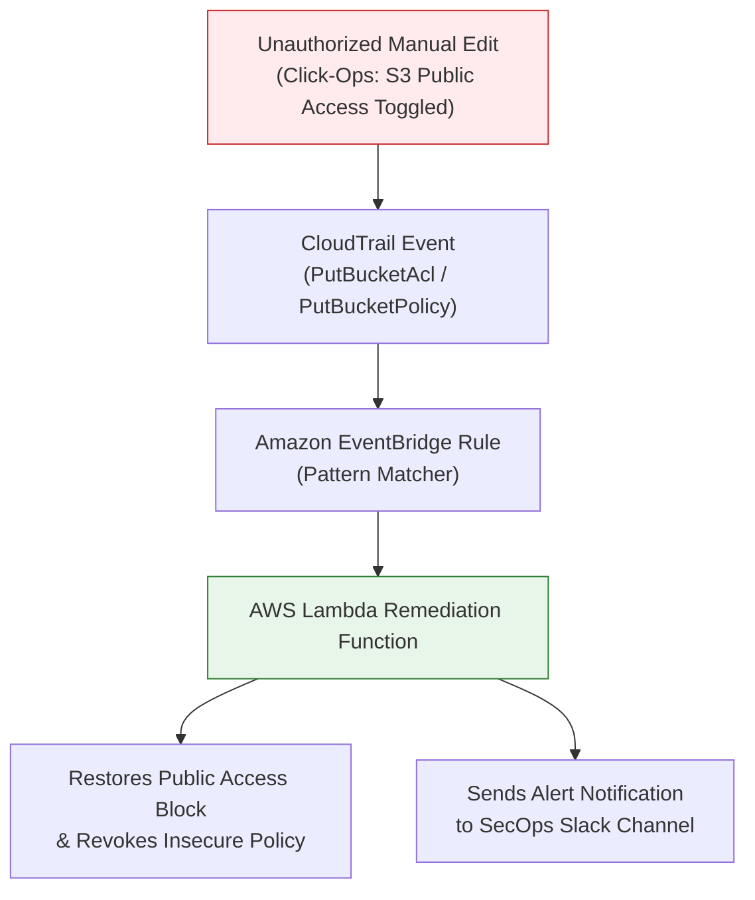

# 05 - Drift Detection and Continuous Compliance Masterclass

Even when an organization deploys 100% of its cloud infrastructure through secure CI/CD pipelines, **Infrastructure Drift** occurs when manual changes ("Click-Ops"), emergency hotfixes, or out-of-band automated scripts modify live cloud resources directly in the cloud provider console or API.

Drift creates critical security blind spots: unauthorized security group modifications, publicly exposed storage buckets, and disabled logging controls bypass git pull request reviews and CI/CD SAST scanners.

This chapter covers technical strategies for continuous drift detection, cloud-native compliance guardrails (AWS Config, Azure Policy), and automated event-driven remediation architectures.

---

## 🚨 Understanding Infrastructure Drift

Infrastructure Drift represents the desynchronization between **Declared State** (Git source code), **Tracked State** (Terraform `.tfstate`), and **Actual Real-World State** (Live Cloud APIs).



### Common Causes of Drift & Security Impacts

| Drift Cause | Real-World Scenario | Security Impact |
| :--- | :--- | :--- |
| **Emergency Hotfix** | Engineer opens SSH port 22 to `0.0.0.0/0` via AWS Console during a midnight outage and forgets to revert. | Unprotected management port exposed to internet scans indefinitely. |
| **Shadow IT** | Developer creates an unencrypted S3 bucket directly in console for quick file transfers. | Storage lacks encryption, logging, and public access blocks; completely invisible to Git repository audits. |
| **Console Policy Edit** | Security auditor manually toggles an IAM policy to test access permissions. | IAM role granted over-privileged access without peer review or record in commit history. |

---

## 🛠️ Automated Drift Detection Technical Strategies

### Strategy 1: CI/CD Pipeline Scheduled `terraform plan`

Run `terraform plan` on a cron-scheduled pipeline (e.g., nightly at 02:00 UTC). Use the `-detailed-exitcode` flag to detect drift programmatically.

#### Detailed Exit Codes:
- `0`: Succeeded with empty diff (No drift detected).
- `1`: Error during execution.
- `2`: Succeeded with non-empty diff (**Drift detected**).

```bash
#!/usr/bin/env bash
# scheduled-drift-check.sh

echo "[+] Initializing Terraform..."
terraform init -backend-config="bucket=enterprise-tf-state-us-east-1-prod"

echo "[+] Running Terraform Plan Drift Check..."
terraform plan -detailed-exitcode -no-color > drift_report.txt
EXIT_CODE=$?

if [ $EXIT_CODE -eq 2 ]; then
  echo "::error::CRITICAL DRIFT DETECTED! Live cloud infrastructure differs from Git baseline!"
  # Trigger alert to Security Operations (Slack / PagerDuty / Jira)
  curl -X POST -H 'Content-type: application/json' \
    --data '{"text":"🚨 *Security Drift Alert*: Live Cloud Resources have drifted from Terraform baseline!"}' \
    "$SLACK_WEBHOOK_URL"
  exit 2
elif [ $EXIT_CODE -eq 0 ]; then
  echo "[+] Zero drift detected. Infrastructure is perfectly synchronized."
  exit 0
else
  echo "[!] Error running terraform plan."
  exit 1
fi
```

---

### Strategy 2: Specialized Drift Scanning with `driftctl`

`driftctl` is an open-source tool that measures infrastructure drift by comparing live cloud accounts directly against Terraform state files, identifying unmanaged "shadow" cloud resources.

```bash
# Install driftctl
curl -L https://github.com/snyk/driftctl/releases/latest/download/driftctl_linux_amd64 -o driftctl
chmod +x driftctl

# Run drift scan against AWS infrastructure and remote S3 state
AWS_REGION=us-east-1 driftctl scan \
  --from tfstate+s3://enterprise-tf-state-us-east-1-prod/production/terraform.tfstate \
  --output json://drift-report.json
```

#### Driftctl Ignore File (`.driftignore`)

Exclude noisy or non-security-critical resources from drift reports:

```text
# .driftignore
# Ignore ephemeral auto-scaling EC2 instances
aws_instance.autoscaling_*

# Ignore temporary CloudWatch log streams
aws_cloudwatch_log_stream.*
```

---

### Strategy 3: AWS CloudFormation Native Drift Detection

AWS CloudFormation provides native drift detection APIs that calculate whether resources in a deployed stack have been modified out-of-band:

```bash
# Initiate drift detection scan on a CloudFormation stack
aws cloudformation detect-stack-drift --stack-name ProductionCoreNetworkStack

# Retrieve drift status report
aws cloudformation describe-stack-resource-drifts \
  --stack-name ProductionCoreNetworkStack \
  --stack-resource-drift-status-filters MODIFIED DELETED
```

---

## 🛡️ Cloud-Native Continuous Compliance (AWS Config & CSPM)

While IaC SAST scans code *before* deployment, **Cloud Security Posture Management (CSPM)** and cloud-native services continuously audit resources *after* deployment.

### Provisioning AWS Config Rules via Terraform

Deploy AWS Config rules directly using Terraform to enforce continuous compliance against CIS AWS Foundations Benchmarks:

```hcl
# aws-config-compliance/main.tf

# Enable AWS Config Recorder
resource "aws_config_configuration_recorder" "main" {
  name     = "enterprise-config-recorder"
  role_arn = aws_iam_role.config_role.arn

  recording_group {
    all_supported                 = true
    include_global_resource_types = true
  }
}

# Config Rule 1: Enforce S3 Public Read Prohibited
resource "aws_config_config_rule" "s3_public_read" {
  name        = "s3-bucket-public-read-prohibited"
  description = "Checks that S3 buckets do not allow public read access."

  source {
    owner             = "AWS"
    source_identifier = "S3_BUCKET_PUBLIC_READ_PROHIBITED"
  }

  depends_on = [aws_config_configuration_recorder.main]
}

# Config Rule 2: Enforce Encrypted EBS Volumes
resource "aws_config_config_rule" "ebs_encryption" {
  name        = "encrypted-volumes"
  description = "Checks that EBS volumes are encrypted at rest."

  source {
    owner             = "AWS"
    source_identifier = "ENCRYPTED_VOLUMES"
  }

  depends_on = [aws_config_configuration_recorder.main]
}

# Config Rule 3: Enforce Restricted SSH Ingress (Port 22)
resource "aws_config_config_rule" "restricted_ssh" {
  name        = "restricted-common-ports"
  description = "Checks whether security groups allow unrestricted incoming traffic to high-risk ports."

  source {
    owner             = "AWS"
    source_identifier = "INCOMING_SSH_DISABLED"
  }

  depends_on = [aws_config_configuration_recorder.main]
}
```

---

## ⚡ Automated Event-Driven Remediation Architecture

When unauthorized drift or a non-compliant state is detected in real time, manual remediation creates delays. An **Event-Driven Remediation Architecture** detects cloud modifications instantly and automatically reverts non-compliant settings.



### Python Lambda Auto-Remediation Code

Below is an AWS Lambda Python script triggered by EventBridge when an S3 bucket is modified to allow public access:

```python
# lambda_remediate_s3_public.py
import json
import boto3
import os
import logging

logger = logging.getLogger()
logger.setLevel(logging.INFO)

s3_client = boto3.client('s3')

def lambda_handler(event, context):
    """
    Automatically enforces S3 Public Access Block when an unauthorized change is detected.
    """
    logger.info(f"Received Event: {json.dumps(event)}")
    
    # Extract bucket name from CloudTrail event details
    try:
        bucket_name = event['detail']['requestParameters']['bucketName']
    except KeyError:
        logger.error("Could not extract bucketName from event payload.")
        return {"status": "error", "reason": "invalid_event"}

    logger.warning(f"Enforcing automated public access block on drifted bucket: {bucket_name}")

    # Apply strict Public Access Block
    response = s3_client.put_public_access_block(
        Bucket=bucket_name,
        PublicAccessBlockConfiguration={
            'BlockPublicAcls': True,
            'IgnorePublicAcls': True,
            'BlockPublicPolicy': True,
            'RestrictPublicBuckets': True
        }
    )

    logger.info(f"Successfully remediated S3 bucket {bucket_name}. Response: {response}")
    
    return {
        "status": "remediated",
        "bucket": bucket_name
    }
```

---

> [!IMPORTANT]
> **Key Takeaway**: Preventing cloud incidents requires pairing pre-deployment CI/CD SAST scanning with continuous post-deployment drift detection (`driftctl` / `terraform plan`) and automated event-driven remediation guardrails.
>
> Next, move to **[Chapter 06: Hands-On Lab](06-hands-on-lab.md)**.
