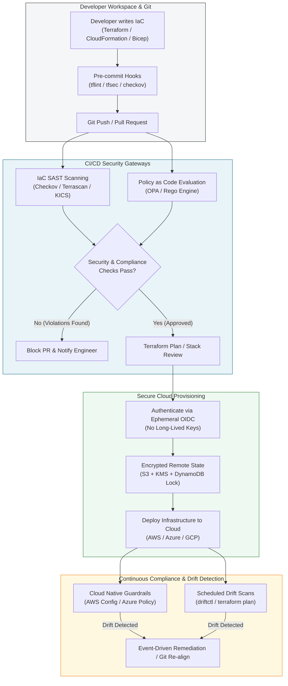

# Infrastructure as Code (IaC) Security Masterclass

Welcome to the **Infrastructure as Code (IaC) Security Guide**. Infrastructure as Code (IaC) has revolutionized cloud engineering by allowing organizations to define, manage, and provision cloud resources through machine-readable configuration files. However, because IaC templates define the foundational architecture of cloud environments, misconfigurations written into IaC templates are replicated instantly across production environments—exposing cloud resources, storage buckets, and identity privileges to global threats.

This guide provides deep technical mechanics, practical code patterns, Policy as Code rules, and automated pipeline controls to secure IaC deployments across HashiCorp Terraform, AWS CloudFormation, and Azure Bicep.

---

## 📖 Overview

Modern cloud attacks rarely exploit traditional operating system zero-days; instead, **over 80% of cloud security incidents stem from misconfigurations** (such as overly permissive IAM roles, publicly exposed storage buckets, unencrypted databases, and exposed SSH ports). When infrastructure is provisioned manually via cloud consoles ("Click-Ops"), security drift and human error proliferate. While IaC solves reproducibility, it concentrates risk: a single flawed HCL or YAML file can deploy hundreds of vulnerable cloud assets in seconds.

Securing IaC requires shifting security left—moving from reactive post-deployment scanning to proactive pre-deployment validation inside developer workflows and CI/CD pipelines.

---

## 🎯 Learning Objectives

By completing this masterclass, you will be able to:
- **Analyze IaC Threat Vectors**: Identify root causes of IaC misconfigurations, state file exfiltration vectors, and supply chain risks.
- **Harden Terraform Configurations**: Implement secure remote state backends (S3/DynamoDB, Azure Blob, GCS), eliminate cleartext secrets, and enforce least-privilege provider authentication using OIDC.
- **Secure CloudFormation & Bicep Templates**: Enforce `@secure()` decorators, dynamic parameter resolution via AWS Secrets Manager/Key Vault, and Stack policies.
- **Deploy Policy as Code (PaC)**: Write custom Open Policy Agent (OPA) Rego rules and Checkov Python policies to block non-compliant code before deployment.
- **Automate Drift Detection & Remediation**: Implement continuous drift monitoring using `driftctl` and AWS Config to detect and reconcile out-of-band "Click-Ops" changes.
- **Execute End-to-End Vulnerability Labs**: Audit vulnerable IaC manifests, execute automated SAST scans, simulate adversary exploitation, and apply production-grade remediations.

---

## ⚙️ Prerequisites

To get the most out of this guide, you should have:
- **Cloud Computing Fundamentals**: Familiarity with core AWS, Azure, or GCP services (IAM, S3/Blob, VPC/VNet, SG/NSG).
- **IaC Basics**: Operational knowledge of Terraform (`.tf`), AWS CloudFormation (`.yaml`), or Azure Bicep (`.bicep`).
- **DevOps & CI/CD**: Understanding of Git workflows, pull requests, and pipeline runners (GitHub Actions, GitLab CI).
- **Command Line Tools**: Basic proficiency with `bash`, `aws-cli`, `az-cli`, `terraform`, and `docker`.

---

## 🏗️ IaC Security Lifecycle Architecture

The following diagram illustrates the end-to-end Security as Code (SaC) pipeline, from local IDE validation to continuous cloud drift enforcement:

---

## 🗺️ Masterclass Navigation

| Chapter | Focus Area | Key Concepts & Deliverables |
| :--- | :--- | :--- |
| **[01. Introduction to IaC Security](01-introduction.md)** | Threat Landscape & Theory | Root causes of IaC risks, immutable infrastructure, threat vectors, Security as Code (SaC) principles, and framework mappings (CIS, NIST, OWASP). |
| **[02. Terraform Hardening](02-terraform-hardening.md)** | Terraform Deep Dive | State file plaintext vulnerability, secure S3/Azure/GCS backends, dynamic secrets resolution, OIDC provider auth, and supply chain module pinning. |
| **[03. CloudFormation & Bicep](03-cloudformation-and-bicep.md)** | Native IaC Hardening | AWS CloudFormation dynamic references, `NoEcho` parameter protection, Stack Policies, Azure Bicep `@secure()` decorators, Key Vault integration, and Managed Identities. |
| **[04. IaC SAST & Policy as Code](04-iac-sast-and-policy-as-code.md)** | Static Analysis & Enforcement | SAST engines (Checkov, tfsec, Terrascan), AST parsing, custom OPA/Rego policies, custom Checkov Python rules, and GitHub Actions CI/CD workflows. |
| **[05. Drift Detection & Compliance](05-drift-detection-and-compliance.md)** | Runtime Verification | Click-ops threat vectors, continuous drift monitoring with `driftctl` and `terraform plan`, AWS Config conformance packs, and event-driven auto-remediation. |
| **[06. Hands-On Lab](06-hands-on-lab.md)** | Practical Vulnerability & Fix | Complete runnable lab featuring vulnerable Terraform code, SAST scan reports, credential harvesting exploit scripts, and production-grade secure HCL fixes. |
| **[07. References & Resources](07-references.md)** | Standards & Tooling | CIS Benchmarks, NIST SP 800-53 controls, OWASP Cheat Sheets, documentation links, and open-source security tool index. |

---

> [!TIP]
> **Recommended Path**: If you are new to IaC security, progress sequentially through Chapters 01 to 06. If you are hardening an existing Terraform or CloudFormation pipeline, jump directly to **[Chapter 02](02-terraform-hardening.md)** or **[Chapter 04](04-iac-sast-and-policy-as-code.md)**.
