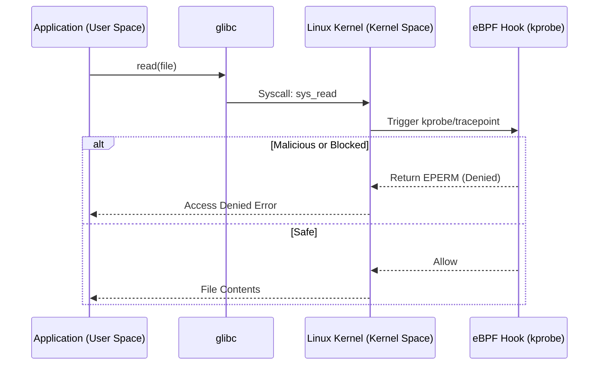

# 01. eBPF Primitives & Syscalls

## 1. The Concept (ELI5)
Imagine your Kubernetes node is a massive office building. The applications (pods) are the employees working in different rooms (user space). The Linux Kernel is the building's central nervous system and security team (kernel space). 

Historically, if an employee wanted to do something privileged—like read a file or open a network port—they had to submit a request to the security team (a **System Call** or **Syscall**). The security team would process the request behind closed doors.

**eBPF** is like installing smart, programmable security cameras directly inside the security team's office. Instead of just reviewing logs the next day, you can write a mini-program (an eBPF program) that runs *instantly* every time a specific action is requested. If the action is suspicious, the eBPF program can sound an alarm or immediately deny the request, all without slowing down the building's operations.

## 2. The Visual



## 3. The Code
Applications often execute arbitrary commands using shell interpreters, which invoke risky syscalls like `execve`. By avoiding shells, we reduce the syscall attack surface, making eBPF and seccomp profiles much easier to write.

### Go
**❌ Vulnerable Code (Shell Execution)**
```go
package main
import (
    "net/http"
    "os/exec"
)
func handler(w http.ResponseWriter, r *http.Request) {
    target := r.URL.Query().Get("target")
    // Executes in a shell, making it vulnerable to injection and using excessive syscalls
    cmd := exec.Command("sh", "-c", "ping -c 1 " + target)
    cmd.Run()
}
```

**✅ Secure Code (Direct Syscall Execution)**
```go
package main
import (
    "net/http"
    "os/exec"
)
func handler(w http.ResponseWriter, r *http.Request) {
    target := r.URL.Query().Get("target")
    // Calls the binary directly via execve without invoking a shell interpreter
    cmd := exec.Command("ping", "-c", "1", target)
    cmd.Run()
}
```

### Python
**❌ Vulnerable Code**
```python
import os
def ping_server(target):
    # Uses shell=True, invoking /bin/sh which creates a massive syscall footprint
    os.system(f"ping -c 1 {target}")
```

**✅ Secure Code**
```python
import subprocess
def ping_server(target):
    # Bypasses the shell, executing the binary directly
    subprocess.run(["ping", "-c", "1", target], check=True)
```

### TypeScript / Node.js
**❌ Vulnerable Code**
```typescript
import { exec } from 'child_process';
function pingServer(target: string) {
    // exec spawns a shell by default
    exec(`ping -c 1 ${target}`);
}
```

**✅ Secure Code**
```typescript
import { execFile } from 'child_process';
function pingServer(target: string) {
    // execFile does not spawn a shell
    execFile('ping', ['-c', '1', target]);
}
```

## 4. The Guardrail
To prevent pods from executing excessive or dangerous syscalls, we use a **Seccomp (Secure Computing) Profile** defined via Kubernetes configuration, or enforce it globally using an OPA Gatekeeper Rego policy.

**Rego Policy (Require RuntimeDefault Seccomp):**
```rego
package k8spspsecpro

violation[{"msg": msg}] {
    pod := input.review.object
    container := pod.spec.containers[_]
    not container.securityContext.seccompProfile.type == "RuntimeDefault"
    not pod.spec.securityContext.seccompProfile.type == "RuntimeDefault"
    msg := sprintf("Container '%v' must have a seccompProfile type of RuntimeDefault", [container.name])
}
```
