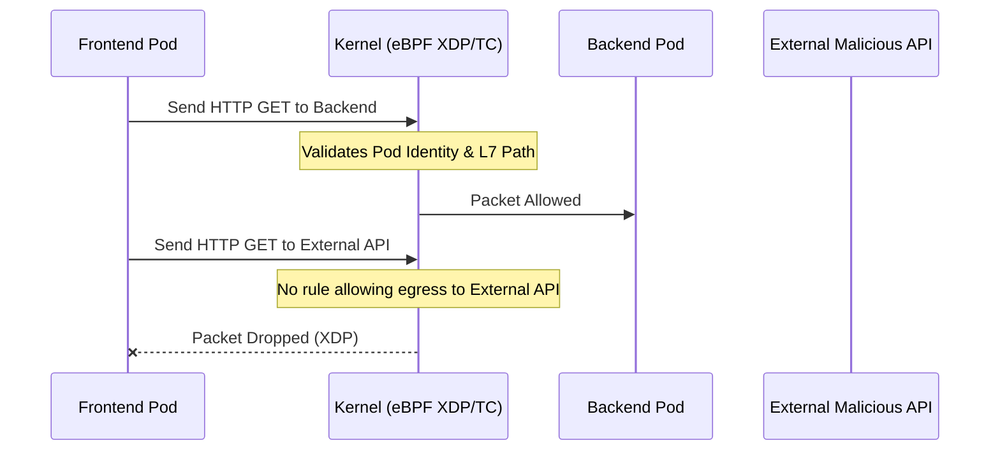

# 03. Network Security with Cilium

## 1. The Concept (ELI5)
Think of a traditional network firewall as a toll booth on a highway. Every car (network packet) has to stop, show its ID (IP address), and wait to be processed. As traffic increases, the toll booth becomes a massive bottleneck.

**Cilium** is an advanced network plugin for Kubernetes. Instead of using a traditional toll booth (iptables), Cilium uses eBPF to implant instructions directly into the highway itself (the Linux kernel's networking stack). Because the kernel processes the rules at the exact moment a packet is created or received, it is incredibly fast. Furthermore, Cilium understands Kubernetes identities (like labels and namespaces) and even Layer 7 protocols (like HTTP and gRPC), allowing it to act as an incredibly intelligent, high-speed bouncer.

## 2. The Visual



## 3. The Code
Server-Side Request Forgery (SSRF) allows an attacker to force a server to make network requests on their behalf. Even if SSRF exists in the code, a strong network policy (via Cilium) can prevent the pod from reaching out to internal metadata services (like `169.254.169.254` on AWS) or external malicious domains.

### Go
**❌ Vulnerable Code (SSRF)**
```go
package main
import (
    "io/ioutil"
    "net/http"
)
func fetchURL(w http.ResponseWriter, r *http.Request) {
    url := r.URL.Query().Get("url")
    // Blindly fetches whatever URL the user provides
    resp, _ := http.Get(url)
    defer resp.Body.Close()
    body, _ := ioutil.ReadAll(resp.Body)
    w.Write(body)
}
```

**✅ Secure Code (Domain Allowlisting)**
```go
package main
import (
    "net/http"
    "net/url"
)
func fetchURL(w http.ResponseWriter, r *http.Request) {
    targetURL := r.URL.Query().Get("url")
    parsed, err := url.Parse(targetURL)
    
    // Restrict fetching to a specific, trusted domain
    if err != nil || parsed.Host != "api.trusted-partner.com" {
        http.Error(w, "Invalid domain", 403)
        return
    }
    
    resp, _ := http.Get(targetURL)
    // ... process response ...
}
```

### Python
**❌ Vulnerable Code**
```python
import requests
from flask import Flask, request

app = Flask(__name__)

@app.route('/proxy')
def proxy():
    target = request.args.get('url')
    # SSRF vulnerability
    return requests.get(target).content
```

**✅ Secure Code**
```python
import requests
from urllib.parse import urlparse
from flask import Flask, request, abort

app = Flask(__name__)
ALLOWED_DOMAIN = "api.internal.service"

@app.route('/proxy')
def proxy():
    target = request.args.get('url')
    domain = urlparse(target).hostname
    
    if domain != ALLOWED_DOMAIN:
        abort(403)
        
    return requests.get(target).content
```

### TypeScript / Node.js
**❌ Vulnerable Code**
```typescript
import express from 'express';
import axios from 'axios';
const app = express();

app.get('/fetch', async (req, res) => {
    const target = req.query.url as string;
    // SSRF
    const response = await axios.get(target);
    res.send(response.data);
});
```

**✅ Secure Code**
```typescript
import express from 'express';
import axios from 'axios';
const app = express();

app.get('/fetch', async (req, res) => {
    const target = req.query.url as string;
    const url = new URL(target);
    
    if (url.hostname !== 'trusted-api.com') {
        return res.status(403).send('Untrusted domain');
    }
    const response = await axios.get(target);
    res.send(response.data);
});
```

## 4. The Guardrail
Regardless of the application code, we use a `CiliumNetworkPolicy` to enforce strict egress rules at the network layer, preventing SSRF payloads from ever leaving the node.

**CiliumNetworkPolicy (YAML): Block all egress except DNS and specific trusted domain**
```yaml
apiVersion: "cilium.io/v2"
kind: CiliumNetworkPolicy
metadata:
  name: "restrict-frontend-egress"
spec:
  endpointSelector:
    matchLabels:
      app: frontend
  egress:
    - toEndpoints:
      - matchLabels:
          "k8s:io.kubernetes.pod.namespace": "kube-system"
          "k8s:k8s-app": "kube-dns"
      toPorts:
        - ports:
           - port: "53"
             protocol: ANY
          rules:
            dns:
              - matchPattern: "*"
    - toFQDNs:
        - matchName: "api.trusted-partner.com"
      toPorts:
        - ports:
           - port: "443"
             protocol: TCP
```
