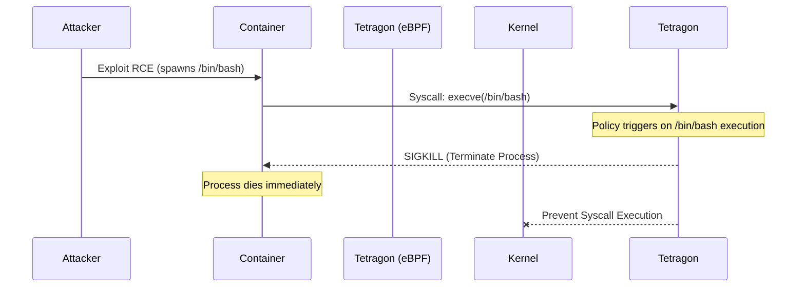

# 04. Runtime Enforcement with Tetragon

## 1. The Concept (ELI5)
If Falco is a burglar alarm that notifies you *after* an intruder enters, **Tetragon** is the armed bodyguard that tackles the intruder the second they touch the door handle.

Tetragon (also built heavily on eBPF, by the creators of Cilium) specializes in **synchronous runtime enforcement**. Because of where it hooks into the Linux kernel, Tetragon can evaluate a system call and issue a `SIGKILL` (a termination signal) to the offending process *before* the kernel even executes the malicious action. It is extremely performant and provides hard preventative boundaries for your workloads.

## 2. The Visual



## 3. The Code
Applications should never require elevated privileges at runtime. If an application requires privileged capabilities (like `CAP_SYS_ADMIN`), it significantly increases the risk of a container escape. Code should be written to operate as a non-root user and avoid invoking privileged binaries.

### Go
**❌ Vulnerable Code (Requires Root to bind port 80)**
```go
package main
import (
    "net/http"
)
func main() {
    // Binding to port 80 requires root privileges (CAP_NET_BIND_SERVICE)
    http.ListenAndServe(":80", nil)
}
```

**✅ Secure Code (Binds to unprivileged port)**
```go
package main
import (
    "net/http"
)
func main() {
    // Binding to port 8080 does not require root
    http.ListenAndServe(":8080", nil)
}
```

### Python
**❌ Vulnerable Code (Writing to root-owned directories)**
```python
import os
def save_config(data):
    # Attempting to write to /etc requires root access
    with open('/etc/app_config.json', 'w') as f:
        f.write(data)
```

**✅ Secure Code (Writing to user-owned directories)**
```python
import os
def save_config(data):
    # Write to a safe, application-specific directory
    with open('/app/data/config.json', 'w') as f:
        f.write(data)
```

### TypeScript / Node.js
**❌ Vulnerable Code (Changing user IDs dynamically)**
```typescript
import process from 'process';

function dropPrivileges() {
    // Attempting to change UID at runtime requires high kernel privileges
    process.setuid(1000); 
}
```

**✅ Secure Code (Start unprivileged)**
```typescript
// Do not change IDs in code. Instead, configure the Dockerfile / PodSpec
// to start the application as a non-root user (USER 1000 in Dockerfile)
console.log("App running safely as defined by infrastructure.");
```

## 4. The Guardrail
We can deploy a `TracingPolicy` via Tetragon to forcefully kill any process that attempts to spawn an interactive shell inside our containers, effectively stopping post-exploitation RCE in its tracks.

**Tetragon TracingPolicy (YAML): Kill Interactive Shells**
```yaml
apiVersion: cilium.io/v1alpha1
kind: TracingPolicy
metadata:
  name: "prevent-shells"
spec:
  kprobes:
  - call: "sys_execve"
    syscall: true
    args:
    - index: 0
      type: "string"
    selectors:
    - matchArgs:
      - index: 0
        operator: "Equal"
        values:
        - "/bin/sh"
        - "/bin/bash"
        - "/bin/zsh"
      matchActions:
      - action: Sigkill
```
