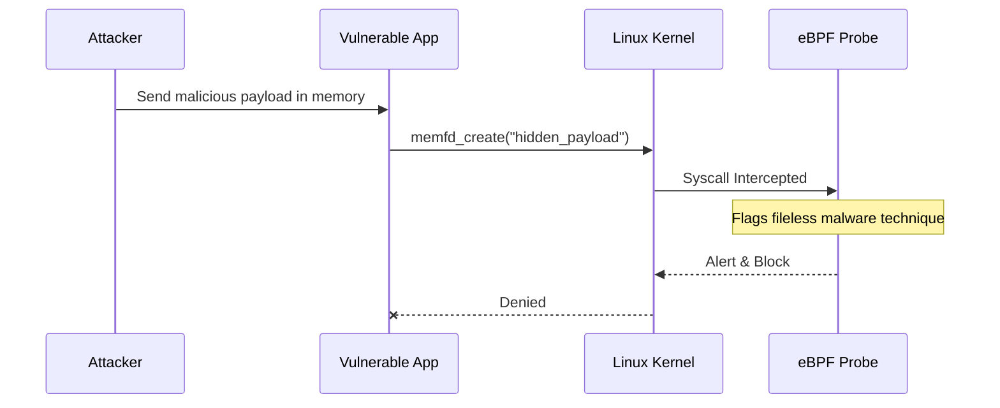

# 06. Malware Detection with eBPF

## 1. The Concept (ELI5)
Traditional anti-virus works by looking at the "fingerprints" (hashes) of files saved on a computer. If the fingerprint matches known malware, it deletes the file. 

However, modern attackers are clever. They use **Fileless Malware**. Instead of saving a file to the hard drive, they inject the malicious code directly into the computer's temporary memory (RAM) and run it from there. Because no file was ever saved, traditional anti-virus sees nothing.

eBPF solves this by monitoring **behavior**, not just files. If a program suddenly asks the kernel to create an invisible, memory-only execution space (like the `memfd_create` system call) and attempts to run code from it, eBPF catches the act in progress and stops it.

## 2. The Visual



## 3. The Code
Applications handling uploads or executing temporary scripts should rely on strictly managed temporary directories and avoid using underlying OS APIs that map memory to executable space unnecessarily.

### Go
**❌ Vulnerable Code (Executing from Memory/Temp Files)**
```go
package main
import (
    "io/ioutil"
    "os"
    "os/exec"
)
// Running unvalidated downloaded binaries directly from temp space
func executePayload(payload []byte) {
    f, _ := ioutil.TempFile("", "exec-*")
    f.Write(payload)
    f.Close()
    os.Chmod(f.Name(), 0755)
    
    cmd := exec.Command(f.Name())
    cmd.Run()
}
```

**✅ Secure Code (Avoid dynamic execution)**
```go
package main
// Do not download and execute arbitrary binaries.
// Application functionality should be bundled at build time.
// If dynamic scripting is absolutely required, use a secure sandbox like WebAssembly (Wasm).
func safeExecution() {
    // Rely on static, pre-compiled logic.
}
```

### Python
**❌ Vulnerable Code (Executing dynamic strings)**
```python
def run_dynamic_code(user_input):
    # exec() runs strings as Python code, acting like fileless execution
    exec(user_input)
```

**✅ Secure Code (Use AST Evaluation)**
```python
import ast

def safe_eval(user_input):
    # literal_eval only evaluates safe data types (strings, numbers, tuples, dicts, booleans, and None)
    return ast.literal_eval(user_input)
```

### TypeScript / Node.js
**❌ Vulnerable Code (Executing memory buffers)**
```typescript
import { exec } from 'child_process';

function runBuffer(buffer: Buffer) {
    // Creating a child process from raw buffered input
    const proc = exec('node');
    proc.stdin?.write(buffer);
    proc.stdin?.end();
}
```

**✅ Secure Code (Static execution only)**
```typescript
// Do not pipe external buffers into interpreter stdin.
// Ensure all executed logic exists on the immutable container filesystem.
```

## 4. The Guardrail
To prevent attackers from dropping malware into running containers, we use Kubernetes Security Contexts to enforce a **Read-Only Root Filesystem**. This means even if an attacker gets RCE, they cannot download and save a malicious binary to the container disk.

**Terraform (Kubernetes Provider): Read-Only Filesystem**
```hcl
resource "kubernetes_deployment" "secure_app" {
  metadata {
    name = "secure-app"
  }
  spec {
    template {
      spec {
        container {
          name  = "app"
          image = "my-app:1.0"
          
          security_context {
            # Prevents writing any malware to the container filesystem
            read_only_root_filesystem = true
          }
        }
      }
    }
  }
}
```
