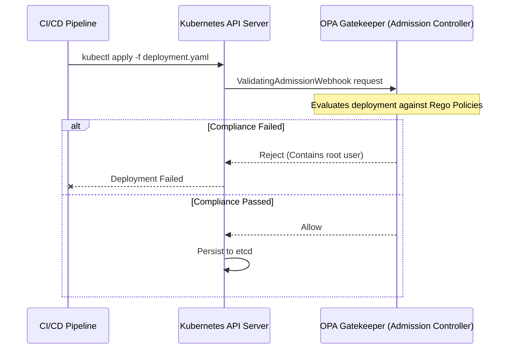

# 07. Auditing & Compliance with Rego

## 1. The Concept (ELI5)
Imagine a health inspector visiting a restaurant. Traditionally, the inspector comes once a year, checks the kitchen, and gives a passing grade. But what happens if the chef drops food on the floor the next day?

In Kubernetes, traditional compliance is like the yearly inspection. You scan your configurations once, and hope nothing bad gets deployed. **Continuous Auditing with Rego** is like installing a robot health inspector that stands in the kitchen 24/7. Before a chef (developer) can cook a meal (deploy an app), the robot checks the recipe against the rulebook (Rego policy). If it violates a rule, the deployment is blocked instantly.

## 2. The Visual



## 3. The Code
Applications often accidentally log or expose sensitive secrets (like API keys) if they are injected into the environment carelessly. A compliant application must manage its secrets securely and avoid dumping environment variables.

### Go
**❌ Vulnerable Code (Logging all environment variables)**
```go
package main
import (
    "fmt"
    "os"
)
func debug() {
    // Blindly prints out all environment variables, leaking secrets to logs
    for _, env := range os.Environ() {
        fmt.Println(env)
    }
}
```

**✅ Secure Code (Logging specific, non-sensitive config)**
```go
package main
import (
    "fmt"
    "os"
)
func debug() {
    // Only log explicit, safe configuration values
    fmt.Printf("App running on PORT: %s\n", os.Getenv("PORT"))
    fmt.Printf("App environment: %s\n", os.Getenv("ENV"))
}
```

### Python
**❌ Vulnerable Code**
```python
import os
import logging

def log_system_state():
    # Dumps entire environment dict into logs
    logging.info(f"System env: {os.environ}")
```

**✅ Secure Code**
```python
import os
import logging

def log_system_state():
    safe_keys = ['FLASK_ENV', 'WORKERS']
    safe_env = {k: os.environ.get(k) for k in safe_keys}
    logging.info(f"System env: {safe_env}")
```

### TypeScript / Node.js
**❌ Vulnerable Code**
```typescript
import express from 'express';
const app = express();

app.get('/health', (req, res) => {
    // Exposes the entire environment via a healthcheck endpoint
    res.json({ status: "healthy", env: process.env });
});
```

**✅ Secure Code**
```typescript
import express from 'express';
const app = express();

app.get('/health', (req, res) => {
    // Only return the status
    res.json({ status: "healthy" });
});
```

## 4. The Guardrail
To ensure secrets are not exposed to applications as raw Environment Variables (which are easily leaked or read by crash dumps), we can enforce a Rego policy that requires all K8s Secrets to be mounted as files, rather than loaded as `env` or `envFrom`.

**Rego Policy: Forbid Secrets as Environment Variables**
```rego
package k8sblocksecretenv

violation[{"msg": msg}] {
    container := input.review.object.spec.template.spec.containers[_]
    env := container.env[_]
    env.valueFrom.secretKeyRef
    msg := sprintf("Container '%v' is using a Secret in an environment variable, which is forbidden. Mount secrets as files instead.", [container.name])
}

violation[{"msg": msg}] {
    container := input.review.object.spec.template.spec.containers[_]
    envFrom := container.envFrom[_]
    envFrom.secretRef
    msg := sprintf("Container '%v' is using envFrom with a Secret, which is forbidden. Mount secrets as files instead.", [container.name])
}
```
