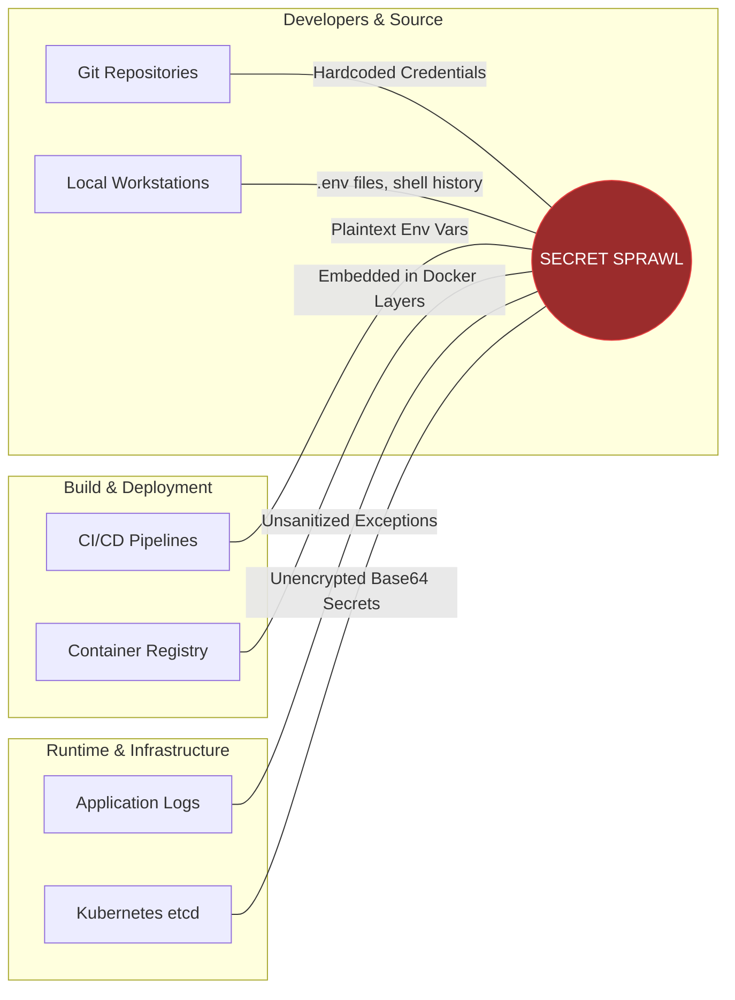
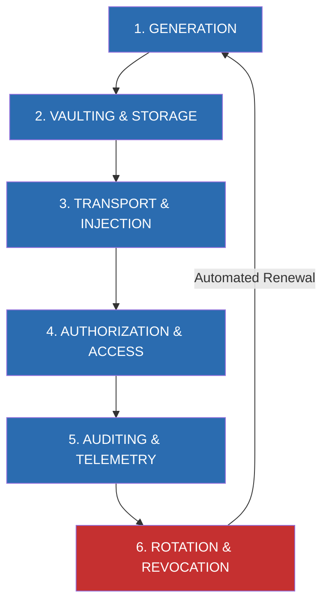

# 01. Introduction to Secrets Management & Threat Landscape

## 1. What is a Secret?

In modern software development and cloud engineering, a **secret** is any piece of digital data that acts as an authentication or authorization credential, granting access to protected systems, sensitive datasets, or privileged APIs.

Unlike public configurations (such as application names, feature flags, or server port numbers), secrets require strict confidentiality, integrity, and controlled distribution.

```
+-------------------------------------------------------------------------------+
|                                 DIGITAL ASSETS                                |
+------------------------------------+------------------------------------------+
|       PUBLIC CONFIGURATION         |              SECRETS (CONFIDENTIAL)      |
+------------------------------------+------------------------------------------+
| - Database Hostnames / Ports       | - Database Passwords & Auth Connection   |
| - Feature Flags & Environment Name |   Strings                                |
| - Non-sensitive API Base URLs      | - API Keys (Stripe, Twilio, OpenAI)      |
| - Public TLS Certificates (.crt)   | - Private Cryptographic Keys (RSA, ECC)  |
| - Max Connection Pool Size         | - OAuth Client Secrets & Refresh Tokens  |
| - CORS Allowed Origins             | - Cloud Provider IAM Access / Secret Keys|
|                                    | - TLS Private Keys (.key)                |
+------------------------------------+------------------------------------------+
```

### Static vs. Dynamic Secrets

Traditional infrastructure relied on **static secrets**: long-lived credentials generated once (often manually) and manually configured across application environments. Static secrets present high risk because their lifespan is unbounded, and their compromise yields indefinite access until manually revoked.

Modern Zero Trust architectures demand **dynamic secrets**: short-lived credentials generated on demand for a specific requester with an explicit Time-To-Live (TTL). When the TTL expires, the secrets management system automatically revokes the credential at the target resource (e.g., dropping a temporary database user).

---

## 2. The Threat Landscape: Secret Sprawl

As organizations transition to microservices, CI/CD automation, and multi-cloud architectures, the number of secrets increases exponentially. When secrets are managed without centralized governance, they leak into unencrypted locations—a risk known as **Secret Sprawl**.



### Common Locations of Secret Exposure

1. **Source Code Version Control**: Hardcoded strings in source files (`.py`, `.js`, `.go`, `.java`), unit tests, or historical Git commits that persist even after deletion from the `HEAD` commit.
2. **Configuration Files & Environment Manifests**: Unencrypted `.env`, `appsettings.json`, `config.yaml`, or `docker-compose.yml` files committed to public or internal repositories.
3. **Container Build Layers**: Passing credentials via Dockerfile `ARG` or `ENV` instructions. Even if deleted in subsequent build steps, the secret remains stored in intermediate image layer blobs.
4. **CI/CD Execution Contexts**: Plaintext print statements in GitHub Actions, GitLab CI runners, or Jenkins logs when verbose debugging is active.
5. **Crash Dumps & Application Logging**: Exception stack traces logging raw request headers (e.g., `Authorization: Bearer <token>`) or full database connection URIs to third-party log aggregators (Elasticsearch, Datadog).
6. **Orchestrator State Backends**: Unencrypted storage in Kubernetes `etcd` clusters or Terraform state files (`terraform.tfstate`) containing plaintext output variables.

---

## 3. Real-World Case Studies & Root Causes

Secret leaks are among the most frequent initial access vectors leveraged by threat actors.

### Case Study 1: The CircleCI Security Incident (2023)
- **Root Cause**: A threat actor compromised a senior engineer's workstation via malware, extracting session tokens that bypassed multi-factor authentication (MFA).
- **Impact**: The attacker accessed CircleCI's internal production systems and decrypted customer secrets stored in CI/CD variables, forcing thousands of organizations to immediately rotate all AWS keys, GitHub tokens, and database passwords used in their build pipelines.

### Case Study 2: Toyota GitHub Repository Secret Leakage (2022)
- **Root Cause**: A third-party development contractor uploaded a public GitHub repository containing hardcoded access credentials to a server holding customer information.
- **Impact**: The secret remained publicly accessible on GitHub for nearly 5 years (from 2017 to 2022), exposing over 296,000 customer email addresses and account details.

### Case Study 3: Uber GitHub AWS Credential Exposure (2016)
- **Root Cause**: Uber developers published private GitHub code containing hardcoded AWS credentials.
- **Impact**: Attackers used the credentials to access Uber's Amazon S3 buckets, downloading the personal information of 57 million users and driver records, resulting in massive regulatory fines and reputational damage.

---

## 4. Formal Taxonomy of Weaknesses (CWE Mapping)

Secrets management failures map directly to standard Common Weakness Enumeration (CWE) categories:

| CWE ID | Vulnerability Name | Technical Risk & Description |
| :--- | :--- | :--- |
| **CWE-798** | **Use of Hard-coded Credentials** | Inbound credentials (passwords, keys) are compiled directly into source code or scripts, allowing anyone with access to the binary or source to authenticate. |
| **CWE-312** | **Cleartext Storage of Sensitive Information** | Secrets are stored on disk, in databases, or in `etcd` without cryptographic protection (encryption at rest). |
| **CWE-522** | **Insufficient Credentials Protection** | Secrets are transmitted or stored using weak encryption algorithms, predictable keys, or insecure transmission channels (HTTP instead of TLS 1.3). |
| **CWE-532** | **Insertion of Sensitive Info into Log File** | Applications print authorization tokens, API keys, or raw connection strings directly to standard out or file system loggers. |
| **CWE-256** | **Unprotected Storage of Credentials** | Credentials stored in environment variables accessible to any unprivileged subprocess on the operating system. |

---

## 5. The Enterprise Secrets Lifecycle Model

Securing credentials requires establishing a deterministic **6-Stage Secrets Lifecycle**. Every secret within an enterprise ecosystem must strictly adhere to these lifecycle controls.



### Stage 1: Generation & Entropy
Secrets must be generated using Cryptographically Secure Pseudo-Random Number Generators (CSPRNG). Never allow human developers to manually invent passwords or API keys.
- **Cryptographic Entropy**: Minimum of 128 bits of entropy for API keys (e.g., 32 random hex characters or 24 random Base64 characters).
- **Dynamic Creation**: Prefer ephemeral dynamic credentials generated on-the-fly over static master keys.

### Stage 2: Vaulting & Storage (Encryption at Rest)
Secrets must reside exclusively inside centralized, dedicated secret managers (e.g., HashiCorp Vault, AWS Secrets Manager, GCP Secret Manager, Azure Key Vault).
- **Envelope Encryption**: Data Encryption Keys (DEKs) encrypt the actual secret payload, while a master Key Encryption Key (KEK) protected by a Hardware Security Module (HSM) encrypts the DEK.
- **Memory-Only Storage**: Storage backends must never write unencrypted secrets to swap space or persistent disk.

### Stage 3: Transport & Injection (Encryption in Transit)
- **Zero Disk Footprints**: Inject secrets directly into application process memory at runtime via `tmpfs` (in-memory volume mounts) or local SDK calls.
- **TLS 1.3 Enforcement**: All API interactions between workloads and secrets vaults must enforce TLS 1.3 with strict mutual authentication (mTLS).

### Stage 4: Authorization & Access Control
- **Principle of Least Privilege**: Workloads receive explicit, narrow access rules (e.g., `read` access to `kv/data/production/payment/*` only).
- **Short-Lived Leases**: Tokens issued to workloads must carry aggressive TTLs (e.g., 15 minutes to 1 hour) requiring explicit lease renewals.

### Stage 5: Auditing & Telemetry
Every interaction with a secret (create, read, update, delete, revoke) must generate an immutable, tamper-evident audit log event containing:
- Authenticated identity (ServiceAccount, IAM ARN, AppRole ID).
- Timestamp (UTC ISO 8601).
- Client IP address and geographic context.
- Specific secret path requested (excluding the secret value itself).

### Stage 6: Rotation & Revocation
- **Proactive Rotation**: Secrets must automatically rotate on a fixed schedule (e.g., every 30 to 90 days) without downtime.
- **Reactive Emergency Revocation**: In the event of a suspected leak or security compromise, security teams must possess a single-command mechanism to instantly revoke all active leases and tokens associated with the key.

---

> [!NEXT]
> Move to **[Chapter 02: HashiCorp Vault Deep Dive](./02-hashicorp-vault.md)** to learn how to deploy, configure, and integrate HashiCorp Vault into enterprise applications.
