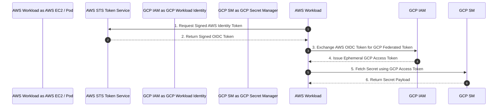

# 03. Cloud Native Secrets Managers

Cloud-native secret managers offer tightly integrated, serverless secrets vaulting managed directly by major cloud providers (AWS, GCP, Azure). They eliminate the operational burden of deploying and managing dedicated Vault clusters while providing seamless identity-based access control (IAM).

---

## 1. Enterprise Secrets Manager Comparison Matrix

| Feature / Metric | **AWS Secrets Manager** | **AWS SSM Parameter Store (SecureString)** | **GCP Secret Manager** | **Azure Key Vault** | **HashiCorp Vault (Self-Hosted/HCP)** |
| :--- | :--- | :--- | :--- | :--- | :--- |
| **Primary Use Case** | Cloud-native production secrets & auto-rotation | Low-cost configuration & static parameters | GCP-native secret storage & Cloud Build | Azure managed secrets, keys & certificates | Multi-cloud enterprise Zero Trust vault |
| **Max Payload Size** | 64 KB | 4 KB (Standard) / 8 KB (Advanced) | 64 KB | 25 KB | Unlimited (bounded by network payload) |
| **IAM Integration** | AWS IAM Roles / Policies | AWS IAM Roles / Policies | GCP IAM / Service Accounts | Azure RBAC / Managed Identity | AppRole, K8s, OIDC, Cloud IAM |
| **Native Auto-Rotation** | Built-in Lambda templates (RDS, Redshift) | Manual / Custom EventBridge Lambda | Cloud Run / Cloud Functions PubSub triggers | Azure Event Grid + Logic Apps / Functions | Native Database/AWS/PKI Secret Engines |
| **Multi-Cloud Support** | AWS-centric (Requires IAM Roles Anywhere) | AWS-centric | GCP-centric (Requires Workload Identity Fed) | Azure-centric (Requires Workload Identity Fed) | Native multi-cloud & hybrid cloud support |
| **Cost Model** | \`$0.40/secret/month + \`0.05 per 10k API calls | Free (Standard) / \`0.05/advanced secret/mo | \`$0.06/secret/month + \`0.03 per 10k API calls | \`0.03 per 10k operations | Infrastructure footprint or HCP licensing |

---

## 2. AWS Secrets Manager

AWS Secrets Manager uses AWS Key Management Service (KMS) for envelope encryption. Secrets are encrypted using a Customer Master Key (CMK).

```mermaid
graph TD
    A[EC2 / ECS / Lambda] -->|1. Assume IAM Role| B[AWS IAM]
    A -->|2. GetSecretValue API| C[AWS Secrets Manager]
    C -->|3. Decrypt Payload via KMS CMK| D[AWS KMS]
    D -->>C: Return Plaintext Secret
    C -->>A: Return Secret JSON Payload
```

### Least Privilege AWS IAM Policy

Restrict access to a specific secret path and mandate encryption via a specific KMS Key ARN:

```json
{
  "Version": "2012-10-17",
  "Statement": [
    {
      "Sid": "AllowSecretRetrieval",
      "Effect": "Allow",
      "Action": [
        "secretsmanager:GetSecretValue",
        "secretsmanager:DescribeSecret"
      ],
      "Resource": "arn:aws:secretsmanager:us-east-1:123456789012:secret:prod/payment/*",
      "Condition": {
        "StringEquals": {
          "aws:PrincipalTag/Environment": "production"
        }
      }
    },
    {
      "Sid": "AllowKMSDecryption",
      "Effect": "Allow",
      "Action": "kms:Decrypt",
      "Resource": "arn:aws:kms:us-east-1:123456789012:key/abc-123-def-456"
    }
  ]
}
```

### Python Implementation with Local Caching (`botocore` + `aws-secretsmanager-caching`)

Caching secrets in memory reduces API costs, avoids throttling limits (`GetSecretValue` has default throughput quotas), and improves application latency.

```python
import json
import boto3
from botocore.exceptions import ClientError
from aws_secretsmanager_caching import SecretCache, SecretCacheConfig

# Setup cached client
client = boto3.client('secretsmanager', region_name='us-east-1')
cache = SecretCache(config=SecretCacheConfig(), client=client)

def get_database_credentials():
    secret_name = "prod/payment/database"
    
    try:
        # Retrieves secret from local cache if TTL is valid; otherwise calls API
        secret_string = cache.get_secret_string(secret_name)
        credentials = json.loads(secret_string)
        
        return credentials["username"], credentials["password"]
    except ClientError as e:
        print(f"AWS Secrets Manager Error: {e}")
        raise e

if __name__ == "__main__":
    user, pwd = get_database_credentials()
    print(f"Retrieved credentials for database user: {user}")
```

---

## 3. Google Cloud Secret Manager

Google Cloud Secret Manager integrates directly with Google Cloud IAM and Workload Identity Federation, allowing Kubernetes pods in GKE to access secrets without long-lived service account keys.

### Node.js Implementation (`@google-cloud/secret-manager`)

```javascript
const { SecretManagerServiceClient } = require('@google-cloud/secret-manager');
const client = new SecretManagerServiceClient();

async function accessGcpSecret() {
  // Format: projects/{project_id}/secrets/{secret_id}/versions/{version_id}
  const name = 'projects/my-gcp-project/secrets/prod-db-password/versions/latest';

  try {
    const [version] = await client.accessSecretVersion({ name });
    const payload = version.payload.data.toString('utf8');

    console.log('GCP Secret retrieved successfully.');
    return payload;
  } catch (err) {
    console.error('Failed to access GCP secret:', err.message);
    throw err;
  }
}

accessGcpSecret();
```

---

## 4. Azure Key Vault

Azure Key Vault provides secure storage for keys, secrets, and certificates. Modern Azure deployments authenticate using **Managed Identities**, eliminating credentials from configuration files entirely.

### Java Implementation (`azure-security-keyvault-secrets` + `azure-identity`)

```java
package com.appsec.azure;

import com.azure.identity.DefaultAzureCredentialBuilder;
import com.azure.security.keyvault.secrets.SecretClient;
import com.azure.security.keyvault.secrets.SecretClientBuilder;
import com.azure.security.keyvault.secrets.models.KeyVaultSecret;

public class AzureKeyVaultManager {

    public static void main(String[] args) {
        String keyVaultName = System.getenv("KEY_VAULT_NAME");
        String keyVaultUri = "https://" + keyVaultName + ".vault.azure.net";

        // Uses Managed Identity (System/User-Assigned) or Azure CLI in dev
        SecretClient secretClient = new SecretClientBuilder()
                .vaultUrl(keyVaultUri)
                .credential(new DefaultAzureCredentialBuilder().build())
                .buildClient();

        KeyVaultSecret secret = secretClient.getSecret("ProdDatabasePassword");
        System.out.println("Azure Key Vault Secret Retrieved: " + secret.getValue());
    }
}
```

### Go Implementation (`azsecrets` + `azidentity`)

```go
package main

import (
	"context"
	"fmt"
	"log"
	"os"

	"github.com/Azure/azure-sdk-for-go/sdk/azidentity"
	"github.com/Azure/azure-sdk-for-go/sdk/security/keyvault/azsecrets"
)

func main() {
	vaultName := os.Getenv("KEY_VAULT_NAME")
	vaultURL := fmt.Sprintf("https://%s.vault.azure.net/", vaultName)

	cred, err := azidentity.NewDefaultAzureCredential(nil)
	if err != nil {
		log.Fatalf("Failed to obtain DefaultAzureCredential: %v", err)
	}

	client, err := azsecrets.NewClient(vaultURL, cred, nil)
	if err != nil {
		log.Fatalf("Failed to create Key Vault client: %v", err)
	}

	resp, err := client.GetSecret(context.TODO(), "ProdDatabasePassword", "", nil)
	if err != nil {
		log.Fatalf("Failed to fetch secret from Azure Key Vault: %v", err)
	}

	fmt.Printf("Successfully retrieved Azure Key Vault Secret!\n")
	_ = resp.Value
}
```

---

## 5. Multi-Cloud & Workload Identity Federation (SPIFFE/SPIRE)

In multi-cloud environments, hardcoding cross-cloud service account keys (e.g., storing a GCP JSON key in AWS) creates massive secret sprawl. 

The industry best practice is **Workload Identity Federation** using open standards like **SPIFFE/SPIRE** (Secure Production Identity Framework for Everyone).



---

> [!NEXT]
> Move to **[Chapter 04: Kubernetes Secrets Hardening](./04-kubernetes-secrets-hardening.md)** to learn how to secure containerized workloads, configure `etcd` KMS encryption, and deploy the External Secrets Operator.
