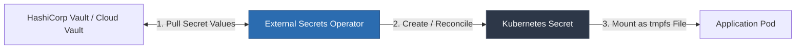

# 04. Kubernetes Secrets Hardening & GitOps Patterns

> [!WARNING]
> By default, native Kubernetes `Secret` objects are **NOT encrypted**. The `.data` fields in a Kubernetes `Secret` manifest are merely Base64-encoded plain text. Anyone with read access to the cluster's `etcd` datastore or possessing `GET`/`LIST` RBAC permissions on secrets can instantly decode all credentials.

---

## 1. Layer 1: `etcd` Encryption at Rest (KMS v2 Provider)

To prevent cluster administrators or attackers with master node access from inspecting plaintext secrets in `etcd`, you must enable KMS Encryption at Rest in the `kube-apiserver`.

```mermaid
graph TD
    A[kubectl apply -f secret.yaml] --> B[kube-apiserver]
    B -->|1. Request Envelope Encryption| C[KMS Plugin / AWS KMS / Vault]
    C -->>B: 2. Return Encrypted Ciphertext
    B -->|3. Write Encrypted Blob| D[(etcd Storage)]

    style D fill:#742a2a,stroke:#9b2c2c,color:#fff
    style C fill:#2b6cb0,stroke:#2c5282,color:#fff
```

### Encryption Configuration Manifest (`/etc/kubernetes/kms/encryption-config.yaml`)

```yaml
apiVersion: apiserver.config.k8s.io/v1
kind: EncryptionConfiguration
resources:
  - resources:
      - secrets
    providers:
      - kms:
          name: aws-encryption-provider
          endpoint: unix:///var/run/kmsplugin/kmsplugin.sock
          cachesize: 1000
          timeout: 3s
      - aescbgcm:
          keys:
            - name: key1
              secret: c2VjcmV0IGlzIGEgc2VjcmV0IGlzIGEgc2VjcmV0IQ==
      - identity: {} # Fallback provider allowing reading unencrypted existing secrets
```

### Enabling KMS in `kube-apiserver` & Re-Encrypting Secrets

1. Pass the configuration flag to `kube-apiserver`:
   `--encryption-provider-config=/etc/kubernetes/kms/encryption-config.yaml`
2. Restart `kube-apiserver`.
3. **Re-encrypt existing secrets** in `etcd` (since encryption applies only to write operations):
   ```bash
   kubectl get secrets --all-namespaces -o json | kubectl replace -f -
   ```

---

## 2. Layer 2: External Secrets Operator (ESO)

Manually creating Kubernetes secrets via `kubectl create secret` leads to configuration drift and secret exposure in developer shell histories. 

The **External Secrets Operator (ESO)** synchronizes secrets from external vaults (HashiCorp Vault, AWS Secrets Manager, GCP Secret Manager) into Kubernetes `Secret` objects automatically.



### Step 1: Define `ClusterSecretStore` (Vault Backend)

```yaml
apiVersion: external-secrets.io/v1beta1
kind: ClusterSecretStore
metadata:
  name: vault-backend
spec:
  provider:
    vault:
      server: "https://vault.internal.example.com:8200"
      path: "secret"
      version: "v2"
      auth:
        kubernetes:
          mountPath: "kubernetes"
          role: "eso-cluster-role"
          serviceAccountRef:
            name: "eso-service-account"
            namespace: "external-secrets"
```

### Step 2: Define `ExternalSecret` Resource

```yaml
apiVersion: external-secrets.io/v1beta1
kind: ExternalSecret
metadata:
  name: payment-service-secrets
  namespace: production
spec:
  refreshInterval: "1h" # Sync frequency with Vault
  secretStoreRef:
    name: vault-backend
    kind: ClusterSecretStore
  target:
    name: payment-app-k8s-secret # Name of the standard K8s Secret created in namespace
    creationPolicy: Owner
  data:
    - secretKey: DB_PASSWORD
      remoteRef:
        key: production/payment/database
        property: password
    - secretKey: API_KEY
      remoteRef:
        key: production/payment/config
        property: api_key
```

---

## 3. Layer 3: Secrets Store CSI Driver (`tmpfs` Memory Mounts)

While ESO synchronizes secrets into standard Kubernetes `Secret` objects, those objects still reside in `etcd`. 

The **Secrets Store CSI Driver** retrieves secrets from HashiCorp Vault or Cloud Vaults and mounts them **directly as temporary in-memory files (`tmpfs`)** into the pod volume without creating a Kubernetes `Secret` object in `etcd` at all.

```yaml
apiVersion: apps/v1
kind: Deployment
metadata:
  name: payment-microservice
  namespace: production
spec:
  replicas: 3
  template:
    metadata:
      labels:
        app: payment-microservice
    spec:
      serviceAccountName: payment-app-sa
      containers:
        - name: app
          image: myregistry.internal/payment-app:v1.4.0
          volumeMounts:
            - name: secrets-store-inline
              mountPath: "/mnt/secrets"
              readOnly: true
      volumes:
        - name: secrets-store-inline
          csi:
            driver: secrets-store.csi.k8s.io
            readOnly: true
            volumeAttributes:
              secretProviderClass: "vault-payment-provider"
```

---

## 4. Layer 4: GitOps Friendly Secrets (Sealed Secrets vs SOPS)

Storing unencrypted secrets in Git repositories violates GitOps practices. Two standard solutions allow safely committing encrypted secrets to version control:

### Option A: Bitnami Sealed Secrets

Sealed Secrets uses asymmetric encryption. Anyone can encrypt a secret using the cluster's public key, but only the `sealed-secrets-controller` running inside the target Kubernetes cluster possesses the private key required for decryption.

```bash
# 1. Generate local standard secret
kubectl create secret generic db-credentials \
  --from-literal=password='SuperSecret123!' \
  --dry-run=client -o json > secret.json

# 2. Encrypt into SealedSecret using public certificate
kubeseal --cert pub-cert.pem < secret.json > sealedsecret.yaml

# 3. Commit sealedsecret.yaml to Git safely!
git add sealedsecret.yaml && git commit -m "Add sealed DB credentials"
```

### Option B: Mozilla SOPS (Secrets OPerationS)

SOPS encrypts specific values inside YAML, JSON, or ENV files using AWS KMS, GCP KMS, Azure Key Vault, or Age keys while preserving the file's unencrypted keys for diffing.

```bash
# Encrypt values in values.yaml using AWS KMS key
sops --encrypt \
  --kms arn:aws:kms:us-east-1:123456789012:key/abc-123 \
  --encrypted-regex '^(password|secret|apiKey)$' \
  values.yaml > values.enc.yaml

# Decrypt in CI/CD before helm deployment
sops --decrypt values.enc.yaml | helm upgrade --install my-release -f - ./my-chart
```

---

## 5. In-Memory Volume Mounts vs Environment Variables

> [!CAUTION]
> Avoid passing secrets via environment variables (`envFrom: secretRef`). Environment variables leak via `/proc/1/environ`, application crash dumps, debug endpoints, and child subprocess inheritance.

```
+---------------------------------------------------------------------------------+
|                       SECRET INJECTION METHOD COMPARISON                        |
+-----------------------------+---------------------------------------------------+
| ENVIRONMENT VARIABLES (BAD) | IN-MEMORY VOLUME MOUNTS (GOOD)                    |
+-----------------------------+---------------------------------------------------+
| - Readable by any process   | - Mounted strictly to specified directory         |
|   via /proc/<pid>/environ   |   (e.g., /mnt/secrets)                            |
| - Logged in APM stack traces| - Stored in RAM (tmpfs); never written to disk    |
|   and crash dumps           | - Restricted permissions (e.g., mode 0400)        |
| - Inherited by untrusted    | - Automatically updated upon secret rotation      |
|   child subprocesses        |   without requiring container restarts            |
+-----------------------------+---------------------------------------------------+
```

### Recommended Pod Security Context & Mount Configuration

```yaml
spec:
  securityContext:
    runAsNonRoot: true
    runAsUser: 10001
    readOnlyRootFilesystem: true
  containers:
    - name: secure-app
      image: payment-service:v2.0
      volumeMounts:
        - name: secret-volume
          mountPath: "/var/run/secrets/payment"
          readOnly: true
  volumes:
    - name: secret-volume
      secret:
        secretName: payment-app-k8s-secret
        defaultMode: 0400 # Read-only by owner only
```

---

> [!NEXT]
> Move to **[Chapter 05: Secret Scanning & Rotation](./05-secret-scanning-and-rotation.md)** to implement automated scanning in GitHub Actions and zero-downtime secret rotation pipelines.
