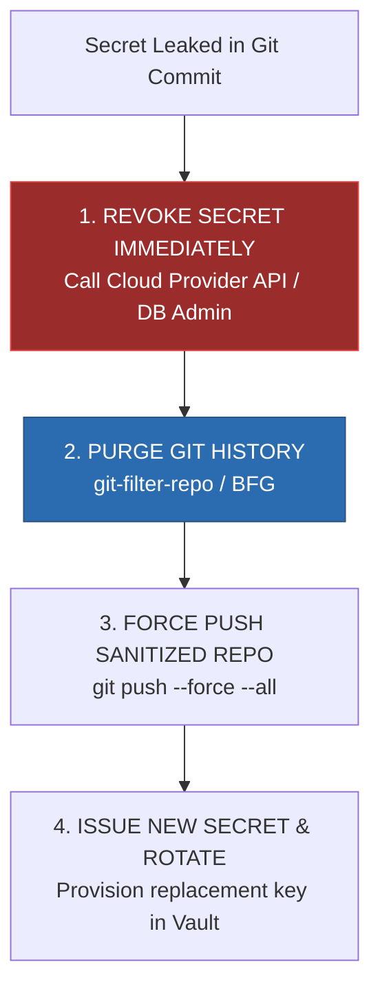
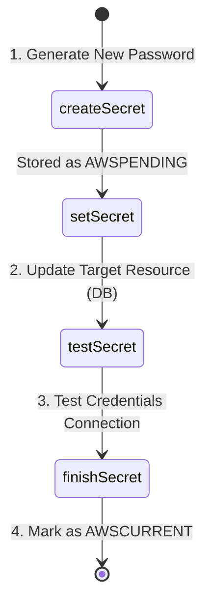

# 05. Secret Detection, Prevention & Automated Rotation

---

## 1. Shift-Left Secret Detection: Pre-Commit & Local Guardrails

Catching hardcoded credentials before they are pushed to remote version control is the most effective defense against secret exposure.

### Pre-Commit Framework Configuration (`.pre-commit-config.yaml`)

```yaml
repos:
  - repo: https://github.com/gitleaks/gitleaks
    rev: v8.18.0
    hooks:
      - id: gitleaks
        name: Detect Hardcoded Secrets (Gitleaks)
        entry: gitleaks protect --verbose --redact --staged
        language: golang
```

### Custom Gitleaks Ruleset (`gitleaks.toml`)

Define custom patterns for proprietary API keys, internal tokens, and entropy thresholds:

```toml
title = "Custom Enterprise Gitleaks Rules"

[[rules]]
id = "internal-api-key"
description = "Detected Internal Platform API Key"
regex = '''(?i)(internal|corp)_api_key\s*[:=]\s*["']?([a-z0-9]{32})["']?'''
secretGroup = 2
keywords = ["internal_api_key", "corp_api_key"]

[[rules]]
id = "generic-high-entropy-secret"
description = "Detected High Entropy String in Assignment"
regex = '''(?i)(password|secret|token|apiKey)\s*[:=]\s*["']?([a-zA-Z0-9+/=_-]{20,128})["']?'''
entropy = 4.5 # Shannon entropy threshold
secretGroup = 2

[allowlist]
description = "Allowlisted Mock Secrets for Unit Tests"
paths = [
  '''tests/mocks/.*''',
  '''go.sum$'''
]
regexes = [
  '''EXAMPLE_KEY_FOR_TESTING_ONLY'''
]
```

### TruffleHog CLI with Active Verification

TruffleHog scans Git repositories, filesystems, and S3 buckets for high-entropy strings and secret patterns, and actively verifies credentials against vendor endpoints (e.g., verifying if an AWS key or Slack token is active).

```bash
# Scan local directory for active, verified secrets
trufflehog filesystem /path/to/code --only-verified

# Scan entire Git commit history
trufflehog git file:///path/to/repo --since-commit HEAD~50
```

---

## 2. CI/CD Pipeline Enforcement (GitHub Actions Workflow)

Even with local pre-commit hooks, CI/CD pipeline verification is mandatory to prevent developers from bypassing local controls (`git commit --no-verify`).

```yaml
name: Security Secret Scan

on:
  push:
    branches: [ main, develop ]
  pull_request:
    types: [ opened, synchronize, reopened ]

jobs:
  gitleaks-scan:
    name: Gitleaks Secret Audit
    runs-on: ubuntu-latest
    steps:
      - name: Checkout Code Base
        uses: actions/checkout@v4
        with:
          fetch-depth: 0 # Deep clone required to scan entire history

      - name: Run Gitleaks Security Scan
        uses: gitleaks/gitleaks-action@v2
        env:
          GITHUB_TOKEN: ${{ secrets.GITHUB_TOKEN }}
          GITLEAKS_LICENSE: ${{ secrets.GITLEAKS_LICENSE }} # Optional for enterprise

  trufflehog-scan:
    name: TruffleHog Active Verification
    runs-on: ubuntu-latest
    steps:
      - name: Checkout Code Base
        uses: actions/checkout@v4
        with:
          fetch-depth: 0

      - name: TruffleHog OSS Scan
        uses: trufflesecurity/trufflehog-actions-scan@v3.0.0
        with:
          path: ./
          base: ${{ github.event.repository.default_branch }}
          head: HEAD
          extra_args: --only-verified
```

---

## 3. Emergency Incident Response: Leaked Secret Remediation

> [!CAUTION]
> Deleting a commit or removing a file containing a secret from `HEAD` does **NOT** remove it from Git history. Anyone can inspect old commits or refs to retrieve the secret.



### Git History Purge Protocol (`git-filter-repo`)

```bash
# 1. Install git-filter-repo
pip install git-filter-repo

# 2. Replace all instances of the leaked string across all branches and tags
git filter-repo --replace-text <(echo "sk_live_1234567890abcdef==>REDACTED_SECRET")

# 3. Force push cleaned history to remote repository
git push origin --force --all
git push origin --force --tags

# 4. Notify all developers to perform a fresh clone of the repository
```

---

## 4. Automated Secret Rotation Architecture

Secret rotation limits the vulnerability window of compromised keys.

### The 4-State Rotation Algorithm

AWS Secrets Manager and enterprise rotation mechanisms enforce a deterministic 4-step state machine:



1. **`createSecret`**: Generates a new cryptographically secure random secret and stores it in the secret manager under the `AWSPENDING` staging label.
2. **`setSecret`**: Updates the target system (e.g., changes the PostgreSQL user's password to the `AWSPENDING` value).
3. **`testSecret`**: Connects to the target system using the `AWSPENDING` secret to verify functionality.
4. **`finishSecret`**: Swaps labels, promoting `AWSPENDING` to `AWSCURRENT` and moving the previous key to `AWSPREVIOUS`.

### Dual-Secret / Grace Period Rotation Strategy

To achieve **zero downtime** for applications that cannot instantly reload credentials from memory, databases should support two active passwords during the rotation grace period:

```python
# AWS Secrets Manager Lambda Rotation Handler Snippet (Python)
import boto3
import random
import string

def lambda_handler(event, context):
    arn = event['SecretId']
    token = event['ClientRequestToken']
    step = event['Step']

    client = boto3.client('secretsmanager')

    if step == "createSecret":
        create_secret(client, arn, token)
    elif step == "setSecret":
        set_secret(client, arn, token)
    elif step == "testSecret":
        test_secret(client, arn, token)
    elif step == "finishSecret":
        finish_secret(client, arn, token)
    else:
        raise ValueError(f"Invalid rotation step: {step}")

def create_secret(client, arn, token):
    # Ensure pending version exists
    try:
        client.get_secret_value(SecretId=arn, VersionId=token, VersionStage="AWSPENDING")
    except client.exceptions.ResourceNotFoundException:
        # Generate random password with 32 characters
        chars = string.ascii_letters + string.digits + "!@#$%^&*"
        new_password = ''.join(random.choice(chars) for _ in range(32))
        
        client.put_secret_value(
            SecretId=arn,
            ClientRequestToken=token,
            SecretString=new_password,
            VersionStages=['AWSPENDING']
        )
```

---

> [!NEXT]
> Move to **[Chapter 06: Hands-On Lab](./06-hands-on-lab.md)** to exploit a vulnerable microservice hardcoding credentials and remediate it using HashiCorp Vault.
