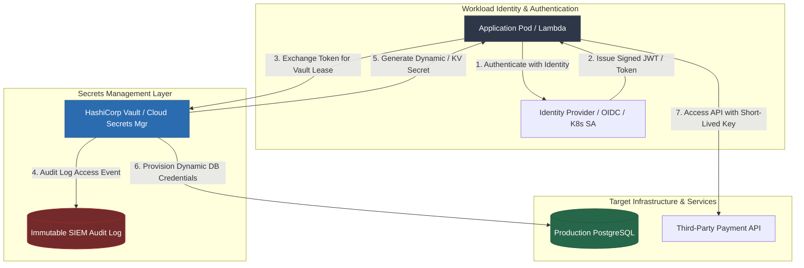

# Secrets Management Guide

> [!IMPORTANT]
> Secret management is a fundamental pillar of modern Application Security and Zero Trust architecture. Hardcoded passwords, API keys, database credentials, and cryptographic certificates scattered across code repositories, CI/CD pipelines, and configuration files represent one of the primary attack vectors in modern cloud breaches.

This enterprise guide provides a comprehensive roadmap for identifying secret sprawl, centralizing secret management, implementing dynamic short-lived credentials, securing orchestrators like Kubernetes, and automating secret scanning and rotation pipelines.

---

## 🏗️ Architecture Overview

The diagram below illustrates a hardened enterprise secrets ecosystem where workloads authenticate via cryptographically verifiable identities (Kubernetes ServiceAccounts, IAM roles) to retrieve short-lived secrets from centralized vaults.

---

## 📋 Prerequisites

To get the maximum value out of this module, you should have:
- **Cloud Infrastructure**: Basic experience with AWS, GCP, Azure, or Kubernetes administration.
- **Development**: Proficiency in at least one modern backend language (**Python**, **Node.js**, **Go**, or **Java**).
- **Containerization & Tooling**: Local installation of Docker, `kubectl`, and basic familiarity with CLI environments.
- **Required Software for Labs**:
  - `Docker` & `Docker Compose` (v2.0+)
  - `vault` CLI (v1.15+)
  - `gitleaks` (v8.0+) or `trufflehog` (v3.0+)
  - Python 3.10+ / Node.js 18+ / Go 1.21+ / Java 17+

---

## 🎯 Learning Objectives

By completing this module, you will be able to:

1. **Quantify & Eliminate Secret Sprawl**: Audit repositories, configuration files, and CI/CD pipelines to remediate `CWE-798` (Use of Hard-coded Credentials).
2. **Architect HashiCorp Vault Solutions**: Deploy Vault using AppRole, Kubernetes Auth, KV v2 engines, Database dynamic secrets, and Transit envelope encryption.
3. **Leverage Cloud Native Secrets Managers**: Implement secret retrieval and local caching using AWS Secrets Manager, GCP Secret Manager, and Azure Key Vault with SDKs in Python, Node.js, Go, and Java.
4. **Harden Kubernetes Secret Architecture**: Enable `etcd` KMS encryption at rest, deploy the External Secrets Operator (ESO), use Secrets Store CSI Driver (`tmpfs`), and implement Sealed Secrets/SOPS for GitOps.
5. **Enforce CI/CD Guardrails & Automated Rotation**: Integrate Gitleaks/TruffleHog into GitHub Actions and configure zero-downtime, multi-step secret rotation workflows.
6. **Execute Hands-On Exploitation & Remediation**: Perform an end-to-end lab breaking a vulnerable microservice and rebuilding it with Vault AppRole authentication and dynamic DB secret leases.

---

## 📚 Guide Navigation

| Chapter | Description | Key Focus Areas |
| :--- | :--- | :--- |
| **[01. Introduction & Threat Landscape](./01-introduction.md)** | Theory, Root Causes, Threats | Secret Sprawl, Lifecycle Model, OWASP/CWE Analysis |
| **[02. HashiCorp Vault Deep Dive](./02-hashicorp-vault.md)** | Enterprise Vault Engineering | AppRole, K8s Auth, KV v2, Dynamic DB Secrets, Transit |
| **[03. Cloud Native Secrets Managers](./03-cloud-secrets-managers.md)** | AWS, GCP, Azure Integrations | IAM Federation, SDK Code Examples, Caching, Comparison |
| **[04. Kubernetes Secrets Hardening](./04-kubernetes-secrets-hardening.md)** | Container & Cluster Security | `etcd` KMS, ESO, CSI Driver (`tmpfs`), Sealed Secrets, SOPS |
| **[05. Secret Scanning & Rotation](./05-secret-scanning-and-rotation.md)** | Shift-Left Security & Automation | Gitleaks, TruffleHog, Pre-commit, AWS Lambda Rotation |
| **[06. Hands-On Vulnerability Lab](./06-hands-on-lab.md)** | Runnable Code PoC & Secure Fix | Microservice Exploitation, Vault AppRole & DB Leases |
| **[07. References & Standards](./07-references.md)** | Standards, Frameworks & Tooling | NIST SP 800-57, PCI DSS v4.0, CIS Benchmarks, Cheat Sheets |

---

> [!TIP]
> Jump straight to **[Chapter 06: Hands-On Lab](./06-hands-on-lab.md)** if you want to immediately execute a live Docker exploit and remediate it using HashiCorp Vault.
