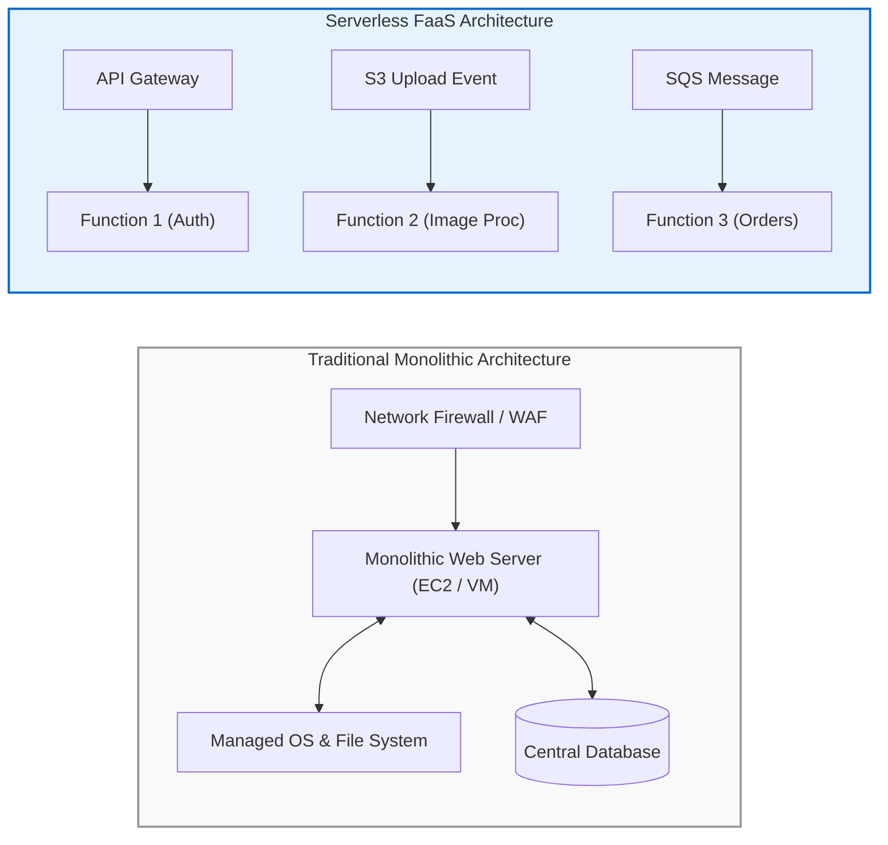
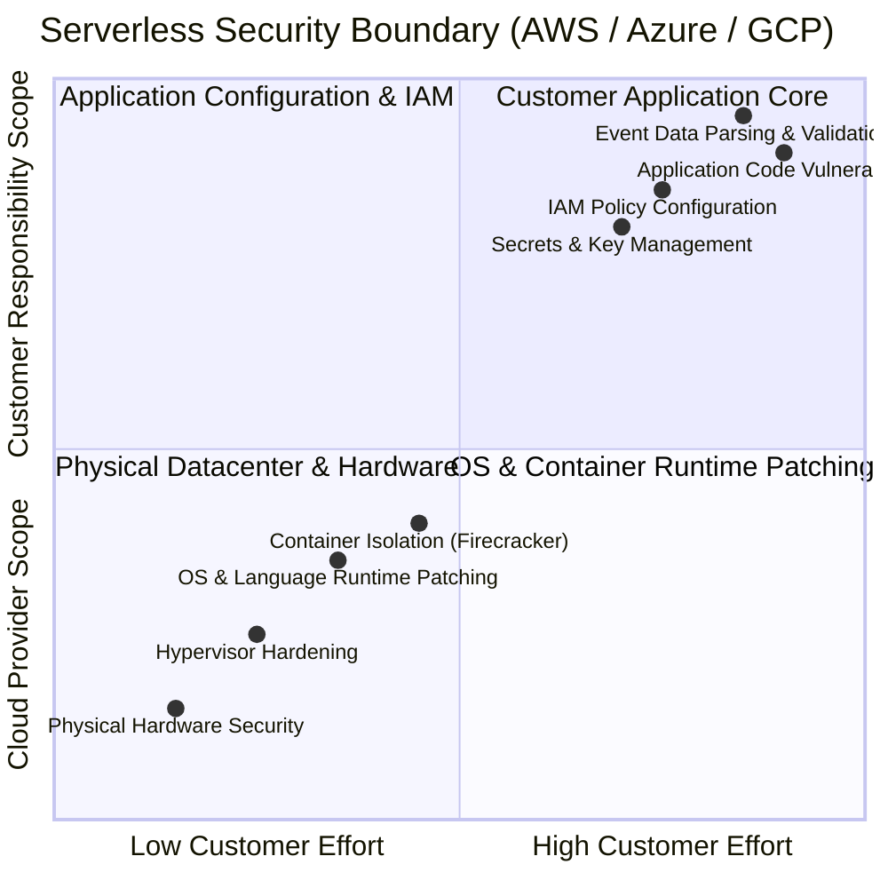
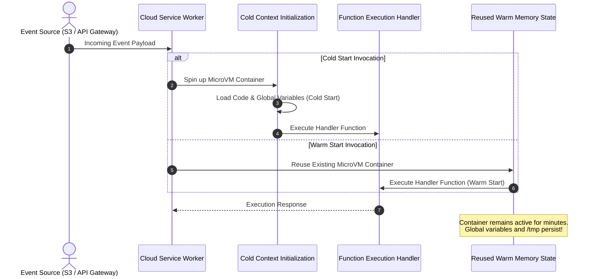

# 01 - Introduction & Serverless Threat Landscape

Serverless computing—commonly delivered via Function-as-a-Service (FaaS) platforms like **AWS Lambda**, **Azure Functions**, and **Google Cloud Functions**—fundamentally changes the application security paradigm. By eliminating underlying virtual servers, operating system management, and manual infrastructure patching, serverless shifts the primary attack surface away from host OS exploits and toward **application code logic, identity policies, event parsing, and data flows**.

> [!NOTE]
> Serverless does not remove security responsibilities—it reframes them. In FaaS environments, **Identity and Access Management (IAM) is the new network firewall**, and **every event trigger is a potential entry point**.

---

## 🏗️ The Serverless Architectural Shift

Traditional application security relies heavily on defense-in-depth implemented through network perimeters: Web Application Firewalls (WAFs), Demilitarized Zones (DMZs), Virtual Private Cloud (VPC) subnets, and host-based Intrusion Detection Systems (IDS).

Serverless architectures dismantle this traditional perimeter model in favor of an **Event-Driven Micro-Perimeter Architecture**:

### Key Differences Impacting Application Security:

1. **Heterogeneous Event Entry Points:** Monolithic applications typically expose a centralized HTTP endpoint. Serverless functions are triggered by dozens of event sources: HTTP requests, object creation events in storage buckets, database stream modifications, message queue items, IoT telemetry, and scheduled cron triggers.
2. **Stateless & Ephemeral Runtimes:** Serverless containers are short-lived, executing for seconds or minutes before being reclaimed by the cloud provider. While this reduces the window for long-term persistence, it renders traditional host forensics and agent-based EDR tools ineffective.
3. **Fine-Grained Micro-Perimeters:** Because each function operates as an independent microservice, permissions must be granularly defined per function. An application comprising 100 Lambda functions requires 100 discrete IAM roles to maintain least privilege.

---

## 🤝 The Serverless Shared Responsibility Model

In serverless architectures, the cloud provider manages infrastructure security, but application security remains 100% the customer's responsibility.

### Detailed Responsibility Matrix

| Domain | Cloud Provider (AWS / Azure / GCP) | Customer Responsibility |
| :--- | :--- | :--- |
| **Physical Facilities & Hardware** | Datacenter security, physical access control, server hardware | None |
| **Virtualization & Isolation** | MicroVM isolation (AWS Firecracker, gVisor, Hyper-V containers) | None |
| **OS & Language Runtimes** | Patching host OS, Python/Node.js/Java runtime updates | Upgrading container runtime versions in configuration |
| **Network Infrastructure** | Cloud network uptime, DDoS protection (AWS Shield) | Configuring VPC subnets, Security Groups, API Gateway WAF rules |
| **Identity & Access (IAM)** | Providing IAM infrastructure, policy engine, evaluation logic | Defining least-privilege IAM roles, resource policies, condition keys |
| **Application Code** | None | Input validation, dependency auditing, secure coding practices |
| **Data Protection** | Encryption primitives (KMS, Key Vault) | Enforcing data encryption at rest and in transit, secret management |
| **Runtime Observability** | Providing CloudWatch, Azure Monitor, GCP Cloud Logging infrastructure | Enabling application logging, audit logs, anomaly detection alerts |

---

## ⚡ Ephemeral Context & Container Reuse Security Dynamics

Understanding the execution lifecycle of a FaaS function is critical to analyzing its attack surface.

### Security Risks of Container Warm Re-use:

1. **`/tmp` Directory Persistence:** FaaS platforms allocate ephemeral disk space (e.g., 512 MB to 10 GB in `/tmp` on AWS Lambda). This space **persists across warm invocations** within the same container execution context. If an attacker writes a malicious payload or dumps stolen data to `/tmp` during invocation `N`, that data remains accessible during invocation `N+1` handled by another user.
2. **Global Variable State Pollution:** Variables declared outside the function handler persist in memory across warm starts. If sensitive data (user sessions, auth tokens, unparsed data) is stored in global variables, memory leaks can pollute subsequent user sessions.
3. **Stale Secrets in Memory:** While caching secrets in global scope reduces network overhead, failure to implement Time-To-Live (TTL) expiration means rotated secrets will remain stale in warm containers until the container is recycled.

> [!WARNING]
> Never assume a serverless function invocation starts with a completely clean state. Global variables and disk storage in `/tmp` are shared across consecutive executions within the same warm container instance.

---

## 🎯 OWASP Serverless Top 10 Risk Mapping

The **OWASP Serverless Top 10** identifies the most critical security risks specific to serverless environments:

### 1. SAS-01: Injection (Event Data Injection)
- **Root Cause:** Trusting incoming event payloads without schema validation. Event data from S3, SQS, or DynamoDB Streams is passed directly to system shells (`subprocess`), SQL queries, or NoSQL queries.
- **Impact:** Remote Code Execution (RCE), data exfiltration, database takeover.

### 2. SAS-02: Broken Authentication & Access Control
- **Root Cause:** Exposing public API Gateway endpoints without authenticators (JWT, Cognito, IAM Auth) or misconfiguring custom Lambda authorizers.
- **Impact:** Unauthorized API access, BOLA (Broken Object Level Authorization).

### 3. SAS-03: Insecure Serverless Deployment Configuration
- **Root Cause:** Using default cloud configurations, exposing unencrypted HTTP endpoints, disabling CORS restrictions, or deploying public S3 event triggers.
- **Impact:** Data leaks, unauthorized trigger execution.

### 4. SAS-04: Over-Privileged Execution Roles
- **Root Cause:** Assigning wildcard (`*`) IAM policies (`AdministratorAccess`, `s3:*`) to execution roles shared across multiple Lambda functions.
- **Impact:** High blast radius; compromising one function yields account-wide control.

### 5. SAS-05: Inadequate Function Monitoring and Logging
- **Root Cause:** Failing to implement structured logging, missing CloudTrail data event auditing, or ignoring anomalous function execution spikes.
- **Impact:** Inability to perform incident response or trace attacker activity during microVM execution.

### 6. SAS-06: Shared Secrets Insecurity
- **Root Cause:** Storing API keys, database passwords, or private keys in plaintext environment variables or checking them into source code repository IaC files.
- **Impact:** Secret exposure via console access, `/proc/self/environ` reading, or SSRF payloads.

### 7. SAS-07: Denial of Wallet (DoW) / Resource Exhaustion
- **Root Cause:** Missing function concurrency caps, lack of API Gateway rate limiting, and setting maximum function timeouts (15 minutes).
- **Impact:** Financial exhaustion due to infinite execution loops or malicious request floods.

### 8. SAS-08: Insecure Third-Party Dependencies & Layers
- **Root Cause:** Importing unvetted third-party npm/pip packages or unverified shared Lambda Layers.
- **Impact:** Supply chain attacks, malicious code execution inside the function execution context.

### 9. SAS-09: Improper Exception Handling & Verbose Error Leaks
- **Root Cause:** Returning raw stack traces, internal IP addresses, or AWS service errors in HTTP responses to end users.
- **Impact:** Reconnaissance information disclosure aiding further targeted attacks.

### 10. SAS-10: Insecure State & Storage Management
- **Root Cause:** Storing sensitive intermediate processing data in unencrypted S3 buckets or temporary `/tmp` storage without cleanup routines.
- **Impact:** Unintended data exposure and cross-invocation data contamination.

---

## 🚀 Key Takeaways & Architecture Principles

- **Shift Focus Upward:** Provider manages host OS and hardware; your security posture depends on code, IAM policies, and configuration.
- **Treat Events as Untrusted Boundary Controls:** Every event trigger (S3, SQS, HTTP, Streams) must be validated against a strict schema.
- **Enforce Per-Function IAM Roles:** Never share execution roles across functions. Apply strict least-privilege scoping.
- **Design for Ephemerality:** Clear `/tmp` storage after handling sensitive payloads, avoid storing state in global variables, and log in structured JSON with correlation IDs.
