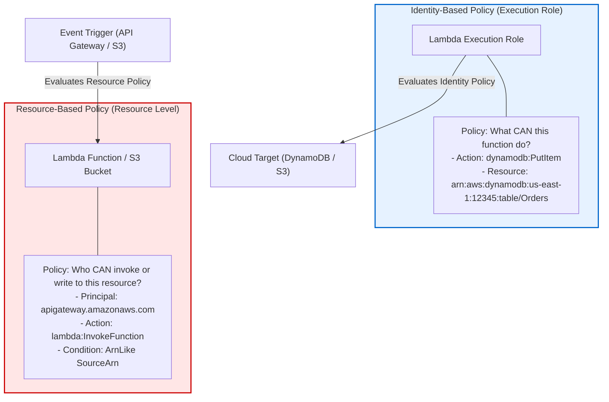

# 02 - Least Privilege IAM and Resource Policies

In serverless applications, **Identity and Access Management (IAM) is the primary security boundary**. Because there is no traditional network perimeter enclosing serverless functions, your security posture relies entirely on the IAM execution roles attached to your functions and the resource-based policies guarding your cloud services.

Assigning a single, monolithic IAM role shared across multiple functions—or using wildcard (`*`) permissions—is the **#1 vulnerability in serverless deployments**.

---

## ⚙️ Core Mechanics: Identity-Based vs Resource-Based Policies

Serverless access control operates on two distinct policy dimensions:



### 1. Identity-Based Policies (Execution Roles)
- Attached directly to the Lambda function execution role.
- Grants the function outbound authorization to call other AWS services (e.g., standard `s3:GetObject`, `dynamodb:PutItem`, `ssm:GetParameter`).

### 2. Resource-Based Policies
- Attached to the target resource itself (e.g., Lambda Function Policy, S3 Bucket Policy, KMS Key Policy).
- Specifies **which principals or services** are allowed to invoke the function or access the resource.
- Essential for preventing cross-account access and unauthorized trigger invocations.

---

## 🛑 Anti-Pattern Risk Analysis: Over-Privileged Roles

### Anti-Pattern 1: Monolithic Shared Execution Role
Developers often assign one global IAM role to all Lambda functions in a stack. If `Function A` (which only reads from S3) and `Function B` (which deletes records in DynamoDB) share the same role, an exploit in `Function A` grants the attacker full deletion privileges in DynamoDB.

### Anti-Pattern 2: Wildcard (`*`) Action & Resource Policies

```yaml
# VULNERABLE: Overly permissive execution policy
Effect: Allow
Action:
  - 's3:*'
  - 'dynamodb:*'
Resource: '*'
```

If a function with this policy falls victim to a code-level injection flaw, the blast radius encompasses:
- Reading, modifying, and deleting all S3 objects across every bucket in the account.
- Dumping or wiping all DynamoDB tables across the region.

### Dangerous IAM Permissions in Serverless Roles

| Dangerous Action | Security Risk / Blast Radius |
| :--- | :--- |
| `iam:PassRole` | Allows the function to pass arbitrary IAM roles to other AWS services (EC2, ECS), enabling full privilege escalation. |
| `lambda:UpdateFunctionCode` | Allows an attacker to overwrite the Lambda source code with a malicious payload directly via AWS API. |
| `sts:AssumeRole` without `Resource` restriction | Enables assuming high-privilege cross-account roles from inside the function execution context. |
| `kms:Decrypt` with `Resource: "*"` | Grants ability to decrypt any secret or dataset encrypted with KMS across the entire account. |

---

## 🛡️ Production-Grade Infrastructure-as-Code Patterns

To maintain least privilege without operational overhead, define per-function IAM policies declaratively using Infrastructure-as-Code (IaC).

### Pattern 1: AWS SAM (Serverless Application Model)

AWS SAM provides pre-built **Policy Templates** that automatically restrict permissions to specific resources.

```yaml
Transform: AWS::Serverless-2016-10-31
Description: Production SAM template with granular per-function IAM roles.

Resources:
  # Secure Table Definition
  OrdersTable:
    Type: AWS::Serverless::SimpleTable
    Properties:
      TableName: production-orders-table
      PrimaryKey:
        Name: orderId
        Type: String

  # Secure Storage Bucket
  InvoicesBucket:
    Type: AWS::S3::Bucket
    Properties:
      BucketName: production-invoices-vault-12345

  # Process Order Function with Tight Permissions
  ProcessOrderFunction:
    Type: AWS::Serverless::Function
    Properties:
      FunctionName: process-order-worker
      CodeUri: src/
      Handler: app.lambda_handler
      Runtime: python3.11
      # Apply scoped policy templates per resource
      Policies:
        # Permission ONLY to write to the specific DynamoDB table
        - DynamoDBCrudPolicy:
            TableName: !Ref OrdersTable
        # Permission ONLY to read from the specific S3 bucket
        - S3ReadPolicy:
            BucketName: !Ref InvoicesBucket
        # Inline custom policy for KMS decryption on a specific key
        - Statement:
            - Effect: Allow
              Action:
                - kms:Decrypt
                - kms:GenerateDataKey
              Resource: !GetAtt EncryptionKey.Arn
      Events:
        ApiTrigger:
          Type: Api
          Properties:
            Path: /orders
            Method: post
```

---

### Pattern 2: Serverless Framework (`serverless.yml`)

Use the `serverless-iam-roles-per-function` plugin to isolate IAM roles per function instead of defining global provider roles.

```yaml
service: order-processing-service

provider:
  name: aws
  runtime: nodejs18.x
  region: us-east-1

plugins:
  - serverless-iam-roles-per-function

functions:
  createOrder:
    handler: handlers/create.handler
    events:
      - httpApi:
          path: /orders
          method: post
    # Granular IAM policy scoped ONLY to this function
    iamRoleStatementsName: create-order-execution-role
    iamRoleStatements:
      - Effect: Allow
        Action:
          - dynamodb:PutItem
        Resource:
          - !GetAtt OrdersTable.Arn

  generateInvoice:
    handler: handlers/invoice.handler
    events:
      - s3:
          bucket: user-invoices-bucket
          event: s3:ObjectCreated:*
    # Independent IAM role scoped strictly to S3 reads and PutObject to invoice bucket
    iamRoleStatements:
      - Effect: Allow
        Action:
          - s3:GetObject
        Resource: "arn:aws:s3:::user-invoices-bucket/*"
      - Effect: Allow
        Action:
          - s3:PutObject
        Resource: "arn:aws:s3:::processed-invoices-bucket/*"
```

---

### Pattern 3: Terraform (HCL)

In Terraform, build dedicated execution roles and resource permissions for every `aws_lambda_function`.

```hcl
# 1. Base Execution Trust Policy for Lambda
data "aws_iam_policy_document" "lambda_assume_role" {
  statement {
    effect  = "Allow"
    actions = ["sts:AssumeRole"]
    principals {
      type        = "Service"
      identifiers = ["lambda.amazonaws.com"]
    }
  }
}

# 2. Granular Policy Document
data "aws_iam_policy_document" "process_payments_policy_doc" {
  # DynamoDB Write Access strictly scoped to single table ARN
  statement {
    sidebar_label = "DynamoDBWrite"
    effect        = "Allow"
    actions       = ["dynamodb:PutItem", "dynamodb:UpdateItem"]
    resources     = [aws_dynamodb_table.payments_table.arn]
  }

  # CloudWatch Logs permissions
  statement {
    sidebar_label = "Logging"
    effect        = "Allow"
    actions       = [
      "logs:CreateLogGroup",
      "logs:CreateLogStream",
      "logs:PutLogEvents"
    ]
    resources     = ["arn:aws:logs:us-east-1:123456789012:log-group:/aws/lambda/process-payments:*"]
  }
}

# 3. Create Dedicated IAM Role
resource "aws_iam_role" "process_payments_role" {
  name               = "process-payments-execution-role"
  assume_role_policy = data.aws_iam_policy_document.lambda_assume_role.json
}

# 4. Attach Scoped Policy to Role
resource "aws_iam_policy" "process_payments_policy" {
  name        = "process-payments-least-privilege-policy"
  description = "Scoped permissions for process-payments Lambda function"
  policy      = data.aws_iam_policy_document.process_payments_policy_doc.json
}

resource "aws_iam_role_policy_attachment" "attach_payments_policy" {
  role       = aws_iam_role.process_payments_role.name
  policy_arn = aws_iam_policy.process_payments_policy.arn
}

# 5. Resource-Based Policy: Allow API Gateway to Invoke Lambda
resource "aws_lambda_permission" "allow_apigateway_invoke" {
  statement_id  = "AllowExecutionFromAPIGateway"
  action        = "lambda:InvokeFunction"
  function_name = aws_lambda_function.process_payments.function_name
  principal     = "apigateway.amazonaws.com"
  source_arn    = "${aws_apigatewayv2_api.http_api.execution_arn}/*/*"
}
```

---

### Pattern 4: AWS CDK (TypeScript)

AWS CDK enforces least privilege natively using high-level construct `.grant*()` methods.

```typescript
import * as cdk from 'aws-cdk-lib';
import * as lambda from 'aws-cdk-lib/aws-lambda';
import * as dynamodb from 'aws-cdk-lib/aws-dynamodb';
import * as s3 from 'aws-cdk-lib/aws-s3';
import { Construct } from 'constructs';

export class SecureServerlessStack extends cdk.Stack {
  constructor(scope: Construct, id: string, props?: cdk.StackProps) {
    super(scope, id, props);

    // Create DynamoDB Table
    const ordersTable = new dynamodb.Table(this, 'OrdersTable', {
      partitionKey: { name: 'orderId', type: dynamodb.AttributeType.STRING },
      encryption: dynamodb.TableEncryption.AWS_MANAGED,
    });

    // Create S3 Storage Bucket
    const secureBucket = new s3.Bucket(this, 'SecureStorageBucket', {
      blockPublicAccess: s3.BlockPublicAccess.BLOCK_ALL,
      encryption: s3.BucketEncryption.S3_MANAGED,
      enforceSSL: true,
    });

    // Create Lambda Function
    const processOrderFn = new lambda.Function(this, 'ProcessOrderHandler', {
      runtime: lambda.Runtime.NODEJS_18_X,
      handler: 'index.handler',
      code: lambda.Code.fromAsset('lambda'),
    });

    // CDK Automatic Least-Privilege Grants:
    // Grants ONLY dynamodb:PutItem/GetItem/UpdateItem/DeleteItem to ordersTable ARN
    ordersTable.grantWriteData(processOrderFn);

    // Grants ONLY s3:GetObject read permissions to secureBucket ARN
    secureBucket.grantRead(processOrderFn);
  }
}
```

---

## 🔒 Advanced IAM Hardening Techniques

### 1. Condition Keys for Contextual Access Control

Enforce conditions to prevent unauthorized invocation channels or non-SSL communication.

```json
{
  "Version": "2012-10-17",
  "Statement": [
    {
      "Sid": "RestrictToSpecificApiGatewayTrigger",
      "Effect": "Allow",
      "Principal": {
        "Service": "apigateway.amazonaws.com"
      },
      "Action": "lambda:InvokeFunction",
      "Resource": "arn:aws:lambda:us-east-1:123456789012:function:order-processor",
      "Condition": {
        "ArnLike": {
          "aws:SourceArn": "arn:aws:execute-api:us-east-1:123456789012:api-id-xyz/*/*/*"
        }
      }
    },
    {
      "Sid": "EnforceTLSRequestsOnly",
      "Effect": "Deny",
      "Principal": "*",
      "Action": "s3:*",
      "Resource": [
        "arn:aws:s3:::my-secure-bucket",
        "arn:aws:s3:::my-secure-bucket/*"
      ],
      "Condition": {
        "Bool": {
          "aws:SecureTransport": "false"
        }
      }
    }
  ]
}
```

### 2. Permission Boundaries
A **Permission Boundary** sets the maximum allowable permissions an IAM execution role can possess, preventing developers or deployment pipelines from accidentally attaching over-privileged policies (`AdministratorAccess`).

```yaml
# SAM Template enforcing Permission Boundary on Lambda Execution Role
MyLambdaRole:
  Type: AWS::IAM::Role
  Properties:
    PermissionsBoundary: !Sub "arn:aws:iam::${AWS::AccountId}:policy/DeveloperPermissionsBoundary"
    AssumeRolePolicyDocument:
      Version: "2012-10-17"
      Statement:
        - Effect: Allow
          Principal:
            Service: lambda.amazonaws.com
          Action: sts:AssumeRole
```

---

## 🔍 Auditing & Verification CLI Commands

Audit your cloud infrastructure for over-privileged serverless execution roles using these CLI commands:

### 1. Identify Over-Privileged Execution Roles with Prowler
```bash
# Run Prowler AWS security scanner filtering for IAM and Lambda checks
prowler aws --checks iam_policy_no_star_star,lambda_function_using_supported_runtimes,lambda_function_not_publicly_accessible
```

### 2. Analyze IAM Execution Role Policies via AWS CLI
```bash
# Get attached policies for a specific Lambda execution role
aws iam list-attached-role-policies --role-name process-order-execution-role

# Get inline policy documents for execution role
aws iam get-role-policy --role-name process-order-execution-role --policy-name InlinePolicyName
```

### 3. Verify Resource-Based Policy on Lambda Function
```bash
# View policy governing WHO can invoke the Lambda function
aws lambda get-policy --function-name process-order-worker
```
