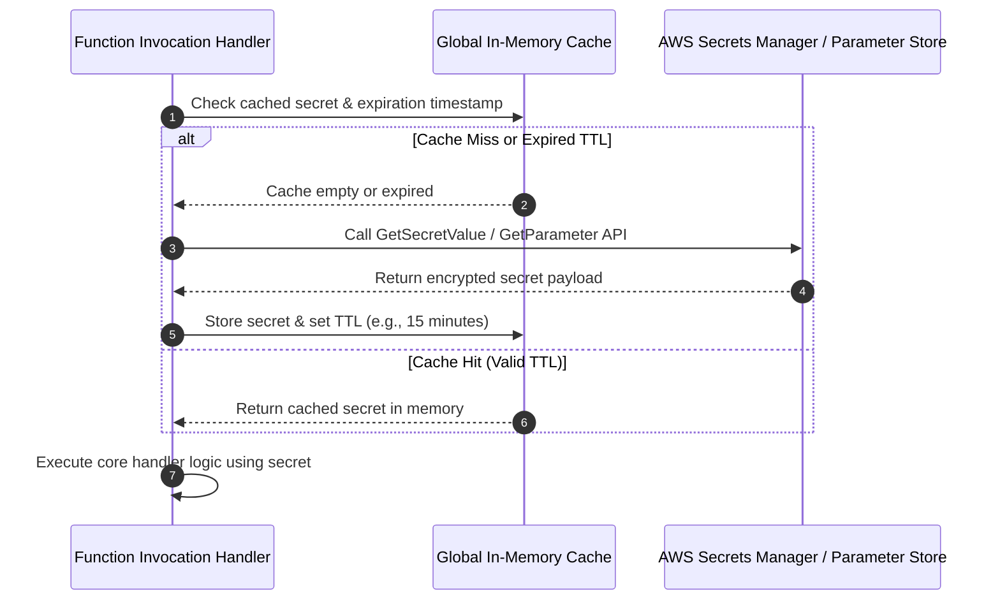

# 04 - Secrets Management and Cold Start Hardening

Managing database credentials, API tokens, third-party keys, and private certificates in serverless architectures requires balancing **security, latency, and financial cost**. Hardcoding credentials or relying solely on unencrypted Lambda environment variables creates severe security vulnerabilities.

---

## ❌ Anti-Pattern: Plaintext Environment Variables

A common mistake in serverless development is placing high-value secrets directly into function environment variables.

### Security Vulnerabilities of Plaintext Environment Variables:

1. **Console & IAM API Exposure:** Plaintext environment variables can be read in the AWS Console by any user or CI/CD role with `lambda:GetFunction` or `lambda:GetFunctionConfiguration` IAM permissions, even if they lack access to underlying database resources.
2. **Exfiltration via Process Inspection:** If a function suffers from Remote Code Execution (RCE), Server-Side Request Forgery (SSRF), or Local File Inclusion (LFI), an attacker can inspect environment variables directly by reading `/proc/self/environ` in Linux or logging `process.env` / `os.environ`.
3. **Lack of Automated Rotation:** Environment variables are static. When credentials change, every serverless function using those credentials must be manually updated and redeployed.

---

## ⚡ Execution Lifecycle: Cold Start vs Warm Start Memory Caching

Fetching secrets over the network from AWS Secrets Manager or HashiCorp Vault on **every invocation** introduces 50ms–200ms of latency and increases API costs significantly.

To solve this without sacrificing security, store and decrypt secrets **outside the handler** during the cold start initialization phase, and cache the secret in memory across warm starts with a Time-To-Live (TTL) expiration.



---

## 💻 Production Implementations: Python & Node.js Secrets Caching

### 1. Production Python Implementation (AWS SSM Parameter Store / Secrets Manager with TTL)

```python
import os
import json
import time
import boto3
from botocore.exceptions import ClientError

# Global variables initialized OUTSIDE the handler (Cold Start Execution Phase)
SSM_CLIENT = boto3.client('ssm')
SECRETS_CLIENT = boto3.client('secretsmanager')

# In-Memory Cache Container
_SECRET_CACHE = {
    "value": None,
    "expires_at": 0
}

CACHE_TTL_SECONDS = 900  # 15 minutes TTL

def get_database_credentials() -> dict:
    """
    Retrieves database credentials from AWS Secrets Manager with in-memory TTL caching.
    Prevents API throttling and reduces latency on warm starts.
    """
    current_time = time.time()
    
    # 1. Cache Hit Check
    if _SECRET_CACHE["value"] and current_time < _SECRET_CACHE["expires_at"]:
        return _SECRET_CACHE["value"]
        
    secret_name = os.environ.get("DB_SECRET_NAME", "/production/rds/credentials")
    
    try:
        # 2. Cache Miss: Fetch from Secrets Manager over HTTPS
        response = SECRETS_CLIENT.get_secret_value(SecretId=secret_name)
        
        if 'SecretString' in response:
            secret_data = json.loads(response['SecretString'])
        else:
            raise ValueError("Binary secret format not supported in this handler")

        # 3. Update Memory Cache with Expiration Timestamp
        _SECRET_CACHE["value"] = secret_data
        _SECRET_CACHE["expires_at"] = current_time + CACHE_TTL_SECONDS
        
        return secret_data

    except ClientError as e:
        print(f"CRITICAL: Failed to retrieve secret '{secret_name}' from Secrets Manager: {e}")
        raise e

def lambda_handler(event, context):
    """
    Function Handler: Uses cached credentials. Latency is ~0ms on warm starts.
    """
    db_creds = get_database_credentials()
    
    db_user = db_creds['username']
    db_pass = db_creds['password']
    
    # Execute database query using retrieved credentials...
    return {"statusCode": 200, "body": json.dumps({"status": "Connected", "user": db_user})}
```

---

### 2. Production Node.js Implementation (AWS SDK v3 Secrets Manager Client)

```typescript
import { APIGatewayProxyEvent, APIGatewayProxyResult } from 'aws-lambda';
import { SecretsManagerClient, GetSecretValueCommand } from '@aws-sdk/client-secrets-manager';

// Initialize SDK client outside handler (Cold Start)
const secretsClient = new SecretsManagerClient({ region: process.env.AWS_REGION || 'us-east-1' });

interface DbCredentials {
    username: string;
    password: string;
    host: string;
    port: number;
}

// In-memory cache structure
let cachedCredentials: DbCredentials | null = null;
let cacheExpiresAt: number = 0;
const TTL_MS = 15 * 60 * 1000; // 15 Minutes

async function fetchSecret(secretName: string): Promise<DbCredentials> {
    const now = Date.now();

    // Check valid cache
    if (cachedCredentials && now < cacheExpiresAt) {
        return cachedCredentials;
    }

    try {
        const command = new GetSecretValueCommand({ SecretId: secretName });
        const response = await secretsClient.send(command);

        if (!response.SecretString) {
            throw new Error('SecretString is empty or binary');
        }

        const credentials: DbCredentials = JSON.parse(response.SecretString);

        // Populate warm cache
        cachedCredentials = credentials;
        cacheExpiresAt = now + TTL_MS;

        return credentials;
    } catch (err: any) {
        console.error(`Error loading secret '${secretName}':`, err.message);
        throw err;
    }
}

export const handler = async (event: APIGatewayProxyEvent): Promise<APIGatewayProxyResult> => {
    const secretName = process.env.DB_SECRET_ARN || 'prod/db/credentials';

    // Retrieve cached secrets (Fast execution)
    const creds = await fetchSecret(secretName);

    return {
        statusCode: 200,
        body: JSON.stringify({ status: "Success", dbHost: creds.host })
    };
};
```

---

## 🔐 KMS Customer Managed Keys (CMK) Integration

Do not rely solely on default AWS Managed Keys (`aws/secretsmanager` or `aws/ssm`). Default keys allow any principal with general KMS decrypt permissions across the account to decrypt secrets.

### Secure AWS KMS Customer Managed Key Policy

Define a dedicated KMS Key Policy that restricts decryption strictly to the specific serverless execution role:

```json
{
  "Version": "2012-10-17",
  "Id": "ScopedKmsKeyPolicy",
  "Statement": [
    {
      "Sid": "AllowKeyAdministration",
      "Effect": "Allow",
      "Principal": {
        "AWS": "arn:aws:iam::123456789012:role/DevOpsAdminRole"
      },
      "Action": "kms:*",
      "Resource": "*"
    },
    {
      "Sid": "AllowSpecificLambdaToDecryptSecret",
      "Effect": "Allow",
      "Principal": {
        "AWS": "arn:aws:iam::123456789012:role/process-payments-execution-role"
      },
      "Action": [
        "kms:Decrypt",
        "kms:DescribeKey"
      ],
      "Resource": "*",
      "Condition": {
        "StringEquals": {
          "kms:ViaService": "secretsmanager.us-east-1.amazonaws.com"
        }
      }
    }
  ]
}
```

---

## 🧹 Ephemeral Storage (`/tmp`) Hardening

AWS Lambda provides up to 10 GB of `/tmp` disk space. Because `/tmp` is shared across warm invocations within the same microVM container, improper handling of temporary files creates serious data leak risks.

### Hardening Guidelines for `/tmp`:

1. **Purge Files on Handler Completion:** Always use `try...finally` blocks to explicitly delete temporary files from `/tmp` before the function returns.
2. **Randomized File Naming:** Generate unique UUID-based filenames in `/tmp` to prevent naming collisions and unauthorized file overwrites across invocations.
3. **Never Store Secrets in `/tmp`:** Avoid writing unencrypted certificates, private keys, or intermediate tokens to `/tmp`. Keep sensitive artifacts exclusively in RAM.

#### Python `/tmp` Cleanup Pattern:

```python
import os
import uuid
import tempfile

def lambda_handler(event, context):
    # Generate randomized temporary file path
    temp_filename = f"/tmp/processing_{uuid.uuid4()}.tmp"
    
    try:
        # Write data to temporary file
        with open(temp_filename, "w") as f:
            f.write("Temporary payload data")
            
        # Perform processing operations...
        
    finally:
        # SECURE: Explicitly purge file from /tmp regardless of success or exception
        if os.path.exists(temp_filename):
            os.remove(temp_filename)
```
