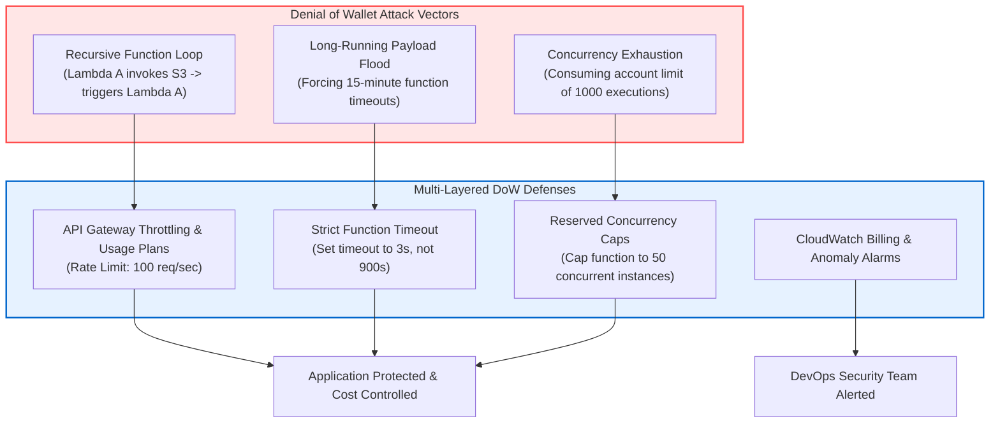
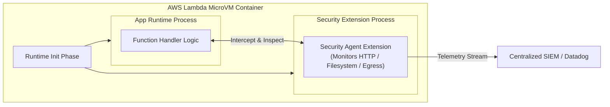

# 05 - Serverless Runtime Security & Defenses

Because traditional Endpoint Detection and Response (EDR) agents cannot run inside ephemeral serverless environments, securing FaaS runtimes requires specialized runtime protection, strict resource throttling, automated static analysis (SAST), and structured observability.

---

## ⏱️ Denial of Wallet (DoW) & Resource Exhaustion Defenses

Serverless cloud pricing operates on a pay-per-execution model (calculated as `Execution Time x Memory Allocated x Number of Invocations`). Attackers leverage this billing structure to launch **Denial of Wallet (DoW)** attacks—intentionally flooding functions with complex payloads or forcing maximum timeouts to inflict extreme financial cost or exhaust regional cloud concurrency limits.



### Defense Controls Matrix

| Defense Layer | Recommended Hardening Action | Implementation Example |
| :--- | :--- | :--- |
| **Strict Timeouts** | Align function timeout to p99 execution duration + 20% buffer | Set SAM/Terraform function `timeout: 3` (seconds), not default 900s |
| **Reserved Concurrency** | Allocate maximum concurrent executions per function to prevent account starvation | Set `ReservedConcurrentExecutions: 50` on uncritical functions |
| **API Gateway Throttling** | Enforce client rate limits and burst limits on HTTP endpoints | Configure API Gateway Stage `ThrottlingRateLimit: 100`, `ThrottlingBurstLimit: 200` |
| **CloudWatch Alarms** | Trigger SNS alerts when invocation counts or billing metrics spike | Alert if `ConcurrentExecutions > 80%` of regional quota |

---

## 🛡️ Runtime Protection via AWS Lambda Extensions

**AWS Lambda Extensions** allow runtime security vendors (e.g., Datadog ASM, Prisma Cloud Defender, Sysdig) to integrate directly into the Lambda execution environment.



### What Lambda Security Extensions Monitor:
1. **Unsafe Process Spawning:** Intercepts `fork()` or `execve()` calls attempting to execute shell binaries (`/bin/sh`, `curl`, `nc`) inside `/tmp`.
2. **Outbound SSRF Egress:** Blocks unexpected TCP/UDP connections to unauthorized external IP addresses or metadata endpoints (`169.254.169.254`).
3. **Event Payload WAF Filtering:** Inspects incoming event objects for SQLi, XSS, or Command Injection signatures before passing them to the application handler.

---

## 🛠️ Security Tooling Setup & Custom Rules

Automate serverless security testing using static application security testing (SAST) and Infrastructure-as-Code (IaC) scanning.

### 1. IaC Hardening with Checkov

Run Checkov in your CI/CD pipeline to flag over-privileged IAM roles, unencrypted environment variables, and missing logging in SAM, Terraform, or Serverless Framework templates:

```bash
# Install Checkov
pip install checkov

# Scan Serverless IaC Directory
checkov -d ./iac-templates/ --framework cloudformation terraform serverless
```

---

### 2. Custom Semgrep SAST Rules for Serverless Vulnerabilities

Create a `.semgrep.yml` file containing custom rules specifically tailored to detect Python and Node.js serverless injection flaws:

```yaml
rules:
  - id: serverless-s3-command-injection
    patterns:
      - pattern-either:
          - pattern: subprocess.run(..., shell=True, ...)
          - pattern: subprocess.check_output(..., shell=True, ...)
          - pattern: os.system(...)
      - pattern-inside:
          - def $HANDLER(event, context):
              ...
    message: "CRITICAL: Potential Command Injection in Lambda handler. Avoid using shell=True with event data."
    languages: [python]
    severity: ERROR

  - id: serverless-plaintext-secret-env
    patterns:
      - pattern: process.env.$SECRET
      - pattern-regex: "(?i)(api_key|password|private_key|secret_key)"
    message: "WARNING: Potential hardcoded secret access via environment variables. Use AWS Secrets Manager."
    languages: [javascript, typescript]
    severity: WARNING
```

#### Run Semgrep in CLI:
```bash
# Execute Semgrep scan with custom rules
semgrep --config .semgrep.yml src/
```

---

## 📊 Structured JSON Observability & Logging

Because ephemeral functions destroy local execution state, structured JSON logging is mandatory for forensic analysis and SIEM auditing.

### Production Structured Logger Pattern (Node.js)

```typescript
import { Context } from 'aws-lambda';

interface LogContext {
    awsRequestId: string;
    functionName: string;
    functionVersion: string;
    userId?: string;
    sourceIp?: string;
}

export class StructuredLogger {
    private logContext: LogContext;

    constructor(context: Context, userId?: string, sourceIp?: string) {
        this.logContext = {
            awsRequestId: context.awsRequestId,
            functionName: context.functionName,
            functionVersion: context.functionVersion,
            userId,
            sourceIp
        };
    }

    private formatMessage(level: string, message: string, extraData: object = {}) {
        return JSON.stringify({
            timestamp: new Date().toISOString(),
            level,
            message,
            context: this.logContext,
            data: this.sanitize(extraData)
        });
    }

    // Mask sensitive fields (PII, credentials, tokens)
    private sanitize(data: any): any {
        const sanitized = { ...data };
        const sensitiveKeys = ['password', 'token', 'apiKey', 'authorization', 'secret'];
        
        for (const key in sanitized) {
            if (sensitiveKeys.includes(key.toLowerCase())) {
                sanitized[key] = '***REDACTED***';
            }
        }
        return sanitized;
    }

    info(message: string, data?: object) {
        console.log(this.formatMessage('INFO', message, data));
    }

    error(message: string, error?: Error, data?: object) {
        console.error(this.formatMessage('ERROR', message, {
            ...data,
            errorMessage: error?.message,
            stack: error?.stack
        }));
    }
}
```
