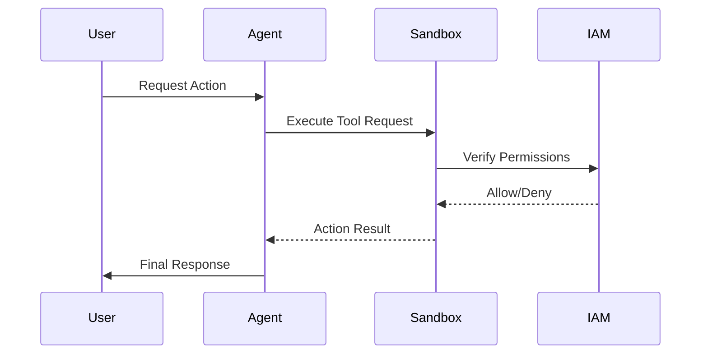

# Securing Agent Architecture

## 1. The Concept (ELI5)

Imagine you hire an assistant and give them a company credit card, the keys to the office, and the password to the company server, but you don't give them any rules on what they can and cannot do. That's an unsecured agent. Securing the architecture means setting up boundaries (like a limited credit card and restricted access) so even if the assistant makes a mistake or is tricked, the damage is contained. In technical terms, it is about sandboxing the agent's environment, restricting network capabilities, and ensuring least-privilege principles are enforced at the architectural level.

## 2. The Visual



## 3. The Code

### Vulnerable Code ❌

**Python**
```python
import os

def run_agent(cmd):
    # Extremely dangerous: Agent dictates shell commands directly
    os.system(cmd)

def main():
    agent_output = "rm -rf /" # Example compromised output
    run_agent(agent_output)
```

**Go**
```go
package main

import (
	"os/exec"
)

func run(cmd string) {
	// Vulnerable: unconstrained shell execution
	exec.Command("sh", "-c", cmd).Run()
}
```

**TypeScript**
```typescript
import { exec } from 'child_process';

function runAgent(cmd: string) {
    // No sanitization or sandboxing
    exec(cmd);
}
```

### Production-Ready Secure Code ✅

**Python**
```python
import subprocess

ALLOWED_COMMANDS = {"ls", "whoami", "date"}

def run_agent_secure(cmd, args):
    if cmd not in ALLOWED_COMMANDS:
        raise ValueError(f"Unauthorized command: {cmd}")
    # Use safe subprocess with explicit arguments and timeout
    return subprocess.run([cmd] + args, capture_output=True, text=True, timeout=5)
```

**Go**
```go
package main

import (
	"fmt"
	"os/exec"
)

var allowedCommands = map[string]bool{
	"ls":     true,
	"whoami": true,
}

func runSecure(cmd string, args []string) error {
	if !allowedCommands[cmd] {
		return fmt.Errorf("unauthorized command: %s", cmd)
	}
	// Avoid shell injection by executing the binary directly
	return exec.Command(cmd, args...).Run()
}
```

**TypeScript**
```typescript
import { execFile } from 'child_process';

const ALLOWED = new Set(['ls', 'whoami', 'date']);

function runAgentSecure(cmd: string, args: string[]) {
    if (!ALLOWED.has(cmd)) throw new Error('Unauthorized');
    // execFile does not spawn a shell, mitigating shell injection
    execFile(cmd, args, (error, stdout, stderr) => {
        console.log(stdout);
    });
}
```

## 4. The Guardrail

```yaml
# Semgrep Rule
rules:
  - id: avoid-os-system-in-agents
    pattern: os.system(...)
    message: Use safe subprocess with explicit arguments. Never allow agents to execute arbitrary shell commands.
    severity: ERROR
    languages: [python]
```

## Deep Dive and Advanced Considerations

When designing agentic systems, the principle of least privilege is paramount. The agent's core reasoning engine should be strictly decoupled from the execution engine. Any interaction with the underlying operating system, external APIs, or databases must be brokered through a hardened sandbox environment. This entails network egress filtering, strict filesystem chroots, and rigorous input validation on all agent-generated commands. An agent is a non-deterministic entity; you cannot guarantee its output is benign, even with perfect prompt engineering. Therefore, defense-in-depth requires that the architectural boundaries assume the agent is fully compromised. Implement temporal access controls, limit execution timeouts, and rely heavily on ephemeral, stateless execution contexts (like short-lived Docker containers or WebAssembly sandboxes) for any code generated and run by the agent.
