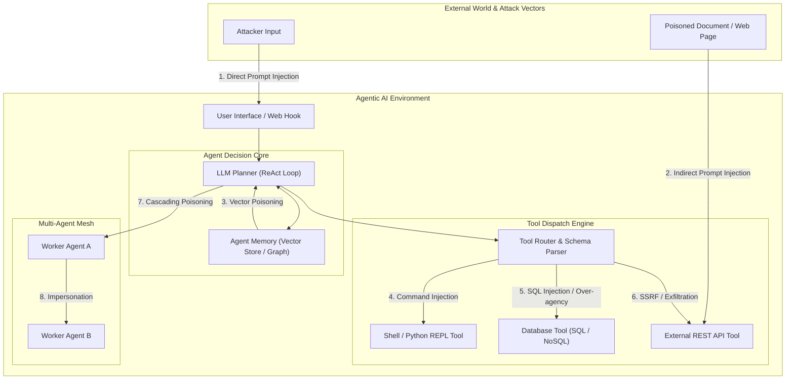

# 01. Introduction to Agentic AI Security

Agentic AI marks a fundamental evolution in artificial intelligence applications. Unlike passive chatbots that merely answer user queries, **AI Agents are autonomous systems capable of planning multi-step actions, executing native code, interacting with databases, calling external APIs, navigating web browsers, and coordinating with other specialized agents**.

While autonomy unlocks immense business value, it fundamentally alters the cybersecurity landscape. Security controls designed for deterministic software or stateless LLM APIs fail to protect agentic workflows.

---

> [!TIP]
> **Companion Open-Source Hands-On Project:** For real-world exploits, vulnerable agent architectures, and hands-on defense implementations, check out our companion repository: [github.com/AnimeshShaw/agentic-ai-security-guide](https://github.com/AnimeshShaw/agentic-ai-security-guide).
>
> **Industry Alignment:** Agentic AI security requires mapping vulnerabilities directly to the **OWASP Top 10 for Large Language Model Applications (2025 Edition)**, specifically highlighting **LLM08: Excessive Agency**, **LLM01: Prompt Injection**, and **LLM05: Supply Chain & Tool Risks**.

---

## 1. What is an Autonomous AI Agent?

An Autonomous AI Agent combines an LLM core with four key subsystems to solve complex goals independently:

```
                    ┌──────────────────────────────────────────┐
                    │               Agent Core                 │
                    │      (Foundation Model / Reasoner)       │
                    └────────────────────┬─────────────────────┘
                                         │
     ┌───────────────────┬───────────────┴───────────────┬───────────────────┐
     ▼                   ▼                               ▼                   ▼
┌─────────┐      ┌──────────────┐                ┌──────────────┐    ┌──────────────┐
│ Memory  │      │  Planning    │                │ Tool Engine  │    │ Multi-Agent  │
│ (Short/ │      │ (ReAct / CoT │                │ (APIs, Code, │    │ Inter-Agent  │
│ Long)   │      │  Decomp)     │                │  Database)   │    │ Messaging)   │
└─────────┘      └──────────────┘                └──────────────┘    └──────────────┘
```

1. **Reasoning Engine (LLM Core)**: Evaluates current state, breaks goals down into sub-tasks, and determines the next step.
2. **Planning Engine**: Employs frameworks like ReAct (Reason + Act), Plan-and-Solve, or Tree-of-Thoughts to iteratively decide whether to formulate an answer or invoke a tool.
3. **Tool Execution Engine**: Translates LLM JSON output into real-world action execution—such as executing shell scripts, issuing SQL queries, sending emails, or calling third-party REST endpoints.
4. **Memory Subsystem**: Retains short-term chat history and retrieves long-term semantic context via vector databases or graph databases.
5. **Multi-Agent Orchestrator**: Coordinates tasks across multiple agents operating in hierarchical (Supervisor-Worker) or peer-to-peer mesh networks (e.g., LangGraph, AutoGen, CrewAI).

---

## 2. Shift in Paradigm: Chatbots vs. RAG vs. Agentic AI

The security implications grow exponentially as systems transition from basic LLMs to full Agentic architectures:

| Architectural Property | Standard Chatbot | RAG System | Agentic AI System |
|---|---|---|---|
| **Primary Function** | Text generation | Document-grounded Q&A | Autonomous goal execution |
| **Execution Control** | Deterministic API call | Deterministic retrieval pipeline | Non-deterministic dynamic loop |
| **Tool Capabilities** | None (Text only) | Read-only Vector Search | Read/Write/Execute across OS & APIs |
| **State Persistence** | Stateless per request | Ephemeral session memory | Long-term persistent vector/graph memory |
| **Blast Radius** | Text hallucination / prompt leak | Data disclosure from vector DB | Host compromise, data destruction, financial loss |
| **Primary Risk** | Direct Prompt Injection | Indirect Injection in documents | **Excessive Agency & Autonomous Hijacking** |

---

## 3. Root Causes of Agentic AI Vulnerabilities

Agentic AI security breaches stem from three fundamental structural flaws inherent in LLM architecture:

### A. Collapse of Control Plane and Data Plane
In traditional software, instructions (code) and input (data) are strictly segregated by compiler boundaries and parameterized inputs. In LLMs, **system instructions, user prompts, web scraping output, and tool call responses are concatenated into a single continuous stream of natural language tokens**. An attacker who controls any part of the data plane can manipulate the agent's control plane.

### B. Dynamic Non-Deterministic Execution Paths
Traditional authorization models rely on predictable path execution (e.g., user `Role A` can access `/api/view`, but not `/api/delete`). In an agentic system, the LLM dynamically decides which tool to call based on unstructured context. If an attacker steers the model's internal reasoning, the agent will happily leverage legitimate developer credentials to execute authorized tools maliciously.

### C. Over-Privileged Tool Design (Excessive Agency)
Developers frequently equip agents with coarse-grained, high-privilege tools (e.g., `execute_sql_query(sql_string)` or `run_python_code(script)`) instead of narrow, parameter-restricted functions (e.g., `get_user_balance(user_id)`). When an agent possesses excessive agency, any prompt injection leads directly to arbitrary code execution or unconstrained database manipulation.

---

## 4. Threat Landscape Architecture Diagram

The diagram below details the end-to-end flow of an Agentic AI system and highlights the critical attack vectors at each boundary:



---

## 5. OWASP Top 10 for LLM Applications (2025) Agentic Mapping

1. **LLM01: Prompt Injection**: Ingesting adversarial commands directly from user text or indirectly through retrieved web pages, tools, or memory.
2. **LLM02: Sensitive Information Disclosure**: Agents revealing proprietary tools, internal system prompts, DB secrets, or session keys during step logs.
3. **LLM05: Supply Chain & Tool Vulnerabilities**: Vulnerable third-party tools, unverified MCP (Model Context Protocol) servers, or malicious Python packages loaded dynamically.
4. **LLM06: Excessive Agency**: Granting tools more permissions than strictly required (e.g., DB `DELETE` access when only `READ` is required).
5. **LLM07: System Prompt Leakage**: Crafting inputs that induce the agent into printing system definitions or hidden step instructions.
6. **LLM08: Vector & Embedding Weaknesses**: Injecting adversarial embeddings into long-term agent memory to manipulate future reasoning loops.
7. **LLM09: Misconfiguration**: Missing authorization checks between multi-agent routines, lack of tool rate-limiting, and un-isolated execution environments.

---

*Next Chapter: [02. Core Concepts & Attack Vectors →](02-core-concepts.md)*
