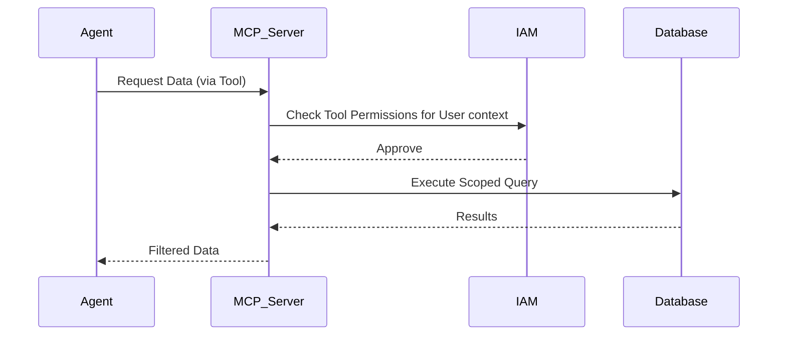

# Tool Access Control and MCP

## 1. The Concept (ELI5)

Think of the Model Context Protocol (MCP) like giving your agent a set of highly specific, tamper-proof tools. Instead of giving them a master key, you give them a special screwdriver that only works on certain screws. If they try to use it on the safe, it won't work. By strictly controlling what tools the agent can use and what data those tools can access, we limit the blast radius of any mistakes or attacks.

## 2. The Visual



## 3. The Code

### Vulnerable Code ❌

**Python**
```python
class AgentTools:
    def query_db(self, query):
        # Vulnerable: Agent decides the exact SQL query
        return db.execute(query)
```

**Go**
```go
func (t *AgentTools) Query(q string) {
    // Vulnerable: Agent controls raw SQL string
    db.Exec(q)
}
```

**TypeScript**
```typescript
class AgentTools {
    queryDb(query: string) {
        // Vulnerable: SQL injection by agent design
        return db.query(query);
    }
}
```

### Production-Ready Secure Code ✅

**Python**
```python
class SecureAgentTools:
    def get_user_data(self, user_id, context_tenant_id):
        # Secure: Tool defines the parameterized query, agent only provides inputs.
        # Additionally, we enforce tenant isolation at the tool level.
        if user_id != context_tenant_id:
            raise PermissionError("Cross-tenant access denied")
        return db.execute('SELECT * FROM data WHERE user_id = ?', (user_id,))
```

**Go**
```go
func (t *SecureAgentTools) GetUserData(userID, tenantID string) error {
    if userID != tenantID {
        return errors.New("access denied")
    }
    // Secure parameterized query
    _, err := db.Query("SELECT * FROM data WHERE id = ?", userID)
    return err
}
```

**TypeScript**
```typescript
class SecureAgentTools {
    async getUserData(userId: string, tenantId: string) {
        if (userId !== tenantId) throw new Error("Access Denied");
        // Parameterized query blocks injection
        return await db.query('SELECT * FROM data WHERE id = $1', [userId]);
    }
}
```

## 4. The Guardrail

```hcl
# Terraform snippet for IAM restricted tool access
resource "aws_iam_policy" "mcp_tool_policy" {
  name        = "MCPToolRestrictedPolicy"
  description = "Limits the agent tool to specific S3 paths"
  policy = jsonencode({
    Version = "2012-10-17"
    Statement = [
      {
        Action   = ["s3:GetObject"]
        Effect   = "Allow"
        Resource = "arn:aws:s3:::company-secure-bucket/agent-allowed-path/*"
      }
    ]
  })
}
```

## Deep Dive and Advanced Considerations

The Model Context Protocol (MCP) standardizes how AI models interact with data sources and tools, providing a unified integration layer. However, exposing tools via MCP requires rigorous authorization checks. Never allow an agent to construct raw queries (SQL, GraphQL, etc.) directly. Instead, expose high-level semantic tools (e.g., `get_user_profile` instead of `execute_sql`). Furthermore, authorization must be context-aware. If User A invokes the agent, the tools the agent uses must run under User A's identity and permissions (OAuth token passthrough or assumed roles). The MCP server must independently validate the agent's requests against the invoking user's permissions, ensuring that even a completely compromised agent cannot bypass the underlying IAM constraints.
