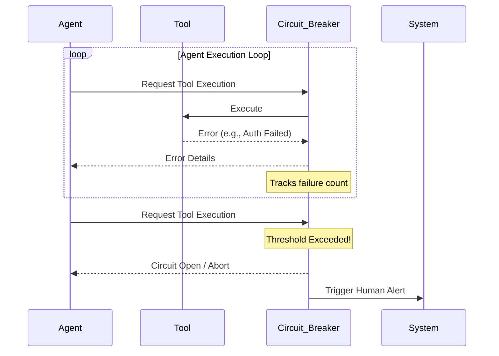

# Preventing Cascading Failures

## 1. The Concept (ELI5)

If a factory robot makes one mistake, it ruins one product. If it gets stuck in a loop making the same mistake at lightning speed, it ruins the whole factory. Autonomous agents can get stuck in recursive loops, stubbornly trying the same failing tool, or hallucinating entirely wrong solutions at high speed. We need circuit breakers, timeouts, and rate limits to stop them if things go wild.

## 2. The Visual



## 3. The Code

### Vulnerable Code ❌

**Python**
```python
def run_agent_loop(agent, task):
    # Vulnerable: Infinite while loop with no bounds
    while True:
        action = agent.decide(task)
        if action.is_done:
            break
        agent.execute(action)
```

**Go**
```go
func RunLoop(agent Agent, task Task) {
    // Vulnerable: Unbounded execution can lead to infinite cost and loops
    for {
        action := agent.Decide(task)
        if action.Done { break }
        agent.Execute(action)
    }
}
```

**TypeScript**
```typescript
async function runAgentLoop(agent: Agent, task: Task) {
    // Vulnerable: No circuit breaking
    while(!task.isComplete) {
        await agent.step(task);
    }
}
```

### Production-Ready Secure Code ✅

**Python**
```python
def run_agent_loop_secure(agent, task, max_iterations=10):
    # Secure: Bounded loop with strict iteration limits
    for i in range(max_iterations):
        action = agent.decide(task)
        if action.is_done:
            return action.result
        
        try:
            agent.execute(action)
        except ToolExecutionError as e:
            agent.log_error(e)
            # Circuit breaker logic inside execute could also raise
            
    raise RunawayAgentException("Agent exceeded maximum allowed iterations without completing the task.")
```

**Go**
```go
func RunLoopSecure(agent Agent, task Task, maxSteps int) error {
    // Secure: Bounded execution loop
    for i := 0; i < maxSteps; i++ {
        action := agent.Decide(task)
        if action.Done { return nil }
        err := agent.Execute(action)
        if err != nil {
            // Handle and track consecutive errors for circuit breaking
            if agent.ConsecutiveErrors() > 3 {
                 return errors.New("circuit breaker tripped")
            }
        }
    }
    return errors.New("max steps exceeded")
}
```

**TypeScript**
```typescript
async function runAgentLoopSecure(agent: Agent, task: Task, maxSteps = 10) {
    for(let i=0; i < maxSteps; i++) {
        if (task.isComplete) return;
        await agent.step(task);
        if (agent.getErrorCount() >= 3) throw new Error("Circuit breaker tripped.");
    }
    throw new Error("Agent loop threshold exceeded.");
}
```

## 4. The Guardrail

```yaml
# Semgrep Rule
rules:
  - id: unbounded-agent-execution-loop
    pattern: while True: ... agent.step()
    message: Autonomous agents must have a strictly bounded execution loop (e.g., a for-loop with a defined max limit) to prevent runaway costs and cascading failures.
    severity: ERROR
    languages: [python]
```

## Deep Dive and Advanced Considerations

Cascading failures in agentic systems often result from runaway recursive calls or getting stuck in 'hallucination loops' where the agent repeatedly uses a tool incorrectly, reads the error, hallucinates a slightly different but still incorrect fix, and tries again indefinitely. This not only burns API credits rapidly (Denial of Wallet attacks) but can overwhelm internal services. To prevent this, implement strict architectural safeguards: (1) Hard caps on the maximum number of reasoning steps per task. (2) Circuit breakers on tools that halt the agent if a specific tool fails consecutively. (3) Exponential backoff and jitter for external API calls made by the agent. (4) Budget constraints at the token level, terminating the agent if it consumes more than an allocated token budget for a given session.
