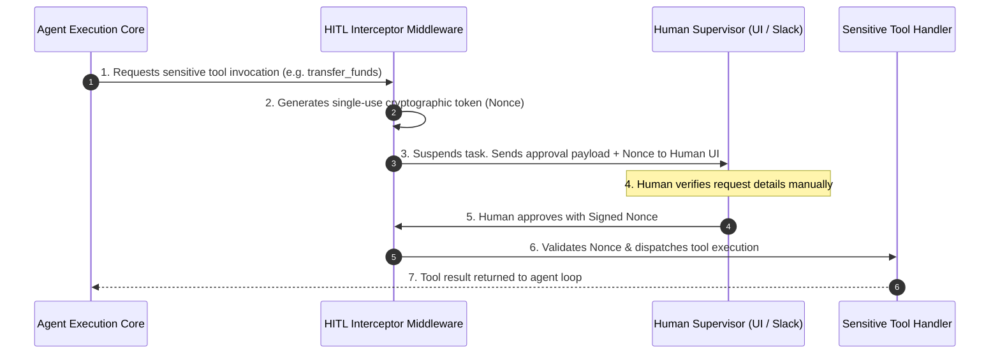

# 04. Production-Grade Defenses & Mitigation Architecture

Securing Agentic AI applications requires moving away from naive prompt-based instructions (e.g., *"Do not execute unauthorized commands"*) and enforcing **hard technical controls at the infrastructure, application, and model orchestration layers**.

---

## 1. Architectural Defense Taxonomy

```
                      ┌───────────────────────────────────────┐
                      │    Agent Defense-in-Depth Layer       │
                      └───────────────────┬───────────────────┘
                                          │
       ┌──────────────────┬───────────────┴───────────────┬──────────────────┐
       ▼                  ▼                               ▼                  ▼
┌──────────────┐   ┌──────────────┐                ┌──────────────┐   ┌──────────────┐
│  Data Plane  │   │ Decision Core│                │ Tool Engine  │   │ Infrastructure│
│ Isolation    │   │  Guardrails  │                │ Restraints   │   │ Sandboxing   │
├──────────────┤   ├──────────────┤                ├──────────────┤   ├──────────────┤
│ Dual-Agent   │   │ Step Limits  │                │ HITL Nonces  │   │ gVisor /     │
│ Boundary     │   │ Input/Output │                │ Schema/Pydantic│ Firecracker │
│ Filter       │   │ Filtering    │                │ OAuth Scopes │   │ Non-root     │
└──────────────┘   └──────────────┘                └──────────────┘   └──────────────┘
```

---

## 2. Mitigation 1: Principle of Least Agency & Scope-Bounded Tools

Never grant an agent open-ended execution functions (like `execute_sql` or `run_shell_command`). Tools must be designed as single-purpose, strongly typed functions with rigorous input validation.

### Multi-Language Secure Tool Implementations

#### Python (Pydantic Schema & Scope-Bounded Tool)
```python
from pydantic import BaseModel, Field, EmailStr
import re

class RefundRequestSchema(BaseModel):
    transaction_id: str = Field(..., regex=r"^TX_[0-9]{8}$", description="Must match format TX_12345678")
    amount: float = Field(..., gt=0, le=500.0, description="Maximum automated refund limit is $500.00")
    customer_email: EmailStr = Field(..., description="Valid customer email address")

def process_refund_safe(params: RefundRequestSchema) -> dict:
    """Safely processes a customer refund within strict bounds."""
    # Strong schema guarantees parameters are pre-validated before reaching handler logic
    print(f"[SECURE ACTION] Processing refund of ${params.amount} for {params.customer_email}")
    return {"status": "SUCCESS", "tx_id": params.transaction_id}
```

#### Node.js / TypeScript (Zod Validation)
```typescript
import { z } from 'zod';

const RefundSchema = z.object({
  transactionId: z.string().regex(/^TX_[0-9]{8}$/),
  amount: z.number().positive().max(500.0),
  customerEmail: z.string().email()
});

type RefundInput = z.infer<typeof RefundSchema>;

function processRefundSafe(rawInput: unknown): { status: string } {
  // Validate raw agent JSON output against Zod schema
  const parsed = RefundSchema.parse(rawInput);
  console.log(`[SECURE ACTION] Processing refund: $${parsed.amount}`);
  return { status: 'SUCCESS' };
}
```

#### Go (Strict Struct Validation)
```go
package main

import (
	"fmt"
	"regexp"
)

type RefundRequest struct {
	TransactionID string  `json:"transaction_id"`
	Amount        float64 `json:"amount"`
}

var txRegex = regexp.MustCompile(`^TX_[0-9]{8}$`)

func ProcessRefundSafe(req RefundRequest) error {
	if !txRegex.MatchString(req.TransactionID) {
		return fmt.Errorf("invalid transaction ID format")
	}
	if req.Amount <= 0 || req.Amount > 500.0 {
		return fmt.Errorf("amount exceeds maximum allowed limit of $500.00")
	}
	fmt.Printf("[SECURE ACTION] Refund approved: $%.2f\n", req.Amount)
	return nil
}
```

---

## 3. Mitigation 2: Cryptographic Human-in-the-Loop (HITL) Approval Workflows

For sensitive actions (such as wire transfers, DB updates, or privilege changes), the agent must **interrupt execution** and request out-of-band human approval before executing the tool handler.



### Python Implementation of HITL Interrupt Pattern (LangGraph Style)

```python
import secrets
import json

class HITLRequiredError(Exception):
    def __init__(self, action_name: str, payload: dict, nonce: str):
        self.action_name = action_name
        self.payload = payload
        self.nonce = nonce

pending_approvals = {}

def sensitive_wire_transfer_tool(amount: float, recipient: str, user_role: str, approval_nonce: str = None):
    # Rule: Any transfer > $1000 requires explicit human approval token
    if amount > 1000.0:
        if not approval_nonce or approval_nonce not in pending_approvals:
            # Generate cryptographic single-use approval token
            nonce = secrets.token_hex(16)
            pending_approvals[nonce] = {
                "action": "wire_transfer",
                "amount": amount,
                "recipient": recipient,
                "status": "PENDING"
            }
            raise HITLRequiredError("wire_transfer", {"amount": amount, "recipient": recipient}, nonce)
        
        # Verify approval status
        approval_record = pending_approvals.pop(approval_nonce)
        if approval_record["status"] != "APPROVED":
            raise PermissionError("Human approval was rejected.")

    return f"Successfully transferred ${amount} to {recipient}."

# Simulating Human UI Approval Callback
def approve_pending_action(nonce: str):
    if nonce in pending_approvals:
        pending_approvals[nonce]["status"] = "APPROVED"
        print(f"[HITL LOG] Nonce {nonce} APPROVED by human admin.")
```

---

## 4. Mitigation 3: Secure Tool Sandboxing & Container Isolation

If an agent requires code execution tools (Python REPL, Bash), the code **must never execute directly on the application host**.

### Recommended Sandboxing Technologies

1. **gVisor (`runsc`)**: A lightweight container sandbox developed by Google that intercepts application syscalls at the kernel boundary.
2. **Firecracker microVMs**: Provides minimal, fast-booting virtual machines with KVM isolation (used by AWS Lambda and Fly.io).
3. **Wasm / WebAssembly Sandboxes**: Executing compiled tool functions inside isolated Wasm runtimes (e.g., Wasmtime or Extism).

### Production Docker Sandboxing Rules for Agent Code Execution

```dockerfile
# Secure Sandbox Containerfile for Agent Code Execution
FROM python:3.11-slim

# Create isolated non-root user
RUN groupadd -r sandbox && useradd -r -g sandbox sandbox

# Micro-environment setup
WORKDIR /app
RUN chmod 755 /app

# Strip unnecessary binaries to harden execution environment
RUN rm -rf /usr/bin/curl /usr/bin/wget /usr/bin/apt* /usr/bin/dpkg*

USER sandbox

# Enforce resource boundaries via CLI flags on launch:
# docker run --read-only --network none --cap-drop=ALL --memory=256m --cpus=0.5 agent-sandbox
```

---

## 5. Mitigation 4: Dual-Agent Control/Data Plane Isolation Architecture

To prevent Indirect Prompt Injection from hijacking agent decision loops, adopt a **Dual-Agent Architecture**:

```
                       ┌──────────────────────────────┐
                       │     Untrusted Data Input     │
                       └──────────────┬───────────────┘
                                      │
                                      ▼
                       ┌──────────────────────────────┐
                       │    Data Processor Agent      │
                       │    (Read-Only / No Tools)     │
                       └──────────────┬───────────────┘
                                      │ (Sanitized Structured JSON Output)
                                      ▼
                       ┌──────────────────────────────┐
                       │   Control / Executive Agent  │
                       │  (Has Tools / Strict Bounds) │
                       └──────────────────────────────┘
```

1. **Data Processor Agent (Untrusted Plane)**: Ingests raw documents, emails, or web pages. Possesses **zero tools**. Its sole task is to extract structured facts and output sanitized JSON.
2. **Control/Executive Agent (Trusted Plane)**: Receives only verified, schema-validated JSON from the Data Processor Agent. It never reads raw untrusted text directly, preventing attention hijacking.

---

## 6. Mitigation 5: Loop Limits & Denial of Wallet Safeguards

To prevent infinite tool execution loops, enforce strict middleware bounds:

```python
class AgentExecutionGuard:
    def __init__(self, max_steps: int = 10, max_budget_usd: float = 0.50):
        self.max_steps = max_steps
        self.max_budget_usd = max_budget_usd
        self.current_steps = 0
        self.current_cost = 0.0

    def step_check(self, step_cost_usd: float):
        self.current_steps += 1
        self.current_cost += step_cost_usd

        if self.current_steps > self.max_steps:
            raise RecursionError(f"Agent exceeded maximum step limit ({self.max_steps}). Terminating loop.")
        if self.current_cost > self.max_budget_usd:
            raise MemoryError(f"Agent exceeded maximum budget limit (${self.max_budget_usd}). Terminating loop.")
```

---

*Next Chapter: [05. Security Testing & Tooling →](05-tools.md)*
