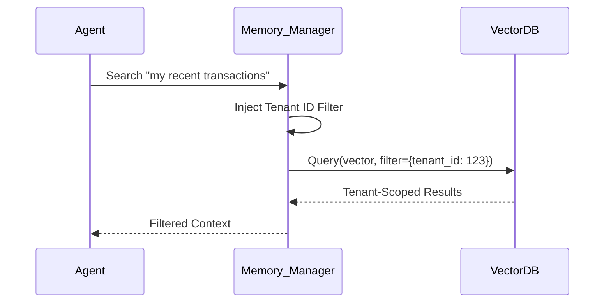

# Agent Memory and Data Privacy

## 1. The Concept (ELI5)

If your assistant writes down everyone's credit card numbers in a notebook and leaves it on a park bench, that's a massive data breach. Agents use memory (like Vector Databases) to remember past conversations and context. We must encrypt this memory, properly scope it, and ensure one user's agent absolutely cannot retrieve or peek into another user's memories.

## 2. The Visual



## 3. The Code

### Vulnerable Code ❌

**Python**
```python
def retrieve_memory(query_vector):
    # Vulnerable: Querying vector DB without tenant isolation
    return vectordb.query(query_vector, top_k=5)
```

**Go**
```go
func Retrieve(vector []float32) []Result {
    // Vulnerable: No tenant filtering
    return db.Query(vector, 5)
}
```

**TypeScript**
```typescript
async function getMemory(vector: number[]) {
    // Vulnerable: Global search across all users
    return await db.query(vector, 5);
}
```

### Production-Ready Secure Code ✅

**Python**
```python
def retrieve_memory_secure(query_vector, tenant_id):
    # Secure: Mandating metadata filtering by tenant ID
    # The tenant_id must come from the authenticated context, NOT the agent's prompt
    filter_criteria = {"tenant_id": tenant_id}
    return vectordb.query(query_vector, filter=filter_criteria, top_k=5)
```

**Go**
```go
func RetrieveSecure(vector []float32, tenantID string) []Result {
    // Secure: Metadata filtering applied
    filter := map[string]string{"tenant_id": tenantID}
    return db.QueryWithFilter(vector, 5, filter)
}
```

**TypeScript**
```typescript
async function getMemorySecure(vector: number[], tenantId: string) {
    // Secure: Scoped query
    return await db.query(vector, 5, { filter: { tenant: tenantId } });
}
```

## 4. The Guardrail

```rego
# OPA Rego rule to ensure VectorDB queries have a tenant filter
package vectordb.authz

default allow = false

allow {
    input.action == "query"
    input.query_filter.tenant_id == input.authenticated_user.tenant_id
}
```

## Deep Dive and Advanced Considerations

Long-term memory introduces severe risks of cross-tenant data leakage (often called 'data bleeding' in RAG systems). When an agent needs context, it queries a vector database. If that database contains embeddings from multiple users or organizations without strict logical isolation, an attacker can manipulate their prompts to retrieve semantic neighbors that belong to someone else. The defense requires rigorous Metadata Filtering at the Vector Database level. The tenant identifier must be injected by the secure backend application layer—never trusted or constructed by the agent itself. Additionally, consider data retention policies (TTL on agent memories) and implementing encryption-in-transit and encryption-at-rest for the vector store. For highly sensitive applications, separate physical indexes per tenant may be necessary to completely eliminate the risk of cross-tenant leakage.
