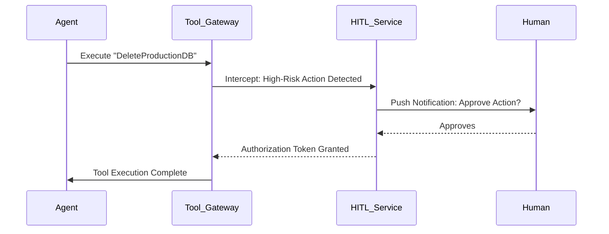

# Human-in-the-Loop (HITL) Workflows

## 1. The Concept (ELI5)

Imagine a drone pilot. The drone can fly itself, but before it fires a missile, the pilot has to press a big red button. HITL is the big red button for agents. For high-risk actions (like deleting a database, changing a password, or spending large amounts of money), the agent must pause its work and ask a human for explicit permission before proceeding.

## 2. The Visual



## 3. The Code

### Vulnerable Code ❌

**Python**
```python
def process_refund(user_id, amount):
    # Vulnerable: Agent executes critical financial transaction autonomously
    payment_gateway.issue_refund(user_id, amount)
```

**Go**
```go
func Refund(userID string, amount float64) {
    // Vulnerable: No human oversight
    gateway.Refund(userID, amount)
}
```

**TypeScript**
```typescript
async function refund(userId: string, amount: number) {
    // Vulnerable: Direct execution of critical action
    await gateway.processRefund(userId, amount);
}
```

### Production-Ready Secure Code ✅

**Python**
```python
def process_refund_secure(user_id, amount, agent_session):
    # Secure: Suspend execution, request human approval
    approval_id = hitl_service.request_approval(
        action="refund", 
        details=f"Refund ${amount} to {user_id}"
    )
    status = hitl_service.wait_for_approval(approval_id, timeout_minutes=15)
    
    if status == 'APPROVED':
        payment_gateway.issue_refund(user_id, amount)
        return "Refund successful"
    else:
        return "Refund denied by human supervisor."
```

**Go**
```go
func RefundSecure(userID string, amount float64) error {
    // Secure: Asynchronous HITL flow
    reqID := hitl.Request("refund", userID, amount)
    approved := hitl.WaitForApproval(reqID)
    if !approved {
        return errors.New("human denied action")
    }
    return gateway.Refund(userID, amount)
}
```

**TypeScript**
```typescript
async function refundSecure(userId: string, amount: number) {
    // Secure: Awaiting external human validation
    const approved = await hitl.requestApproval('refund', { userId, amount });
    if (!approved) throw new Error("Action aborted by human.");
    await gateway.processRefund(userId, amount);
}
```

## 4. The Guardrail

```yaml
# Security policy configuration for tools
tools:
  - name: calculate_metrics
    requires_approval: false
  - name: issue_refund
    requires_approval: true
    approval_role: "finance_admin"
  - name: drop_database
    requires_approval: true
    approval_role: "devops_lead"
```

## Deep Dive and Advanced Considerations

Implementing robust HITL requires asynchronous workflow state management. When an agent decides to use a high-risk tool, the system must pause the agent's execution thread or serialize its state, dispatch a notification to the designated human approver, and wait. The agent should be informed that the action is pending, allowing it to move on to other tasks or wait gracefully. Crucially, the HITL enforcement must happen at the server/API boundary, not within the agent's prompt. You cannot rely on a prompt like `You must ask the user before deleting files`. The agent can and will ignore this under the influence of an indirect prompt injection. The tool execution gateway itself must enforce the requirement for a valid human-signed cryptographic token or database state before allowing the execution of the restricted function.
