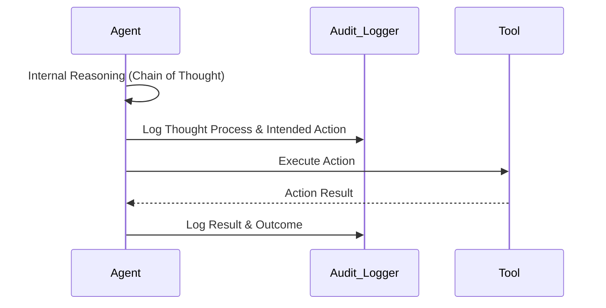

# Auditing and Monitoring Agents

## 1. The Concept (ELI5)

You wouldn't run a bank without security cameras. Monitoring and auditing mean keeping a tamper-proof log of everything the agent thinks, decides, and does. If something goes wrong—like the agent accidentally sharing a secret—you can 'rewind the tape' and see exactly what information it was given and why it made that bad decision.

## 2. The Visual



## 3. The Code

### Vulnerable Code ❌

**Python**
```python
def run_step(action):
    # Vulnerable: Inadequate visibility into non-deterministic actions
    print(f"Executing {action}")
    execute(action)
```

**Go**
```go
func Step(action string) {
    // Vulnerable: Standard logging is insufficient for agents
    log.Printf("Action: %s", action)
    Execute(action)
}
```

**TypeScript**
```typescript
function step(action: string) {
    // Vulnerable: Silent execution or weak logging
    console.log(action);
    execute(action);
}
```

### Production-Ready Secure Code ✅

**Python**
```python
import json
import time

def run_step_secure(agent_state, action, context_id):
    # Secure: Comprehensive, structured audit logging
    audit_event = {
        "timestamp": time.time(),
        "context_id": context_id,
        "agent_state_hash": hash(str(agent_state)),
        "intended_action": action.name,
        "action_payload": action.args,
        "chain_of_thought": agent_state.recent_thoughts
    }
    secure_audit_logger.log(json.dumps(audit_event))
    
    result = execute(action)
    
    secure_audit_logger.log(json.dumps({
        "context_id": context_id,
        "action_result": str(result),
        "success": True
    }))
    return result
```

**Go**
```go
func StepSecure(state State, action Action, ctxID string) Result {
    // Secure: Structured JSON logging to immutable storage
    audit.Log(map[string]interface{}{
        "ctxID": ctxID,
        "thoughts": state.Thoughts,
        "action": action.Name,
    })
    res := Execute(action)
    audit.Log(map[string]interface{}{"ctxID": ctxID, "result": res})
    return res
}
```

**TypeScript**
```typescript
async function stepSecure(state: State, action: Action, ctxId: string) {
    // Secure: Detailed telemetry
    auditLog.record({
        contextId: ctxId,
        reasoning: state.chainOfThought,
        toolInvoked: action.name,
        inputs: action.params
    });
    const result = await execute(action);
    auditLog.record({ contextId: ctxId, output: result });
    return result;
}
```

## 4. The Guardrail

```yaml
# Configuration for Agent Observability (e.g., OpenTelemetry)
tracing:
  enabled: true
  capture_prompt: true
  capture_completion: true
  redact_pii: true # Extremely important to prevent sensitive data logging
  backend: "splunk-audit-index"
```

## Deep Dive and Advanced Considerations

Comprehensive observability for agents requires tracing non-deterministic paths. Unlike traditional software where a function's execution path is predictable, an agent's path changes based on its probabilistic model and external inputs. To debug security incidents, you must capture the entire 'Chain of Thought' (CoT), the exact prompts sent to the LLM (including system prompts and retrieved context), the raw LLM responses, and the specific tool invocations and their outcomes. This logging must be immutable to prevent a compromised agent from covering its tracks. Furthermore, because prompts and contexts often contain sensitive user data (PII, credentials), the auditing pipeline must include robust redaction mechanisms (e.g., using specialized NLP models to scrub PII before writing to the log store). Establish monitoring alerts for anomalous agent behavior, such as sudden spikes in tool execution failures or attempts to access unauthorized endpoints.
