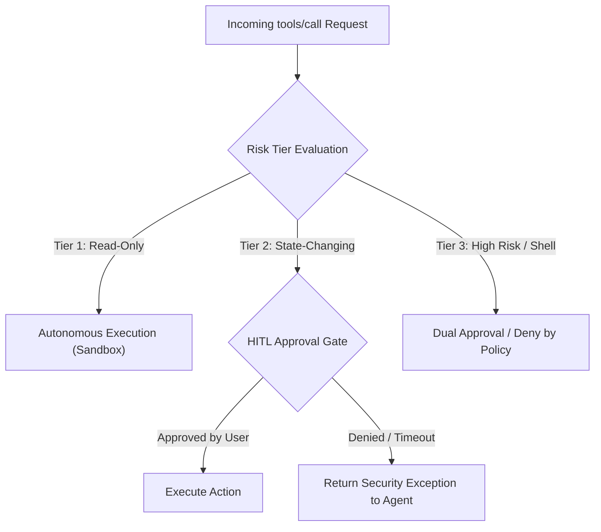

# 03 - Least Privilege & Permission Scopes in MCP

> [!IMPORTANT]
> **Core Principle:** An AI model should never possess direct, unmediated access to destructive or wide-ranging system operations. Every MCP tool must enforce strict parameter boundaries, canonical path verification, and Human-in-the-Loop (HITL) authorization gates for state-changing operations.

---

## 🎯 Architectural Principles of Scoped Tool Design

The Principle of Least Privilege in MCP tool execution relies on three primary defense layers:

1. **Granular Action Risk Tiers:** Classifying tool capabilities based on risk severity.
2. **Deterministic Parameter Constraints:** Enforcing strict type validation, regex patterns, and canonical path checks.
3. **Human-in-the-Loop (HITL) Approval Gates:** Intercepting sensitive requests before execution.



---

## 🚦 Risk Classification Matrix

| Tier | Risk Level | Example MCP Tools | Security Mechanism |
| :--- | :--- | :--- | :--- |
| **Tier 1** | Low (Read-Only) | `read_weather`, `search_docs`, `get_system_time` | Autonomous execution within read-only sandbox. |
| **Tier 2** | Medium (State-Changing) | `create_issue`, `send_email`, `write_sandboxed_file` | Strict schema validation + Async HITL user approval prompt. |
| **Tier 3** | High (Critical / Destructive) | `execute_bash`, `drop_database`, `delete_file`, `update_iam_role` | Hard block by default; requires explicit user flag + hardware token / MFA. |

---

## 🔒 Path Canonicalization & Traversal Prevention

A frequent flaw in MCP tool implementations is accepting directory or file paths from the model without resolving symbolic links or relative traversals (`../`).

### Path Traversal Attack Vector
If an agent receives a prompt injection like:
```json
{ "name": "read_file", "arguments": { "filepath": "../../../../../etc/passwd" } }
```
A naive tool using naive string concatenation (`sandbox_path + filepath`) will escape the sandbox directory.

### Mitigation Rule
Always canonicalize paths using absolute resolution (`os.path.realpath` / `fs.realpathSync`) and verify that the target path **starts with the strict allowed base directory**.

---

## 💻 Multi-Language Code Demonstrations

### 🐍 Python Implementation

#### Vulnerable Code vs Hardened Secure MCP Tool with HITL
```python
# SECURE: Production-Grade MCP Tool with Pydantic validation, Path Canonicalization, & HITL Gate
import os
import re
from typing import Callable
from pydantic import BaseModel, Field, field_validator

ALLOWED_BASE_DIR = os.path.realpath("/var/app/mcp_workspace")

class FileDeleteInput(BaseModel):
    relative_path: str = Field(..., description="Relative path within workspace to delete")

    @field_validator("relative_path")
    def validate_path(cls, v: str) -> str:
        if ".." in v or v.startswith("/"):
            raise ValueError("Path traversal sequences are strictly forbidden")
        return v

def request_human_approval(action_type: str, details: str) -> bool:
    """Simulates an interactive user approval gate in an agent host."""
    print(f"\n[SECURITY ALERT] Action Requires Human Approval!")
    print(f"Action: {action_type} | Target: {details}")
    # In production, this connects to an interactive UI dialog or webhook
    return True

def delete_file_secure(input_data: FileDeleteInput, user_approval_callback: Callable[[str, str], bool]) -> dict:
    # 1. Path Canonicalization & Scope Check
    unsafe_path = os.path.join(ALLOWED_BASE_DIR, input_data.relative_path)
    canonical_path = os.path.realpath(unsafe_path)

    # Verify canonical path remains within ALLOWED_BASE_DIR boundary
    if not canonical_path.startswith(ALLOWED_BASE_DIR + os.sep):
        return {"status": "error", "message": "Security Error: Path traversal out of workspace boundary"}

    # 2. HITL Approval Gate for State-Changing Action
    approved = user_approval_callback("DELETE_FILE", canonical_path)
    if not approved:
        return {"status": "error", "message": "Security Error: Action rejected by user"}

    # 3. Secure Execution
    try:
        if os.path.exists(canonical_path):
            os.remove(canonical_path)
            return {"status": "success", "message": f"File {input_data.relative_path} deleted successfully"}
        else:
            return {"status": "error", "message": "File not found"}
    except Exception as e:
        return {"status": "error", "message": f"Execution failed: {str(e)}"}
```

---

### 🟨 Node.js / TypeScript Implementation

```typescript
import * as path from "path";
import * as fs from "fs/promises";
import { z } from "zod";

const AllowedBaseDir = path.resolve("/var/app/mcp_workspace");

const FileReadSchema = z.object({
  filename: z.string().min(1).max(255).regex(/^[a-zA-Z0-9_\-\.]+$/, "Invalid characters in filename")
});

export class SecureFileToolNode {
  private async askUserApproval(action: string, target: string): Promise<boolean> {
    console.log(`[HITL INTERCEPT] Action: `${action} on Target: $`{target}`);
    // Async approval logic (e.g. WebSocket emit to UI)
    return true;
  }

  public async readFileContent(rawArgs: unknown): Promise<{ success: boolean; data?: string; error?: string }> {
    // 1. Zod Input Schema Enforcement
    const parseResult = FileReadSchema.safeParse(rawArgs);
    if (!parseResult.success) {
      return { success: false, error: `Invalid Schema: ${parseResult.error.message}` };
    }

    const { filename } = parseResult.data;

    // 2. Strict Path Resolution
    const resolvedPath = path.resolve(AllowedBaseDir, filename);
    
    // Canonical Boundary Check
    if (!resolvedPath.startsWith(AllowedBaseDir + path.sep)) {
      return { success: false, error: "Security Exception: Directory traversal attempt blocked" };
    }

    // 3. Execution
    try:
      const content = await fs.readFile(resolvedPath, "utf-8");
      return { success: true, data: content };
    } catch (err: any) {
      return { success: false, error: `File Read Error: ${err.message}` };
    }
  }
}
```

---

### golang Implementation

```go
package mcpsecurity

import (
	"fmt"
	"path/filepath"
	"strings"
)

type SecurePathValidator struct {
	BaseDir string
}

func NewPathValidator(baseDir string) (*SecurePathValidator, error) {
	absBase, err := filepath.Abs(baseDir)
	if err != nil {
		return nil, err
	}
	// Evaluate symlinks for canonical base
	evalBase, err := filepath.EvalSymlinks(absBase)
	if err != nil {
		evalBase = absBase
	}
	return &SecurePathValidator{BaseDir: evalBase}, nil
}

func (v *SecurePathValidator) ValidateScopedPath(requestedPath string) (string, error) {
	// Clean relative paths
	cleanPath := filepath.Clean(requestedPath)
	target := filepath.Join(v.BaseDir, cleanPath)

	// Resolve symlinks
	canonicalTarget, err := filepath.EvalSymlinks(target)
	if err != nil {
		// If file doesn't exist yet, validate parent directory
		canonicalTarget = target
	}

	// Boundary check
	if !strings.HasPrefix(canonicalTarget, v.BaseDir+string(filepath.Separator)) && canonicalTarget != v.BaseDir {
		return "", fmt.Errorf("security violation: target path %s escapes base dir %s", canonicalTarget, v.BaseDir)
	}

	return canonicalTarget, nil
}
```

---

### ☕ Java Implementation

```java
package com.appsec.mcp.security;

import java.io.File;
import java.io.IOException;
import java.nio.file.Path;
import java.nio.file.Paths;

public class ScopedFileSystemTool {
    private final Path baseDirectory;

    public ScopedFileSystemTool(String baseDir) throws IOException {
        this.baseDirectory = Paths.get(baseDir).toRealPath();
    }

    public String readScopedFile(String relativePath) throws IOException, SecurityException {
        // Resolve raw path against base directory
        Path resolvedPath = baseDirectory.resolve(relativePath).normalize();

        // Check canonical path boundary
        if (!resolvedPath.startsWith(baseDirectory)) {
            throw new SecurityException("Path Traversal Detected: " + relativePath);
        }

        // Verify real path handles symlink tricks
        File targetFile = resolvedPath.toFile();
        if (targetFile.exists() && !targetFile.toPath().toRealPath().startsWith(baseDirectory)) {
            throw new SecurityException("Symlink Escape Detected!");
        }

        return java.nio.file.Files.readString(resolvedPath);
    }
}
```

---

> [!CAUTION]
> **Dangerous Anti-Pattern:** Never rely on simple string replacement like `filepath.replace("../", "")`. Attackers bypass naive filters using nested encodings or patterns like `....//` or URL encoding (`%2e%2e%2f`). Always use canonical path verification (`toRealPath()` / `realpath`).

