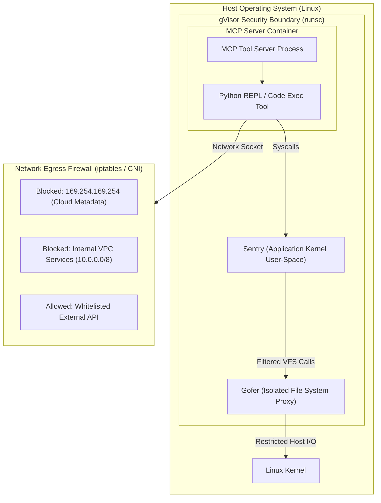

# 04 - MCP Sandbox Isolation & Container Security

> [!CAUTION]
> **Host Escape Threat:** Executing an MCP server directly on the host OS exposes ambient environment variables (cloud IAM credentials, API tokens, SSH keys) and host filesystem access to potentially compromised tool execution environments. MCP servers MUST execute inside isolated, restricted sandboxes.

---

## 🏗️ Sandboxing Architecture & Defense-in-Depth

Securing MCP tool server execution requires a multi-layered sandboxing model:



---

## 🛡️ Container Isolation Runtimes: Standard Docker vs gVisor

Standard Docker uses shared Linux kernel namespaces and cgroups. A kernel exploit inside a Docker container grants root access on the host. 

For high-risk MCP servers (especially tools that execute code, evaluate Python, or manipulate files), application security engineers must deploy **gVisor (`runsc`)** or **Kata Containers (MicroVMs)**.

### Why gVisor (`runsc`) for MCP?
- **User-Space Kernel (Sentry):** Intercepts syscalls and executes them in user-space, preventing direct communication with the host Linux kernel.
- **Seccomp Sandbox:** Reduces host syscall exposure to a minimal set.
- **File Access Proxy (Gofer):** Mediates filesystem requests through a secondary isolated process.

---

## 📄 Hardened Docker Compose Configuration (`docker-compose.yml`)

The following production-ready configuration isolates an MCP server container against host compromise:

```yaml
version: '3.8'

services:
  mcp_tool_server:
    image: company/mcp-python-tools:1.2.0
    container_name: mcp_tool_server_isolated
    # 1. Enforce gVisor user-space kernel runtime
    runtime: runsc
    
    # 2. Non-root user context (UID:GID 10001:10001)
    user: "10001:10001"
    
    # 3. Completely disable networking or use restricted internal network
    network_mode: "none"
    
    # 4. Enforce read-only root filesystem
    read_only: true
    
    # 5. Security options: Prevent privilege escalation & apply custom seccomp
    security_opt:
      - no-new-privileges:true
      - seccomp=./seccomp-strict.json
      
    # 6. Drop ALL Linux capabilities
    cap_drop:
      - ALL
      
    # 7. Strict resource limits (Cgroups v2 mitigation against DoS)
    deploy:
      resources:
        limits:
          cpus: '0.50'
          memory: 256M
          pids: 50
        reservations:
          cpus: '0.10'
          memory: 64M
          
    # 8. Temporary write storage (ephemeral, non-executable in-memory tmpfs)
    tmpfs:
      - /tmp:rw,noexec,nosuid,nodev,size=32m
      - /run:rw,noexec,nosuid,nodev,size=16m
      
    # 9. Environment Variable Hygiene: Never inherit host environment
    environment:
      - WORKSPACE_DIR=/tmp/workspace
      - LOG_LEVEL=INFO
      # DO NOT include AWS_SECRET_ACCESS_KEY, OPENAI_API_KEY, or host secrets here!
```

---

## 🔒 Custom Seccomp System Call Profile (`seccomp-strict.json`)

Seccomp (Secure Computing Mode) restricts the system calls an MCP tool server can issue. The following profile blocks dangerous kernel operations:

```json
{
  "defaultAction": "SCMP_ACT_ERRNO",
  "architectures": [
    "SCMP_ARCH_X86_64",
    "SCMP_ARCH_AARCH64"
  ],
  "syscalls": [
    {
      "names": [
        "read", "write", "exit", "exit_group", "futex", 
        "fstat", "lseek", "mmap", "mprotect", "munmap", 
        "brk", "rt_sigaction", "rt_sigprocmask", "getpid", "getuid"
      ],
      "action": "SCMP_ACT_ALLOW"
    },
    {
      "names": [
        "ptrace", "process_vm_readv", "process_vm_writev", 
        "kexec_load", "bpf", "syslog", "reboot"
      ],
      "action": "SCMP_ACT_KILL"
    }
  ]
}
```

---

## 🌐 Network Microsegmentation & SSRF Mitigation

If an MCP tool requires external internet connectivity (e.g. fetching documentation or calling authorized third-party APIs), you must prevent **Server-Side Request Forgery (SSRF)** against cloud metadata endpoints and internal infrastructure.

### Cloud Metadata & Private Range IP Blacklist Matrix
| IP Range | Target Infrastructure | Threat |
| :--- | :--- | :--- |
| `169.254.169.254` | AWS / GCP / Azure IMDS Metadata | Cloud IAM Credentials Theft |
| `169.254.170.2` | AWS ECS Task Metadata | Container IAM Token Theft |
| `10.0.0.0/8`, `172.16.0.0/12`, `192.168.0.0/16` | Internal VPC & Microservices | Internal Service Exploitation / Lateral Movement |
| `127.0.0.1/8`, `::1` | Host Localhost Services | Unauthenticated Admin APIs |

### Hardened `iptables` Rules for Container Egress
Add these rules to the MCP container initialization script to enforce egress filtering:

```bash
#!/bin/bash
set -euo pipefail

# 1. Flush existing rules
iptables -F OUTPUT

# 2. Block access to Cloud Instance Metadata Service (IMDS)
iptables -A OUTPUT -d 169.254.169.254 -j DROP
iptables -A OUTPUT -d 169.254.170.2 -j DROP

# 3. Block access to RFC 1918 Private IPv4 Networks
iptables -A OUTPUT -d 10.0.0.0/8 -j DROP
iptables -A OUTPUT -d 172.16.0.0/12 -j DROP
iptables -A OUTPUT -d 192.168.0.0/16 -j DROP

# 4. Allow egress strictly to Whitelisted External API IP (e.g. 192.0.2.50)
iptables -A OUTPUT -d 192.0.2.50 -p tcp --dport 443 -j ACCEPT

# 5. Drop all other outbound network traffic
iptables -A OUTPUT -j DROP
```

---

## 🧹 Environment Variable Hygiene & Credentials Management

> [!WARNING]
> **Anti-Pattern:** Passing `AWS_SECRET_ACCESS_KEY` or `OPENAI_API_KEY` into an MCP server container's environment variables allows any prompt injection payload to execute `env` or read `/proc/self/environ` to exfiltrate host keys.

### Best Practices:
1. **Never pass ambient host tokens:** Inherit zero host environment variables into container instances.
2. **Ephemeral Scoped IAM Tokens:** Use short-lived, low-privilege tokens (e.g., AWS STS AssumeRole with 15-minute expiration restricted to a single S3 bucket prefix).
3. **Out-of-Band API Key Injection:** If a tool requires external API credentials, the **MCP Host Proxy** should inject authentication headers into outgoing requests on behalf of the tool, keeping raw secret keys completely hidden from the MCP Server code.

---

> [!TIP]
> **Production Deployment Checklist:**
> - Set `runtime: runsc` (gVisor) for code/file execution MCP tools.
> - Configure `read_only: true` for the container root filesystem.
> - Drop all capabilities (`cap_drop: [ALL]`) and set `no-new-privileges: true`.
> - Enforce strict network egress blocking for `169.254.169.254` and private VPC IPs.
> - Scrub environment variables to prevent secret exposure.

