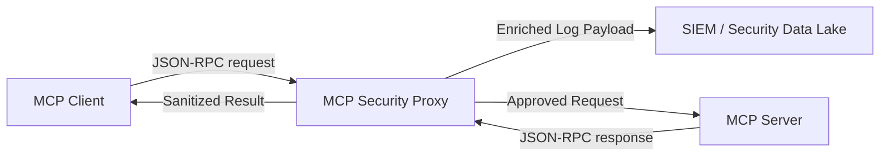

# 05 - MCP Security Auditing, Telemetry & SAST Rules

> [!IMPORTANT]
> **Forensic Visibility:** Auditing Model Context Protocol (MCP) interactions requires capturing full JSON-RPC 2.0 transactions (requests, responses, and notification frames) while automatically redacting sensitive credentials and PII.

---

## 📊 Telemetry Architecture & Audit Schema

An enterprise MCP Security Proxy must intercept traffic between the MCP Client and MCP Server, enriching every transaction with security context before forwarding telemetry to a SIEM (Splunk, Elastic, Datadog).



### Production Telemetry JSON Log Schema

```json
{
  "timestamp": "2026-07-26T01:15:30.124Z",
  "event_type": "mcp_tool_invocation",
  "trace_id": "4bf92f3577b34da6a3ce929d0e0e4736",
  "session_id": "sess_88921a4f",
  "agent_id": "agent_code_assistant_v2",
  "mcp_server_id": "github_mcp_server",
  "tool": {
    "name": "github_mcp_server::create_issue",
    "arguments": {
      "repo": "org/app",
      "title": "Bug Report",
      "body": "[REDACTED_PII]"
    }
  },
  "execution": {
    "latency_ms": 142,
    "status": "APPROVED",
    "user_approval_required": true,
    "user_approval_granted": true,
    "approved_by_user": "user_dev_99"
  },
  "security": {
    "path_traversal_detected": false,
    "prompt_injection_score": 0.02,
    "response_bytes": 1024
  }
}
```

---

## 💻 Multi-Language MCP Proxy Middleware

### 🐍 Python AsyncIO Telemetry Interceptor Middleware

```python
# mcp_async_telemetry_proxy.py
import json
import logging
import time
import uuid
import re
from typing import Dict, Any

logging.basicConfig(level=logging.INFO, format='%(asctime)s [%(levelname)s] %(message)s')
logger = logging.getLogger("MCP_Security_Auditor")

class MCPTelemetryProxy:
    def __init__(self, target_server_writer, pii_patterns=None):
        self.target_writer = target_server_writer
        # Regex pattern for auto-redacting secret keys / tokens in arguments
        self.secret_pattern = re.compile(r'(?:api[_-]?key|secret|password|bearer|token)["\']?\s*[:=]\s*["\']?([^"\'\s]+)', re.IGNORECASE)

    def sanitize_payload(self, data: Dict[str, Any]) -> Dict[str, Any]:
        """Deep copy and redact sensitive parameters before logging."""
        json_str = json.dumps(data)
        redacted_str = self.secret_pattern.sub(r'\1: "[REDACTED_SECRET]"', json_str)
        return json.loads(redacted_str)

    async def intercept_client_request(self, session_id: str, raw_json_rpc: str) -> str:
        start_time = time.time()
        trace_id = str(uuid.uuid4())
        
        try:
            payload = json.loads(raw_json_rpc)
        except json.JSONDecodeError:
            logger.error(f"MALFORMED_JSON_RPC session={session_id} raw={raw_json_rpc}")
            raise

        method = payload.get("method")
        
        if method == "tools/call":
            params = payload.get("params", {})
            tool_name = params.get("name", "unknown")
            arguments = params.get("arguments", {})
            
            sanitized_args = self.sanitize_payload(arguments)
            
            audit_entry = {
                "event": "MCP_TOOL_CALL_INITIATED",
                "trace_id": trace_id,
                "session_id": session_id,
                "tool_name": tool_name,
                "arguments": sanitized_args,
                "timestamp_epoch": start_time
            }
            logger.info(f"AUDIT: {json.dumps(audit_entry)}")

        return raw_json_rpc
```

---

### 🟨 Node.js / TypeScript Proxy Middleware

```typescript
import { Request, Response, NextFunction } from "express";
import crypto from "crypto";

export function mcpAuditLoggerMiddleware(req: Request, res: Response, next: NextFunction) {
  const startTime = Date.now();
  const traceId = crypto.randomUUID();

  if (req.body && req.body.method === "tools/call") {
    const toolName = req.body.params?.name;
    const rawArgs = JSON.stringify(req.body.params?.arguments || {});

    // Redact Bearer tokens & API Keys
    const redactedArgs = rawArgs.replace(/"(api_key|token|password)":"[^"]+"/gi, '"$1":"[REDACTED]"');

    const auditLog = {
      traceId,
      timestamp: new Date().toISOString(),
      eventType: "MCP_TOOL_EXECUTION",
      toolName,
      arguments: JSON.parse(redactedArgs),
      clientIp: req.ip
    };

    console.log(`[MCP_AUDIT] ${JSON.stringify(auditLog)}`);
  }

  next();
}
```

---

## 🚨 Anomaly Detection & Threat Rules

Security operations teams should configure SIEM detection rules to alert on suspicious MCP behavior patterns:

1. **High-Velocity Chain Anomaly:** More than 10 `tools/call` executions within 5 seconds from a single agent session (indicates looping agent or injection attack).
2. **Exfiltration Sequence Pattern:** A tool invocation of `read_file` followed immediately within the same session by `http_post_webhook` or `send_email`.
3. **Parameter Tampering Spike:** Sudden increase in JSON Schema validation errors (`400 Bad Request`) returned from tool servers.

---

## 🔍 Static Analysis (SAST) Rules for MCP Tool Code

Use **Semgrep** rules to scan custom MCP server codebases for dangerous patterns.

### Semgrep Rule: Unsafe MCP Command Execution (`mcp-command-injection.yaml`)

```yaml
rules:
  - id: mcp-unvalidated-command-execution
    patterns:
      - pattern-either:
          - pattern: os.system($REQ["params"]["arguments"][...])
          - pattern: subprocess.Popen($REQ["params"]["arguments"][...], ...)
          - pattern: subprocess.run($REQ["params"]["arguments"][...], ...)
    message: "CRITICAL: Unvalidated MCP request argument passed directly to command execution function. Risk of Remote Code Execution (RCE)."
    languages: [python]
    severity: ERROR
    metadata:
      category: security
      cwe: "CWE-78: Improper Neutralization of Special Elements used in an OS Command"
      owasp: "LLM07: Insecure Plugin Design"

  - id: mcp-unvalidated-path-traversal
    patterns:
      - pattern: open($REQ["params"]["arguments"][...], ...)
      - pattern-not-inside:
          - pattern: |
              $P = os.path.realpath(...)
              ...
              if $P.startswith(...):
                  ...
    message: "WARNING: File path argument from MCP request passed to open() without canonical path validation. Risk of Path Traversal."
    languages: [python]
    severity: WARNING
```

---

> [!TIP]
> **Audit Checklist:**
> - Ensure log payloads mask all credential parameters (`password`, `token`, `secret`).
> - Trace requests using unique `trace_id` propagated across Host, Proxy, and Server.
> - Deploy SAST rules in CI/CD pipelines to catch raw system calls in MCP tools.
