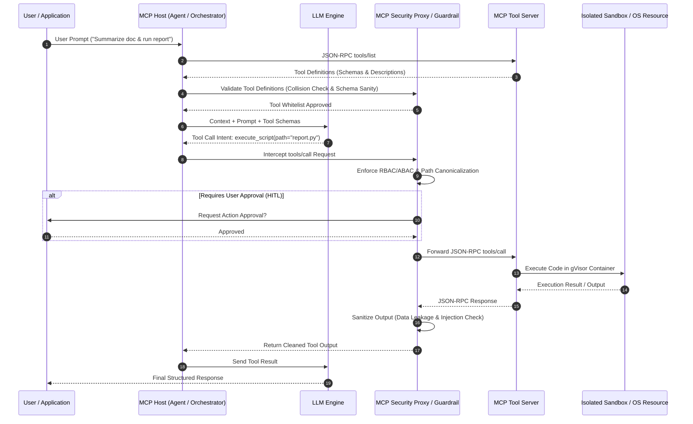

# Model Context Protocol (MCP) & Tool-Use Security Masterclass

Welcome to the **Model Context Protocol (MCP) & Tool-Use Security** module of AppSec Atlas. This comprehensive guide details the security model, threat vectors, defense architectures, and production best practices for securing AI agents integrated with external tools, resources, and execution environments via the Model Context Protocol (MCP).

---

## 🌟 Overview

As Large Language Models (LLMs) transition from conversational text generators into autonomous **agentic systems**, they rely on tools to interact with the physical and digital world—reading files, querying databases, executing code, and triggering REST APIs. 

The **Model Context Protocol (MCP)**, originally introduced by Anthropic and adopted as an open industry standard, standardizes how AI applications (MCP Hosts/Clients) connect to context providers and tool servers (MCP Servers). However, exposing executable capabilities to non-deterministic neural networks creates severe security challenges:

- **Confused Deputy Attacks:** Prompt injection payloads in untrusted data forcing LLMs to misuse authorized tools.
- **Tool Poisoning & Shadowing:** Rogue MCP servers injecting malicious tool definitions or overriding legitimate system tools.
- **Unbounded Privileges & Excessive Agency:** Tools executing shell commands or database modifications without granular access control.
- **Data Exfiltration:** Exfiltrating host data or API secrets through unauthorized outbound tool requests.

This masterclass equips application security engineers, AI architects, and developers with actionable patterns to build resilient, hardened MCP ecosystems.

---

## 📋 Prerequisites Matrix

| Requirement | Knowledge Level | Purpose |
| :--- | :--- | :--- |
| **LLM & Prompt Injection Mechanics** | Intermediate | Understanding direct/indirect prompt injection payloads and ReAct agent decision loops. |
| **JSON-RPC 2.0 Protocol** | Intermediate | Understanding standard payload schemas for MCP requests, responses, and notifications. |
| **Containerization & Linux Security** | Intermediate | Configuring Docker, gVisor (`runsc`), Seccomp, and kernel namespaces for isolation. |
| **Programming (Python / TS / Go / Java)** | Intermediate | Implementing secure MCP servers, client interceptors, input sanitization, and HITL gates. |

---

## 🎯 Learning Objectives

By completing this module, you will be able to:

1. **Analyze MCP Architecture & Threat Boundaries:** Identify security boundaries across MCP Hosts, Clients, Servers, and Transports (stdio, SSE/HTTP).
2. **Mitigate Tool Poisoning & Shadow Tools:** Prevent description injection, tool signature collisions, and rogue tool registration.
3. **Implement Least Privilege & Permission Scopes:** Enforce strict parameter validation, path canonicalization, ABAC/RBAC, and Human-in-the-Loop (HITL) approval workflows.
4. **Deploy Hardened Execution Sandboxes:** Isolate MCP tool servers using Docker, gVisor microVM runtimes, seccomp profiles, and network microsegmentation.
5. **Implement End-to-End JSON-RPC Auditing:** Intercept, log, and analyze MCP transactions using structured telemetry and SIEM integration.
6. **Exploit & Remediate Tool Vulnerabilities:** Hands-on experience attacking a vulnerable MCP server and engineering production-grade security controls.

---

## 🏗️ Architectural Overview

The Model Context Protocol establishes a client-server relationship over standard communication channels:

---

## 🗺️ Module Navigation

This guide is structured into 7 deep-dive technical chapters:

1. **[01 - Introduction to MCP & Tool-Use Security](./01-introduction.md)**  
   *Protocol specification, architecture components, JSON-RPC 2.0 lifecycle, root causes of tool vulnerabilities, and OWASP LLM threat mapping.*

2. **[02 - Tool Poisoning & Shadow Tools](./02-mcp-tool-poisoning-and-shadow-tools.md)**  
   *Deep mechanics of tool description injection, shadow tool registration, namespace squatting, and multi-language defensive code patterns.*

3. **[03 - Least Privilege & Permission Scopes](./03-least-privilege-and-permission-scopes.md)**  
   *Fine-grained scope enforcement, path canonicalization, input validation, and Human-in-the-Loop (HITL) approval gate implementations.*

4. **[04 - MCP Sandbox Isolation](./04-mcp-sandbox-isolation.md)**  
   *Containerization architectures using Docker and gVisor (`runsc`), Seccomp, AppArmor, network egress filtering, and environment variable hygiene.*

5. **[05 - MCP Security Auditing & Telemetry](./05-mcp-security-auditing.md)**  
   *Logging JSON-RPC payloads, async audit middleware, OpenTelemetry integration, SIEM field mapping, and automated SAST/DAST rules.*

6. **[06 - Hands-On Lab: MCP Exploitation & Mitigation](./06-hands-on-lab.md)**  
   *A complete, self-contained vulnerable MCP server lab environment, automated python exploit script, and step-by-step hardened solution.*

7. **[07 - References & Resources](./07-references.md)**  
   *Official specifications, industry frameworks, CVE references, security benchmarks, and recommended reading.*

---

> [!IMPORTANT]
> **Production Standard:** Security must be enforced at the **MCP Proxy / Host boundary** and **within the tool implementation itself**. Never rely solely on the LLM's system prompt to enforce security policies or parameter boundaries.

