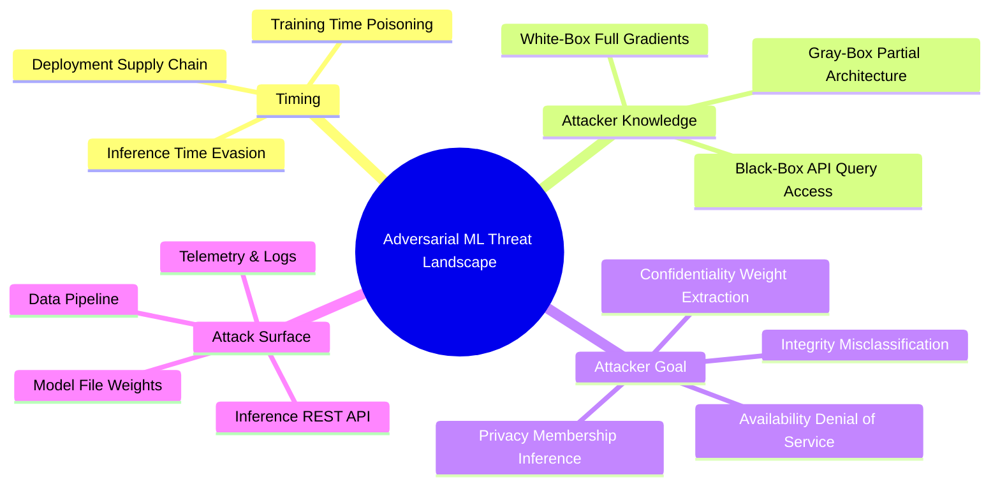
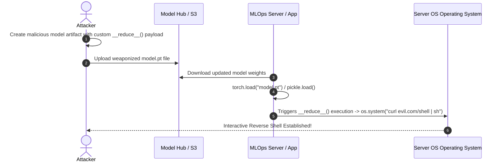
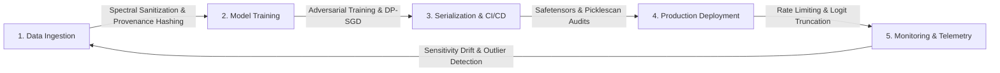

# 01. Overview & Adversarial ML Threat Landscape

Machine Learning (ML) systems operate under fundamentally different security paradigms than classical software applications. In traditional web and system security, vulnerabilities stem from discrete syntax errors, memory bounds violations, or inadequate input sanitization (e.g., Buffer Overflows, SQL Injection, Cross-Site Scripting). In contrast, **machine learning models are vulnerable due to the mathematical properties of continuous, high-dimensional vector spaces and statistical optimization algorithms**.

---

> [!NOTE]
> **Core Concept:** Classical software separates *code* (instructions) from *data* (inputs). In machine learning, the *model weights* (code/logic) are learned directly from *data*, making the entire decision boundary dependent on continuous statistical distributions rather than explicit logic branches.

---

## 1. Classical Software vs. Machine Learning Security

To understand machine learning security, application security engineers must shift from analyzing control flow graphs to evaluating continuous decision boundaries and vector representation spaces.

| Dimension | Classical Software Security | Machine Learning Model Security |
|---|---|---|
| **Vulnerability Source** | Syntax errors, logic bugs, unvalidated input parsing | Continuous decision hyperplanes, non-convex loss surfaces, statistical data artifacts |
| **Exploit Vector** | Malicious shellcode, control-flow hijacking, payload injection | Imperceptible input noise, statistical distribution shifts, synthetic queries |
| **Attack Objective** | Remote Code Execution (RCE), privilege escalation, database dump | Model misclassification, Trojan trigger activation, weight theft, data privacy extraction |
| **Security Metric** | Memory safety, input boundary checks, standard cryptography | Lipschitz continuity, `L_p` norm bounds, differential privacy (`\epsilon, \delta`), empirical robustness |
| **Remediation Strategy** | Patching code logic, bounds checking, parameterized queries | Adversarial training, spectral sanitization, DP-SGD, output probability rounding |

---

## 2. Theoretical Root Cause: The High-Dimensional Geometry of ML

Why are deep neural networks (DNNs) susceptible to adversarial manipulation?

### A. Linear Behavior in High Dimensions
Deep networks were long assumed to suffer from non-linear overfitting. However, breakthrough research (Goodfellow et al.) demonstrated that modern deep networks behave surprisingly **linearly in high-dimensional input spaces**. 

If an input sample `x` has dimension `d` (e.g., a 256×256×3 image with d = 196,608 features), a tiny perturbation vector `\eta` with maximum amplitude `\epsilon` across each dimension accumulates linearly across weight vector `w`:

```
w^T x_adv = w^T (x + \eta) = w^T x + w^T \eta
```

If `\eta = \epsilon \cdot sign(w)`, the change in activation is:

```
w^T \eta = \epsilon \cdot ||w||_1
```

In high-dimensional spaces where `d` is large, the average norm `||w||_1` grows linearly with `d`. Consequently, an imperceptibly small perturbation `\epsilon` on individual inputs produces a massive shift in network activation output!

### B. Non-Convex Decision Hyperplanes and "Adversarial Pockets"
Neural networks map inputs into non-convex decision spaces. The decision boundaries between classes are complex hyperplanes. Nearby training points often lie close to these hyperplanes. Adversaries exploit the gradient directions perpendicular to these boundaries to push samples into "adversarial pockets"—regions in vector space where input appears unchanged to human perception but maps to a completely different classification class with high confidence.

---

## 3. Adversarial ML Threat Landscape & Taxonomy

Standardization bodies including **NIST (NIST AI 100-2)** and **MITRE (MITRE ATLAS™)** categorize adversarial ML threats across four main dimensions:



### Threat Taxonomy Matrix

| Threat Category | Attack Timing | Attacker Knowledge | Target Component | Core Mechanism & Business Impact |
|---|---|---|---|---|
| **Evasion (Adversarial Perturbation)** | Inference Time | White / Gray / Black-Box | Inference API / Perception Pipeline | Modifying input samples with calculated noise to cause misclassification (e.g., bypassing malware scanners or visual recognition). |
| **Data Poisoning (Availability)** | Training Time | Black / Gray-Box | Training Data Store / Feature Store | Injecting corrupted samples to degrade overall model performance across all tasks. |
| **Clean-Label Backdoor (Trojan)** | Training Time | Black / Gray-Box | Training Data & Model Weights | Injecting trigger patterns (e.g., visual watermark or trigger phrase) into correctly labeled data to create secret execution backdoors. |
| **Model Extraction (Stealing)** | Inference Time | Black-Box API Access | Model Weights & IP | Querying an inference endpoint systematically to construct a synthetic dataset and train a surrogate model that mirrors proprietary IP. |
| **Membership Inference (MIA)** | Inference Time | Black-Box API Access | Data Privacy | Analyzing prediction confidence scores to determine whether a specific individual's record was included in the private training dataset. |
| **Model Inversion** | Inference Time | White / Gray-Box | Training Data Reconstruction | Reconstructing representative samples of sensitive training data (e.g., facial images, medical records) by backpropagating from output logits. |
| **Supply Chain Exploitation** | Deployment Time | Access to Repository | Model File Serialization | Replacing model files (`.pt`, `.pkl`) with weaponized payload files that execute arbitrary code upon deserialization. |

---

## 4. Supply Chain Security: Model Serialization Hazards

A critical, often overlooked aspect of ML model security is **artifact supply chain integrity**.

### The Python Pickle Insecurity Pattern
Historically, PyTorch (`.pt`, `.pth`), Scikit-Learn (`.pkl`), and Joblib serialized model weights using Python's native `pickle` module. Python `pickle` is **not secure against erroneous or malicious data**.

During unpickling via `torch.load()` or `pickle.load()`, Python executes the `__reduce__` magic method provided by object instances inside the file. An attacker can construct a serialized model file that executes arbitrary OS commands when loaded by an application server.



> [!CAUTION]
> **Critical Risk:** Never call `torch.load()` or `pickle.load()` on untrusted model files downloaded from public repositories or external user uploads. Default PyTorch `torch.load()` uses `pickle` under the hood!

### Secure Serialization Standard: Safetensors
Modern ML security requires replacing unsafe pickle binaries with pure tensor storage formats such as **`safetensors`** developed by Hugging Face:
- Stores raw tensor buffers without executable code.
- Prevents arbitrary code execution.
- Enables zero-copy memory mapping (`mmap`) for faster model loading.

---

## 5. Defense-in-Depth Lifecycle Strategy

Securing machine learning models requires applying controls across every stage of the MLOps pipeline:



---

*Next Chapter: [02. Adversarial Input Robustness & Sensitivity →](02-adversarial-robustness-evaluations.md)*
