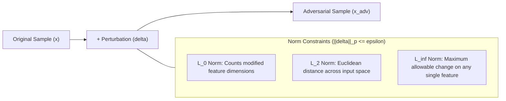
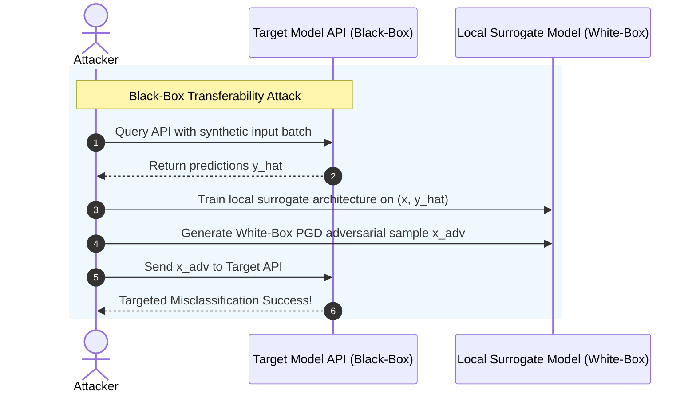

# 02. Adversarial Input Robustness & Sensitivity

Adversarial evasion attacks manipulate inference inputs using calculated mathematical noise to force a machine learning model into making incorrect predictions. This chapter explores the mechanics of input sensitivity, mathematical metrics for adversarial noise, key evasion attack algorithms, and robust adversarial training defenses.

---

## 1. Mathematical Perturbation Metrics (`L_p` Norms)

To evaluate model robustness, we measure the magnitude of the perturbation vector `\delta = x_{adv} - x` using standard vector norms. An effective adversarial attack seeks to maximize classification loss while constraining `\delta` under a perceptual threshold `\epsilon`.



1. **`L_0` Norm (`||\delta||_0`)**: Measures the number of features or pixels modified by the attacker, regardless of perturbation magnitude. (Used in sparse attacks like One-Pixel Attack).
2. **`L_2` Norm (`||\delta||_2`)**: Measures the standard Euclidean distance between original and perturbed inputs. (Used in Carlini & Wagner `L_2` attack).
3. **`L_\infty` Norm (`||\delta||_\infty`)**: Measures the maximum absolute perturbation applied to any single feature component:
   ```
   ||\delta||_\infty = \max_i |\delta_i| \le \epsilon
   ```
   This is the standard evaluation metric in image and numerical tabular domain attacks because it bounds maximum individual pixel deviation.

---

## 2. Evasion Attack Taxonomy & Algorithms

Evasion attacks fall into three primary threat models based on attacker visibility:
- **White-Box**: Full access to model architecture, weights `\theta`, and loss gradient computation `\nabla_x J(\theta, x, y)`.
- **Gray-Box**: Access to feature representations or output probabilities without full gradient backpropagation.
- **Black-Box**: Zero access to weights or internal representations; access is restricted to inference API queries (returning labels or confidence probabilities).



---

### A. Fast Gradient Sign Method (FGSM)
Proposed by Goodfellow et al., FGSM is a single-step white-box attack that computes the gradient of the loss function with respect to the input sample and shifts the input in the direction of maximum loss:

```
x_{adv} = x + \epsilon \cdot sign\left(\nabla_x J(\theta, x, y)\right)
```

Where:
- `x` is the original input sample.
- `\theta` represents the model parameters.
- `y` is the true target label.
- `J(\theta, x, y)` is the cross-entropy loss function.
- `\epsilon` controls the perturbation step size.

### B. Projected Gradient Descent (PGD)
PGD (Madry et al.) is an iterative extension of FGSM and is considered the **gold standard for white-box `L_\infty` robustness evaluation**. PGD runs multiple small gradient steps and projects the resulting vector back into the `\epsilon`-ball surrounding original sample `x`:

```
x^{t+1} = \Pi_{x + S} \left( x^t + \alpha \cdot sign\left(\nabla_x J(\theta, x^t, y)\right) \right)
```

Where:
- `\alpha` is the step size per iteration (typically `\epsilon / 4`).
- `S = \{ \delta \mid ||\delta||_\infty \le \epsilon \}` is the allowable perturbation space.
- `\Pi_{x + S}` projects intermediate perturbed samples back onto the valid input domain and `\epsilon`-neighborhood.

### C. Carlini & Wagner (C&W) `L_2` Attack
Carlini and Wagner introduced an optimization-based attack that bypasses defensive distillation and gradient masking filters. Instead of relying on loss gradients directly, C&W solves the optimization problem:

```
\min_{\delta} ||\delta||_2^2 + c \cdot f(x + \delta)
```

Where `f(x')` is defined using pre-softmax logits `Z(x')`:

```
f(x') = \max\left( \max_{i \neq t} Z(x')_i - Z(x')_t, -\kappa \right)
```

Where `t` is the target class, and `\kappa` controls the confidence margin of misclassification.

---

## 3. Code Implementations: PyTorch & TensorFlow

### PyTorch Gradient Sensitivity & Evasion Suite (Python)

```python
# adversarial_eval.py
import torch
import torch.nn as nn
from typing import Tuple

def measure_input_gradient_norm(model: nn.Module, input_tensor: torch.Tensor, target_class: torch.Tensor) -> float:
    """
    Calculates L2 norm of model gradients with respect to input tensor.
    High gradient norm indicates high decision boundary sensitivity.
    """
    model.eval()
    input_tensor = input_tensor.clone().detach().requires_grad_(True)
    
    output = model(input_tensor)
    loss = nn.CrossEntropyLoss()(output, target_class)
    loss.backward()
    
    grad_norm = input_tensor.grad.norm(2).item()
    return grad_norm


def fgsm_attack(model: nn.Module, x: torch.Tensor, y: torch.Tensor, epsilon: float) -> torch.Tensor:
    """
    Executes single-step Fast Gradient Sign Method (FGSM) attack.
    """
    model.eval()
    x_adv = x.clone().detach().requires_grad_(True)
    
    outputs = model(x_adv)
    loss = nn.CrossEntropyLoss()(outputs, y)
    model.zero_grad()
    loss.backward()
    
    # Compute perturbation: epsilon * sign(grad)
    with torch.no_grad():
        x_adv = x_adv + epsilon * x_adv.grad.sign()
        x_adv = torch.clamp(x_adv, 0.0, 1.0) # Clamp to valid image/feature range
        
    return x_adv


def pgd_attack(
    model: nn.Module, 
    x: torch.Tensor, 
    y: torch.Tensor, 
    epsilon: float, 
    alpha: float, 
    iters: int
) -> torch.Tensor:
    """
    Executes multi-step Projected Gradient Descent (PGD) attack under L_inf norm.
    """
    model.eval()
    x_adv = x.clone().detach()
    
    # Initialize with random start inside epsilon-ball for maximal exploration
    x_adv = x_adv + torch.empty_like(x_adv).uniform_(-epsilon, epsilon)
    x_adv = torch.clamp(x_adv, 0.0, 1.0)
    
    for i in range(iters):
        x_adv.requires_grad = True
        outputs = model(x_adv)
        loss = nn.CrossEntropyLoss()(outputs, y)
        
        model.zero_grad()
        loss.backward()
        
        with torch.no_grad():
            # Gradient step
            x_adv = x_adv + alpha * x_adv.grad.sign()
            # Project back to epsilon-ball around original input x
            eta = torch.clamp(x_adv - x, min=-epsilon, max=epsilon)
            x_adv = torch.clamp(x + eta, min=0.0, max=1.0)
            
    return x_adv
```

### TensorFlow / Keras PGD Implementation (Python)

```python
# tf_pgd_attack.py
import tensorflow as tf

@tf.function
def tf_pgd_attack(model: tf.keras.Model, x: tf.Tensor, y: tf.Tensor, epsilon: float, alpha: float, iters: int) -> tf.Tensor:
    """
    TensorFlow 2.x implementation of PGD L_inf attack using GradientTape.
    """
    x_adv = tf.identity(x) + tf.random.uniform(tf.shape(x), minval=-epsilon, maxval=epsilon)
    x_adv = tf.clip_by_value(x_adv, 0.0, 1.0)
    
    for _ in range(iters):
        with tf.GradientTape() as tape:
            tape.watch(x_adv)
            predictions = model(x_adv, training=False)
            loss = tf.keras.losses.sparse_categorical_crossentropy(y, predictions)
            
        gradient = tape.gradient(loss, x_adv)
        x_adv = x_adv + alpha * tf.sign(gradient)
        
        # Projection step onto L_inf ball
        eta = tf.clip_by_value(x_adv - x, -epsilon, epsilon)
        x_adv = tf.clip_by_value(x + eta, 0.0, 1.0)
        
    return x_adv
```

### TypeScript Input Perturbation Gateway Guard (Node.js)

```typescript
// perturbationGuard.ts
import * as tf from '@tensorflow/tfjs-node';

export interface PerturbationCheckResult {
  isAnomalous: boolean;
  l2Distance: number;
  linfDistance: number;
}

export class InferencePerturbationGuard {
  private baselineCentroids: Map<number, tf.Tensor1D>;
  private maxLinfThreshold: number;

  constructor(maxLinfThreshold: number = 0.15) {
    this.baselineCentroids = new Map();
    this.maxLinfThreshold = maxLinfThreshold;
  }

  /**
   * Evaluates distance metrics between incoming feature vector and historical baseline centroids.
   */
  public verifyInputPerturbation(inputVector: number[], targetClass: number): PerturbationCheckResult {
    const inputTensor = tf.tensor1d(inputVector);
    const centroid = this.baselineCentroids.get(targetClass);

    if (!centroid) {
      return { isAnomalous: false, l2Distance: 0, linfDistance: 0 };
    }

    const diff = tf.sub(inputTensor, centroid);
    const l2Distance = tf.norm(diff, 2).dataSync()[0];
    const linfDistance = tf.max(tf.abs(diff)).dataSync()[0];

    const isAnomalous = linfDistance > this.maxLinfThreshold;

    return { isAnomalous, l2Distance, linfDistance };
  }
}
```

---

## 4. Production Defenses & Robust Training

### PGD Adversarial Training (Madry Minimax Defense)
The most robust defense against white-box and black-box evasion attacks is **Adversarial Training**. Instead of training on clean samples alone, the network is trained using a minimax formulation:

```
\min_\theta \mathbb{E}_{(x,y) \sim \mathcal{D}} \left[ \max_{\delta \in \mathcal{S}} J(\theta, x + \delta, y) \right]
```

In PyTorch, during each epoch step:
1. Generate adversarial samples `x_{adv}` using multi-step PGD for the current batch.
2. Calculate loss `J(\theta, x_{adv}, y)`.
3. Backpropagate loss to update model parameters `\theta`.

```python
# pdt_trainer.py
def train_adversarial_epoch(model: nn.Module, dataloader, optimizer, criterion, epsilon=0.03, alpha=0.01, iters=7):
    model.train()
    total_loss = 0.0
    
    for x_batch, y_batch in dataloader:
        # Step 1: Generate adversarial batch on the fly
        x_adv = pgd_attack(model, x_batch, y_batch, epsilon, alpha, iters)
        
        # Step 2: Forward pass on adversarial samples
        optimizer.zero_grad()
        outputs = model(x_adv)
        loss = criterion(outputs, y_batch)
        
        # Step 3: Optimize model weights against adversarial noise
        loss.backward()
        optimizer.step()
        total_loss += loss.item()
        
    return total_loss / len(dataloader)
```

> [!WARNING]
> **Beware of Gradient Masking:** Defenses that rely on non-differentiable preprocessing (e.g., JPEG compression, quantization, or defensive distillation) often create false security by breaking gradient backpropagation without smoothing the decision boundary. Attacks like BPDA (Backward Pass Differentiable Approximation) or C&W easily bypass gradient masking. Always evaluate robustness using PGD or AutoAttack!

---

*Next Chapter: [03. Data Poisoning & Dataset Sanitization →](03-data-poisoning-and-clean-label-sanitization.md)*
